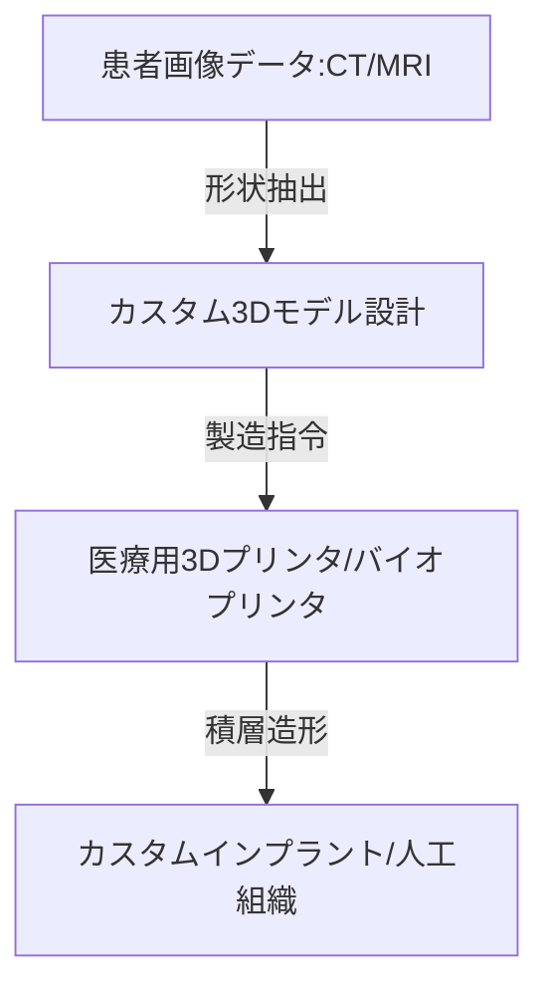

--- 
title: T10-09-05 医療用3Dプリンティング・バイオプリンティング
url: https://www.meti.go.jp/policy/mono_info_service/mono/robot/healthcare/3d-printing.html
date: 2025-11-14
tags:
  - 3Dプリンティング
  - バイオプリンティング
  - カスタムインプラント
  - 手術シミュレーション
  - 組織再生
source: テクノロジーロードマップ2026-2035 第2部第10章、Google検索
---

# T10-09-05 医療用3Dプリンティング・バイオプリンティング

## Summary（5つの要点）

1.  **カスタムインプラント**: 患者の**CT/MRIデータ**から得られた**骨格**や**欠損部**の形状に完全にフィットする、**人工関節**、**人工骨**、**歯科インプラント**などの**カスタムメイド**の**医療機器**を3Dプリンタで製造する。

2.  **手術シミュレーションモデル**: 手術の**難易度**や**リスク**を事前に評価するため、**患者固有**の**臓器**や**病変**を**実際の感触**に近い**生体模倣材料**で再現した**高精細なシミュレーションモデル**を3Dプリンタで作成する（T10-08-04と連携）。

3.  **バイオプリンティング**: **生体材料（バイオインク）**と**細胞**を組み合わせて積層し、**人工組織**や**人工臓器**を**三次元的**に構築する技術。**再生医療**の最終目標である**機能的な臓器**の創出を目指す。

4.  **オンデマンド製造と分散化**: 必要な時に、**医療現場**や**専門ラボ**で**カスタム機器**を**迅速**に製造する**分散型製造システム**を構築し、**リードタイム**の**短縮**と**医療コスト**の**最適化**を図る。

5.  **生体吸収性・機能性材料**: 3Dプリンティングに用いる材料として、体内で**治療後に自然に分解・吸収**される**生体吸収性ポリマー**や、**薬物放出機能**を持つ**機能性材料**を開発する。

#### 概念図

---

### 技術評価表（定量的な視点）

| 評価項目 | 評価 | 根拠 |
| :--- | :--- | :--- |
| 導入コスト | ⭐⭐⭐☆☆ | 産業用プリンタは高価。材料コストは高いが、カスタム品の経済効果は大きい。 |
| 技術成熟度 | ⭐⭐⭐⭐☆ | カスタムインプラントは実用化・保険適用が進展。バイオプリンティングは研究段階。 |
| 日本の競争力 | ⭐⭐⭐⭐☆ | iPS細胞研究（再生医療）との連携、精密なモノづくり技術が強み。 |
| 市場性 | ⭐⭐⭐⭐⭐ | **整形外科**、**歯科**、**形成外科**など、カスタムニーズが高い分野で必須技術。組織再生の成功で爆発的拡大。 |
| 品質保証の重要性 | ⭐⭐⭐⭐⭐ | 埋め込み機器の強度、生体適合性、造形精度が患者の安全性に直結するため、極めて高い信頼性が要求される。 |

---

## 日本の立ち位置・強み弱みのSummary

### 強み

* **iPS細胞・再生医療**: **京都大学**などでのiPS細胞研究が世界をリードしており、**バイオプリンティング**との**連携**で**人工臓器**の研究が進展。

* **精密加工技術**: 3Dプリンティングによる**複雑形状**の**チタン合金**や**セラミックス**などの**カスタム部品**製造技術が高い。

* **政府支援**: 経済産業省（METI）などが**医療分野**での**3Dプリンティング活用**を**規制緩和**を含めて積極的に推進。

### 弱み

* **バイオインク材料**: **細胞生存率**や**機能維持**を可能にする**バイオインク**（細胞足場材料）の**材料開発**や**承認プロセス**が海外に後れを取る分野がある。

* **法規制・品質保証**: **カスタムメイド**の**医療機器**に対する**薬事承認**や**製造管理**の**基準**が**画一的**でなく、**製造者の負担**が大きい。

* **バイオプリンティングの機能性**: 造形された**人工組織**が**血管**や**神経**といった**複雑な機能**を**完全に再現**する技術が未成熟。

---

## 技術ロードマップ（短期/中期/長期）

### 短期目標（～2027年）

* **患者固有**の**手術シミュレーションモデル**作成が、**複雑な手術**の**術前計画**で**標準的**に利用される（T10-08-04と連携）。

* **歯科インプラント**や**整形外科**向けの**カスタムメイド**の**金属製インプラント**が、**保険適用**の**対象**として**拡大**される。

* **3Dプリンティング**による**生体吸収性**の**骨補填材**や**スクリュー**が臨床導入される。

### 中期目標（2028年～2031年）

* **バイオプリンティング技術**が、**皮膚**や**軟骨**といった**比較的単純な構造**の**人工組織**の**再生治療**で**治験**を開始する。

* **病院内**に**3Dプリントセンター**が設置され、**AI**が**設計**から**品質管理**までを**支援**する**オンデマンド製造体制**が構築される。

* **薬物放出機能**を持つ**機能性カスタムインプラント**が実用化され、**局所的な治療効果**を高める。

### 長期目標（2032年～2035年）

* **血管**や**神経**を**完全に備えた**、**機能的**な**人工臓器**（例：人工肝臓、人工腎臓）が**バイオプリンティング**により生成され、**臨床応用**される。

* 医療用3Dプリンティングが、**すべての医療機器製造**の**標準的手法**となり、**個別化医療**の**ハードウェア基盤**を担う。

* **AI**が**患者の疾患状態**を**リアルタイム**で解析し、**カスタムインプラント**の**設計**と**製造**を**全自動**で行う**クローズドループシステム**が実現する。

### 📚 参照リンク

1.  医療分野における3Dプリンティング活用事例（経済産業省）: [https://www.meti.go.jp/policy/mono_info_service/mono/robot/healthcare/3d-printing.html]

2.  再生医療とバイオプリンティングの展望（国立研究開発法人）: [https://www.nibiohn.go.jp/]
