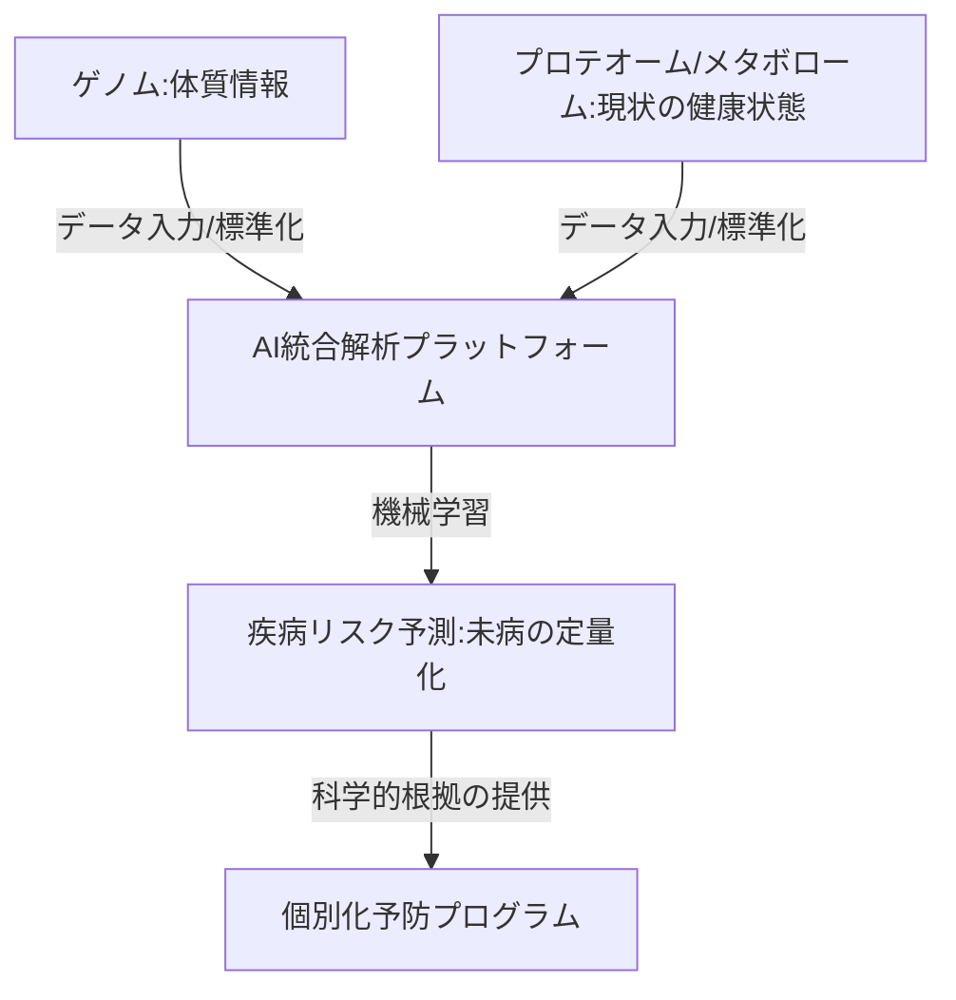

--- 
title: T11-01-01 マルチオミクス統合解析プラットフォーム
url: https://www.amed.go.jp/news/release_20240901.html
date: 2025-11-16
tags:
  - マルチオミクス
  - ゲノム解析
  - プロテオミクス
  - メタボロミクス
  - 個別化予防
  - AI統合
source: テクノロジーロードマップ2026-2035 第2部第11章、Google検索
---

# T11-01-01 マルチオミクス統合解析プラットフォーム

## Summary（5つの要点）

1.  **データ統合**: **ゲノム**、**トランスクリプトーム**、**プロテオーム**、**メタボローム**、**マイクロバイオーム**など、**複数の生体情報（マルチオミクスデータ）**を単一のプラットフォーム上に集約する。

2.  **AI/機械学習**: 統合された**超大容量**のデータを**AI**（ディープラーニング、機械学習）により**多次元的**に解析し、**分子間ネットワーク**や**病態メカニズム**を解明する。

3.  **疾病リスク予測**: 個人の**分子レベル**での**異常**を早期に検出し、**将来の疾病発症リスク**を**高精度**に**定量予測**する。

4.  **個別化予防プログラム**: 解析結果に基づき、**遺伝的要因**と**環境要因**を考慮した**最適な栄養指導**、**運動プログラム**、**サプリメント介入**を導き出す。

5.  **創薬・標的同定**: 疾患の原因となる**新たなバイオマーカー**や**創薬標的分子**を効率的に同定し、**個別化治療薬**の開発（T10-01-02と連携）に貢献する。

#### 概念図

---

### 技術評価表（定量的な視点）

| 評価項目 | 評価 | 根拠 |
| :--- | :--- | :--- |
| 導入コスト | ⭐⭐☆☆☆ | データ取得（次世代シーケンサー、質量分析計）が高額。クラウドコンピューティング費用も大きい。 |
| 技術成熟度 | ⭐⭐⭐☆☆ | 個々のオミクス技術は確立。データ間の**統合解析**と**AIによる病態解釈**は発展途上。 |
| 日本の競争力 | ⭐⭐⭐⭐☆ | ゲノム・プロテオミクス研究は世界的強み。AMED等の国家プロジェクトで大規模データ基盤整備中。 |
| 市場性 | ⭐⭐⭐⭐⭐ | **未病・予防医療**の中核技術であり、製薬・食品・保険業界など、全ヘルスケア市場の基盤となる。 |
| 品質保証の重要性 | ⭐⭐⭐⭐⭐ | 予測の**偽陽性・偽陰性**は不必要な医療行為や見逃しにつながるため、**モデルの信頼性**が極めて重要。 |

---

## 日本の立ち位置・強み弱みのSummary

### 強み

* **基礎研究**: **ゲノム科学**、特に**日本人固有の疾患**に関する**基礎研究**と**プロテオミクス**の**技術力**が高い。

* **装置技術**: **質量分析装置**や**次世代シーケンサー**など、**計測機器**における**高い技術力**（T11-05-01と連携）。

* **国家主導**: **AMED**（日本医療研究開発機構）などによる**大規模コホート研究**と**データ共有基盤**の整備が進んでいる。

### 弱み

* **標準化の遅れ**: 医療機関や研究機関間で**データ形式**の**標準化**が遅れており、**データの相互運用性**が低い。

* **大規模データセット**: 欧米や中国に比べ、**数十万人規模**の**マルチオミクス統合臨床データ**の**蓄積**と**公開**が遅れている。

* **プライバシー規制**: **匿名化**されたデータであっても、**二次利用**に対する**法規制**や**国民の意識**が**厳格**で、データ活用が限定的。

---

## 技術ロードマップ（短期/中期/長期）

### 短期目標（～2027年）

* **ゲノム**と**臨床情報**の**統合解析**モデルが、**生活習慣病**（糖尿病、高血圧）の**ハイリスク者抽出**に実用化される。

* **オミクスデータ**の**標準的な格納形式（PHRとの連携を視野）**と**セキュリティプロトコル**が確立される。

### 中期目標（2028年～2031年）

* **プロテオーム・メタボローム**を加えた**三次元統合解析**が実現し、**がん**や**認知症**などの**難病**の**超早期リスク**を**予測**する。

* **AI**が**オミクスデータ**から**新規バイオマーカー**を**自動発見**し、**個別化予防薬**の**開発**に直結する。

* 解析プラットフォームが**クラウド化**され、**大学**・**病院**・**製薬企業**間での**国際共同研究**が容易になる。

### 長期目標（2032年～2035年）

* **マルチオミクス解析**が**健康診断**の**標準項目**となり、**生涯**にわたる**疾病リスク**と**最適な介入策**が**自動で提示**される**先制医療社会**が実現する。

* **細胞レベル**の**動態**を**リアルタイム**で予測する**デジタルツイン**モデルが**オミクスデータ**を基盤として構築される。

### 📚 参照リンク

1.  日本医療研究開発機構（AMED）: [https://www.amed.go.jp/]

2.  ゲノム医療実現のためのデータ共有・活用に関する取り組み（内閣府）: [https://www.kantei.go.jp/jp/singi/kenkouiryou/]
