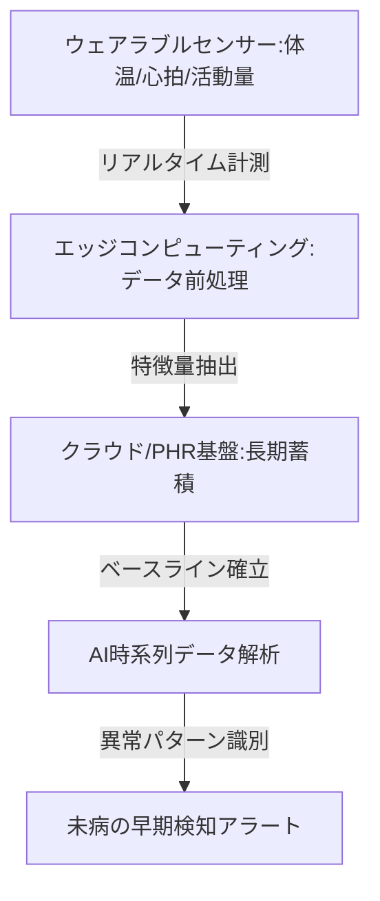

--- 
title: T11-01-02 ウェアラブル継続モニタリングシステム
url: https://www.meti.go.jp/policy/mono_info_service/mono/robot/healthcare/healthcare-iot.html
date: 2025-11-16
tags:
  - ウェアラブル
  - 継続モニタリング
  - 生体センサー
  - IoT
  - 未病検知
  - 健康管理
source: テクノロジーロードマップ2026-2035 第2部第11章、Google検索
---

# T11-01-02 ウェアラブル継続モニタリングシステム

## Summary（5つの要点）

1.  **多角的生体計測**: **スマートウォッチ**、**スマートリング**、**パッチ型センサー**などを活用し、**心拍変動（HRV）**、**血中酸素飽和度（SpO2）**、**体温**、**睡眠パターン**、**活動量**などを**24時間365日**継続的に計測する。

2.  **高精度非侵襲センサー**: 特に**血圧**や**血糖値**といった**重要なバイタルサイン**を、**非侵襲（採血不要）**かつ**高精度**で**リアルタイム**に計測するセンサー技術（光学式、インピーダンス式など）が不可欠。

3.  **エッジAI処理**: センサーから得られる**大量のデータ**を**デバイス側（エッジ）**で**前処理**・**特徴量抽出**し、必要な情報のみをクラウドに送信することで、**バッテリー消費**を抑え、**プライバシー**を保護する。

4.  **未病の早期検知**: **平常時のベースラインデータ**を**長期蓄積**し、**体調変化**に伴う**わずかなパターン異常**を**AI**が検知。**感染症**や**心疾患**の**超早期段階**での**異常**を**アラート**する。

5.  **医療・PHR連携**: 取得データを**安全なクラウド基盤**（T11-01-05）に集約し、**医療機関**や**AIリスク予測エンジン**（T11-01-03）と連携させることで、**診断**や**治療方針決定**の**根拠**とする。

#### 概念図

---

### 技術評価表（定量的な視点）

| 評価項目 | 評価 | 根拠 |
| :--- | :--- | :--- |
| 導入コスト | ⭐⭐⭐⭐☆ | 一般普及が進み低価格化。非侵襲血糖測定などの高機能センサーはまだ高価。 |
| 技術成熟度 | ⭐⭐⭐⭐☆ | 心拍・活動量計測は成熟。**非侵襲血圧・血糖値計測**は**研究開発競争**の最中。 |
| 日本の競争力 | ⭐⭐⭐☆☆ | **センサー部品**や**小型化技術**は強み。**大規模データプラットフォーム**では米国勢に後れ。 |
| 市場性 | ⭐⭐⭐⭐⭐ | デジタルヘルス市場の中心であり、一般消費者から医療機関まで需要が爆発的に拡大。 |
| 品質保証の重要性 | ⭐⭐⭐⭐⭐ | **医療用**として利用する場合、データの**測定精度**、**信頼性**が**誤診**を防ぐ上で極めて重要。 |

---

## 日本の立ち位置・強み弱みのSummary

### 強み

* **部品・材料技術**: **光学センサー**、**半導体**、**小型バッテリー**など、**高精度な電子部品**の製造技術で世界トップクラス。

* **医療機器メーカーの参入**: 既存の**体外診断用医薬品（IVD）**メーカーや**医療機器メーカー**が、**ウェアラブルデバイス**の**医療応用**に積極的に参入。

* **健康経営**: 企業による**従業員の健康管理（健康経営）**への関心が高く、**導入意欲**が高い。

### 弱み

* **規制対応の遅れ**: ウェアラブルデバイスを**医療機器（SaMD: Software as a Medical Device）**として承認するまでの**プロセス**が海外（FDA）に比べ**煩雑**で、実用化が遅れがち。

* **非侵襲技術**: **非侵襲**の**連続血糖値測定（CGM）**や**連続血圧測定**など、**高度なバイタルセンサー**の**製品化**で海外ベンダーに先行されている。

* **データプラットフォーム**: **GAFA**などの**巨大テック企業**が構築する**グローバルなデータプラットフォーム**に対する**競争力**が弱い。

---

## 技術ロードマップ（短期/中期/長期）

### 短期目標（～2027年）

* **光学式心拍・SpO2センサー**の**精度**が**医療グレード**に達し、**不整脈**や**睡眠時無呼吸**の**検知**で**保険適用**される。

* **連続血糖測定（CGM）デバイス**が、**糖尿病**の**日常管理**において**標準的**なツールとして広く普及する。

### 中期目標（2028年～2031年）

* **非侵襲**の**連続血圧測定**デバイスが実用化され、**高血圧患者**の**在宅管理**に必須のツールとなる。

* ウェアラブルデータに基づいた**AIアルゴリズム**が、**未病**としての**感染症発症**や**心不全増悪**の**予測**で**医療機器承認（SaMD）**を取得する。

* **複数のセンサーデータ**を**統合解析**し、**複合的な疾患リスク**を予測する**システム**がPHR基盤（T11-01-05）上で稼働する。

### 長期目標（2032年～2035年）

* **すべての個人**が**生涯**にわたり**ウェアラブル**を装着し、**健康状態**が**完全にデジタル化**された**「デジタルツイン」**が実現する。

* ウェアラブルデバイスが**体調異常**を検知した場合、**AI**が**自動的**に**医療機関**へ**連絡**・**予約**し、**先制的な介入**が行われる**完全自動化システム**が稼働する。

### 📚 参照リンク

1.  ヘルスケア分野におけるIoT活用推進（経済産業省）: [https://www.meti.go.jp/policy/mono_info_service/mono/robot/healthcare/healthcare-iot.html]

2.  非侵襲バイタルセンシング技術の最新動向（NEDO）: [https://www.nedo.go.jp/]
