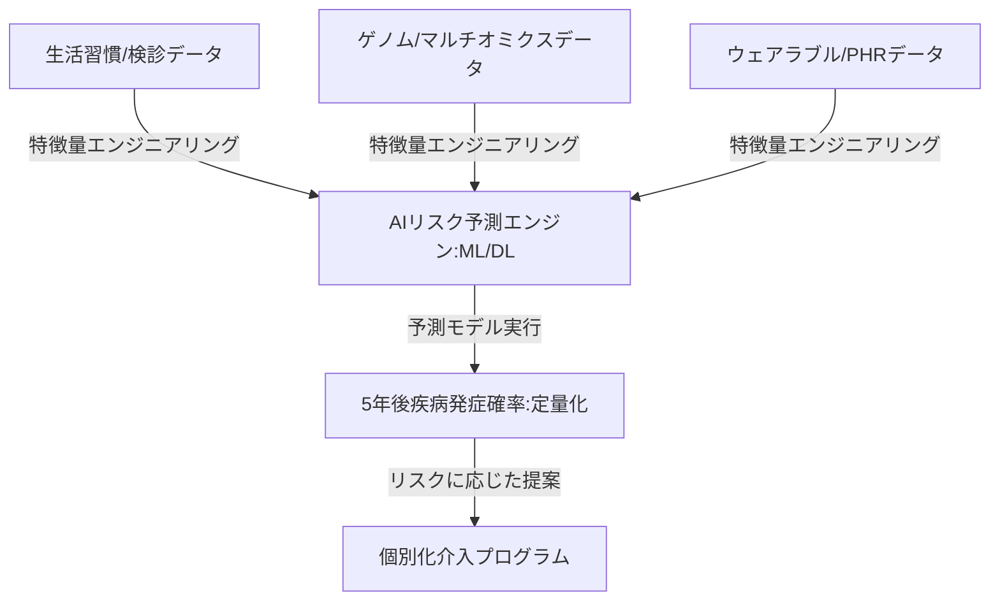

--- 
title: T11-01-03 AIパーソナル健康リスク予測エンジン
url: https://www.jst.go.jp/ristex/health/project/index.html
date: 2025-11-16
tags:
  - AI
  - 機械学習
  - リスク予測
  - 個別化予防
  - 生活習慣病
  - PHR活用
source: テクノロジーロードマップ2026-2035 第2部第11章、Google検索
---

# T11-01-03 AIパーソナル健康リスク予測エンジン

## Summary（5つの要点）

1.  **統合的データ利用**: **ゲノム情報**、**健康診断結果**、**電子カルテ（PHR）**、**ウェアラブル**からの**行動データ**など、**多種多様なデータ**を**一元的に収集・統合**する。

2.  **機械学習モデル**: **ディープラーニング**や**勾配ブースティング**などの**機械学習アルゴリズム**を活用し、**個人の潜在的な疾病リスク**（例：5年後の糖尿病発症確率）を**高精度**に**予測**する。

3.  **バイアス補正と公平性**: データ収集の**偏り**や**特定の集団**に**過剰適合**することを防ぐため、**公平性（Fairness）**を考慮した**AIモデル**の**開発**・**検証**が必須となる。

4.  **リスクに応じた提案**: 予測された**リスクの高さ**と**要因**に基づき、**生活習慣改善**や**早期受診**を促す**具体的な個別化介入プログラム**（T11-01-04と連携）を**自動で提案**する。

5.  **リアルタイム再評価**: **ウェアラブルデータ**の**継続的な入力**に基づき、**予測スコア**を**リアルタイム**に**更新**し、**行動変容**による**リスクの低減効果**を**定量的に可視化**する。

#### 概念図

---

### 技術評価表（定量的な視点）

| 評価項目 | 評価 | 根拠 |
| :--- | :--- | :--- |
| 導入コスト | ⭐⭐⭐☆☆ | モデル開発自体は高コストだが、サービス利用時のコストはデータ連携の仕組みに依存。 |
| 技術成熟度 | ⭐⭐⭐☆☆ | 統計モデルは成熟。**多種多様なビッグデータ**を統合した**DLモデル**は発展途上。 |
| 日本の競争力 | ⭐⭐⭐☆☆ | 基礎的なAI技術は高いが、**大規模な実証データ**の不足が課題。海外の先行事例を追う形。 |
| 市場性 | ⭐⭐⭐⭐⭐ | **保険会社**、**自治体**、**健康食品・サービス企業**など、予防医療市場全体で需要が極めて高い。 |
| 品質保証の重要性 | ⭐⭐⭐⭐⭐ | **予測の信頼性（AUC、適合率）**がそのまま**サービスの信頼性**に直結する。**説明可能AI（XAI）**も重要。 |

---

## 日本の立ち位置・強み弱みのSummary

### 強み

* **国民皆保険制度**: **検診データ**が**高い頻度**で取得されており、**均質的**な**ベースラインデータ**が豊富に存在する。

* **AI研究**: **理化学研究所**、**筑波大学**など、**生命科学**と**AI**の**融合研究**に強み。

* **健康経営**: 企業による**従業員のデータ**を活用した**リスク予測サービス**の**需要**が高まっている。

### 弱み

* **データ連携の障壁**: **PHR基盤**（T11-01-05）の**整備遅れ**により、**医療・検診・生活習慣データ**の**統合**が**技術的**・**制度的**に困難。

* **説明責任の欠如**: **AI**が**導き出した予測**の**根拠**を**一般**の**利用者**や**医師**に**分かりやすく説明**する**XAI（説明可能AI）技術**の**臨床導入**が遅れている。

* **倫理的課題**: **遺伝情報**を用いた**リスク予測**が、**保険**や**雇用**における**差別**につながらないよう、**倫理的**・**法的**な**整備**が急務。

---

## 技術ロードマップ（短期/中期/長期）

### 短期目標（～2027年）

* **既存**の**検診データ**と**生活習慣アンケート**に基づく**AIリスク予測モデル**が、**特定健診**の**ハイリスク者抽出**に**標準導入**される。

* **予測結果**と**行動変容アプリ**（T11-01-04）が**API連携**し、**自動で介入プログラム**が提示されるシステムを実証。

### 中期目標（2028年～2031年）

* **ウェアラブルデータ**を**リアルタイム**に取り込み、**疾病発症リスク**を**日次**で**更新**する**動的リスク予測システム**が稼働する。

* **マルチオミクスデータ**（T11-01-01）を統合した**次世代リスク予測モデル**が開発され、**予測精度**が**既存モデル**を**20%以上**上回る。

* **XAI技術**により、**AI予測**の**根拠**が**医師**と**患者**に**透明性**をもって**提示**される。

### 長期目標（2032年～2035年）

* **出生時**の**ゲノム情報**から**生涯**にわたる**総合的**な**疾患発症リスク**が**自動で予測**され、**先制医療**の**中核エンジン**となる。

* **健康診断**や**受診**が**AI予測**によって**完全に最適化**され、**不必要な検査**や**医療費**が**削減**される。

### 📚 参照リンク

1.  戦略的創造研究推進事業（JST RISTEX）: [https://www.jst.go.jp/ristex/health/project/index.html]

2.  AIを活用した医療・ヘルスケア分野の現状と課題（総務省）: [https://www.soumu.go.jp/]
