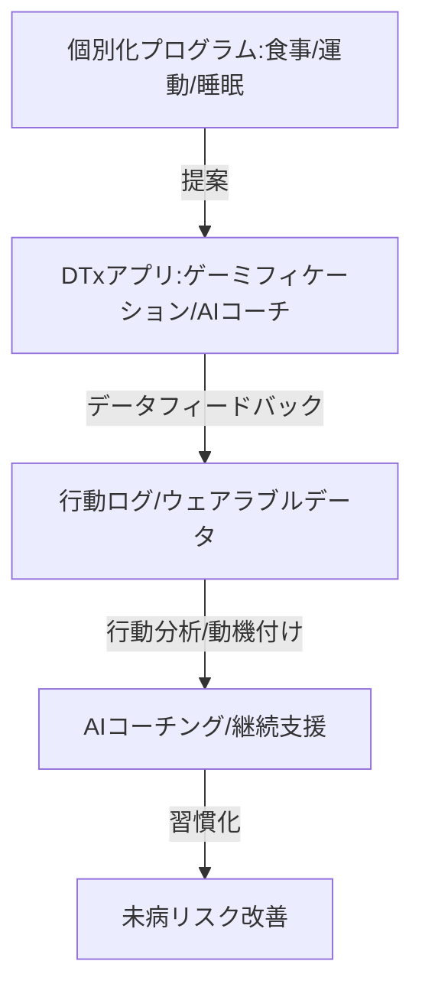

--- 
title: T11-01-04 デジタル行動変容支援アプリ
url: https://www.mhlw.go.jp/content/10800000/000889163.pdf
date: 2025-11-16
tags:
  - DTx
  - デジタルセラピューティクス
  - 行動変容
  - ゲーミフィケーション
  - AIコーチ
  - 未病改善
source: テクノロジーロードマップ2026-2035 第2部第11章、Google検索
---

# T11-01-04 デジタル行動変容支援アプリ

## Summary（5つの要点）

1.  **個別最適化された介入**: **AIリスク予測エンジン**（T11-01-03）の結果に基づき、**ユーザー固有**の**生活習慣**、**嗜好**、**モチベーションレベル**に合わせた**運動**、**食事**、**睡眠**の**改善プログラム**を設計する。

2.  **デジタルセラピューティクス（DTx）**: **薬**と**同等の治療効果**を持つことが**臨床試験**で**証明**され、**医療機器**として**承認**された**ソフトウェア**。**高血圧**、**不眠症**、**糖尿病**などの**治療**に利用される。

3.  **エンゲージメント維持技術**: **ゲーミフィケーション（報酬・競争要素）**、**ソーシャル機能**、**パーソナライズされた通知**など、**ユーザー**が**継続的**に**利用**するための**行動経済学**に基づく**心理的メカニズム**を導入する。

4.  **AI健康コーチ**: **自然言語処理（NLP）**や**大規模言語モデル（LLM）**を活用し、**ユーザー**からの**相談**や**悩み**に対して**人間**のような**共感**と**専門知識**をもって**対話**し、**行動変容**を促す**AIコーチング**を実現する。

5.  **データ連携と効果検証**: **ウェアラブルデータ**（T11-01-02）や**PHR**（T11-01-05）と連携し、**アプリ**が**ユーザー**の**行動**や**生体指標**に与えた**効果**を**定量的にトラッキング**し、**プログラム**を**継続的**に**改善**する。

#### 概念図

---

### 技術評価表（定量的な視点）

| 評価項目 | 評価 | 根拠 |
| :--- | :--- | :--- |
| 導入コスト | ⭐⭐⭐⭐☆ | ソフトウェア中心で、比較的安価に導入可能。DTx製品は保険適用によりコスト減。 |
| 技術成熟度 | ⭐⭐⭐☆☆ | 基本的な健康アプリは普及。**DTx**や**高度なAIコーチング**は**黎明期**。 |
| 日本の競争力 | ⭐⭐⭐☆☆ | **DTx**の**製品化**や**規制対応**で**米国**に**後れ**。アプリ開発力自体は高い。 |
| 市場性 | ⭐⭐⭐⭐⭐ | **医療費抑制**の**切り札**として**政府**が**推進**。予防医療分野で巨大市場を形成。 |
| 品質保証の重要性 | ⭐⭐⭐⭐⭐ | 治療効果を持つため、**安全性**、**有効性**、**セキュリティ**に関する**厳格な治験**と**薬事承認**が必須。 |

---

## 日本の立ち位置・強み弱みのSummary

### 強み

* **ゲーム・エンタメ技術**: **ゲーミフィケーション**や**UX/UI設計**に関する**高い技術**と**ノウハウ**。

* **規制枠組みの整備**: 厚生労働省が**DTx**に関する**薬事承認**の**審査基準**を策定し、**保険適用**も一部で開始されている。

* **産学連携**: **製薬企業**や**IT企業**が**大学**と連携し、**臨床試験**に基づく**DTx開発**を加速させている。

### 弱み

* **DTx承認製品の少なさ**: **不眠症**、**高血圧**など**一部**で**承認**されたものの、**パイプライン**の**数**や**適用疾患**が**海外**に**比**べて**限定的**。

* **AIコーチングの知見**: **行動経済学**や**心理学**に基づいた**対話型AI**の**開発**において、**専門人材**が**不足**している。

* **保険適用へのハードル**: **DTx**が**従来の治療薬**と**同等以上**の**費用対効果**を**示す**ための**データ収集**が**困難**。

---

## 技術ロードマップ（短期/中期/長期）

### 短期目標（～2027年）

* **高血圧**、**不眠症**、**ニコチン依存症**など**主要**な**生活習慣病**向け**DTx製品**が**薬事承認**を**取得**し、**保険適用**のもとで**広く処方**される。

* **AIリスク予測**（T11-01-03）と**連携**し、**リスク**の**度合い**に応じて**介入プログラム**の**強度**を**自動で調整**する。

### 中期目標（2028年～2031年）

* **LLM**を活用した**AI健康コーチ**が**ユーザー**の**個別**の**感情**や**背景**を**理解**し、**人間**と**同等以上**の**行動変容支援能力**を発揮する。

* **アプリ**が**ウェアラブル**を**通じて**ユーザーの**状態**を**検知**し、**介入タイミング**を**自動決定**する**クローズドループシステム**が確立される。

### 長期目標（2032年～2035年）

* **DTx**が**未病**だけでなく、**認知症予防**、**メンタルヘルス**、**リハビリテーション**など**広範**な**医療領域**で**標準的**な**治療法**となる。

* **デジタル行動変容アプリ**が**PHR基盤**（T11-01-05）と**完全に統合**され、**生涯**にわたる**予防・治療**を**一貫**して**支援**する**パーソナルヘルスナビゲーター**となる。

### 📚 参照リンク

1.  プログラム医療機器実用化促進パッケージ（厚生労働省）: [https://www.mhlw.go.jp/]

2.  デジタルセラピューティクスの開発動向（日本経済産業省）: [https://www.meti.go.jp/]
