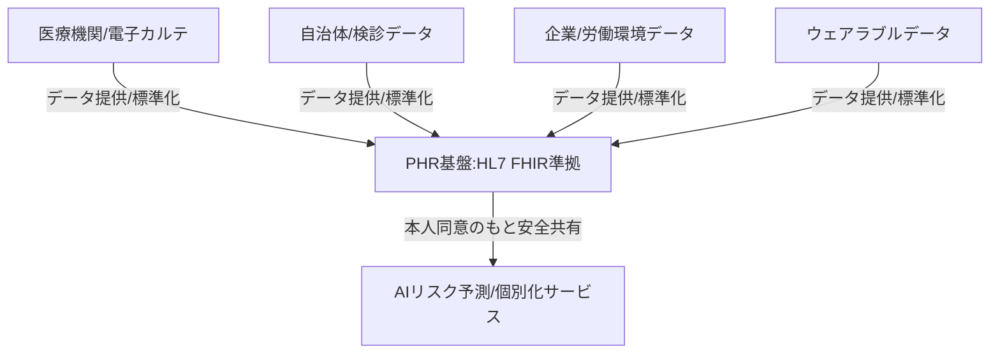

--- 
title: T11-01-05 自治体・企業連携PHR(Personal Health Record)基盤
url: https://www.mhlw.go.jp/stf/shingi/other_kouseiroudou-seisakukeikaku_00030.html
date: 2025-11-16
tags:
  - PHR
  - 電子カルテ
  - データ連携
  - HL7 FHIR
  - 健康データ
  - マイナポータル
source: テクノロジーロードマップ2026-2035 第2部第11章、Google検索
---

# T11-01-05 自治体・企業連携PHR(Personal Health Record)基盤

## Summary（5つの要点）

1.  **データ統合・所有権**: **個人**の**健康**や**医療**に関する**全てのデータ**（診療記録、検診結果、服薬履歴、ウェアラブルデータ）を**本人**が**一元的**に**管理**・**活用**できる**プラットフォーム**を提供する。

2.  **国際標準準拠（FHIR）**: 医療情報の**相互運用性**を確保するため、**HL7 FHIR（Fast Healthcare Interoperability Resources）**などの**国際標準**に**準拠**した**データ連携API**を開発・導入する。

3.  **安全なデータ共有**: **自治体（特定健診、予防接種）**、**企業（産業保健、健康診断）**、**医療機関**が、**本人の同意**のもとで**必要な情報**を**安全**かつ**迅速**に**共有**できる**仕組み**（**セキュリティプロトコル**）を構築する。

4.  **マイナポータル連携**: **PHR**と**マイナポータル**を**連携**させ、**公的な医療情報**の**取得**や**保険資格確認**などを**簡素化**し、**国民的**な**利用**を促進する。

5.  **個別化予防の基盤**: **AIリスク予測エンジン**（T11-01-03）や**行動変容アプリ**（T11-01-04）などの**個別化サービス**に**高精度**で**包括的**な**データ**を**提供**し、**未病対策**の**社会インフラ**とする。

#### 概念図

---

### 技術評価表（定量的な視点）

| 評価項目 | 評価 | 根拠 |
| :--- | :--- | :--- |
| 導入コスト | ⭐⭐☆☆☆ | 全国規模のインフラ整備であり、初期投資および維持管理コストが極めて高い。 |
| 技術成熟度 | ⭐⭐⭐☆☆ | FHIR規格は成熟。既存の**バラバラ**な**レガシーシステム**との**連携**に技術的困難が多い。 |
| 日本の競争力 | ⭐⭐⭐☆☆ | **政府主導**で推進。技術自体は**海外規格**を**採用**しており、**推進力**が**鍵**。 |
| 市場性 | ⭐⭐⭐⭐⭐ | **全医療**・**ヘルスケア産業**の**基盤**となり、**国策**として**推進**されるため市場性は極めて高い。 |
| 品質保証の重要性 | ⭐⭐⭐⭐⭐ | **医療**と**健康**の**基幹情報**であり、**セキュリティ侵害**、**データ改ざん**は**社会**への**影響**が**甚大**。 |

---

## 日本の立ち位置・強み弱みのSummary

### 強み

* **国策としての推進**: 厚生労働省、経済産業省、デジタル庁が連携し、**医療情報の標準化**と**PHR**の**構築**を**最優先課題**として推進。

* **インフラ技術**: **NTTデータ**、**富士通**などの**大手ITベンダー**が**高いシステム構築能力**を持つ。

* **標準化へのコミットメント**: **HL7 FHIR**などの**国際標準**を**積極的に採用**する方針が明確。

### 弱み

* **レガシーシステム**: **医療機関**の**電子カルテ**や**健診システム**が**ベンダー**ごとに**異なり**、**標準化**と**連携**に**多大な時間**と**コスト**がかかっている。

* **プライバシーと信頼性**: **マイナンバー**や**医療情報**に対する**国民**の**不安**が根強く、**データ利用**における**透明性**と**セキュリティ**の**確保**が最重要課題。

* **医療界の抵抗**: **データ共有**に対する**医療機関**、**医師会**の**意識改革**と**インセンティブ設計**が十分ではない。

---

## 技術ロードマップ（短期/中期/長期）

### 短期目標（～2027年）

* **電子カルテ情報**の**標準化**を**加速**し、**マイナポータル**を通じた**特定健診結果**や**薬剤情報**の**閲覧**が**全国**の**医療機関**で**可能**になる。

* **PHR基盤**と**ウェアラブル継続モニタリング**（T11-01-02）や**行動変容アプリ**（T11-01-04）との**API連携**を**確立**する。

### 中期目標（2028年～2031年）

* **自治体**が保有する**予防接種**、**母子保健**、**介護**などの**公的データ**が**PHR**に**統合**され、**生涯**の**健康データ**が**一元管理**される。

* **企業**の**産業医**や**保健師**が**PHR**を**活用**し、**従業員**の**健康経営**に**最適**な**介入**を**実施**する**システム**が普及する。

### 長期目標（2032年～2035年）

* **全国民**の**PHR**が**安全**に**相互接続**され、**AI**が**医療機関**、**保険者**、**自治体**に対し**医療費適正化**、**地域疾病対策**の**最適解**を**提案**する**データ駆動型医療**が実現する。

* **PHR基盤**が**AI創薬**（T10-01-02）や**マルチオミクス**（T11-01-01）の**研究データ**として**二次利用**され、**革新的**な**医療研究**を**加速**させる。

### 📚 参照リンク

1.  保健医療情報提供のあり方に関する検討会（厚生労働省）: [https://www.mhlw.go.jp/stf/shingi/other_kouseiroudou-seisakukeikaku_00030.html]

2.  医療情報化の推進（デジタル庁）: [https://www.digital.go.jp/]
