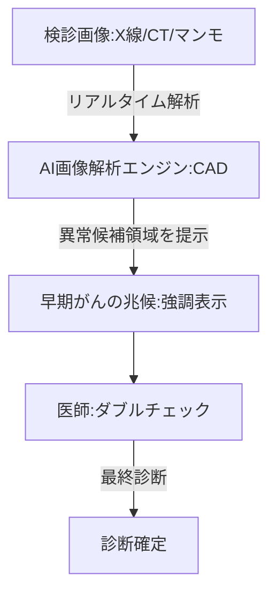

--- 
title: T11-02-01 AIがん検診画像診断支援システム
url: https://www.fujifilm.com/jp/ja/healthcare/artificial-intelligence
date: 2025-11-16
tags:
  - AI診断
  - がん検診
  - 画像診断支援
  - CAD
  - 見落とし防止
  - 予防医療
source: テクノロジーロードマップ2026-2035 第2部第11章、Google検索
---

# T11-02-01 AIがん検診画像診断支援システム

## Summary（5つの要点）

1.  **リアルタイム診断支援**: **胸部X線**、**CT**、**マンモグラフィ**、**内視鏡**の画像をAIがリアルタイムで解析し、**異常候補領域**を医師のモニタ上に**強調表示**（マーキング）する。

2.  **医師の負担軽減と見落とし防止**: 放射線科医や内視鏡医の**読影作業**を支援し、**ダブルチェック**の役割を担うことで、**見落とし率**を**大幅に低減**し、**診断精度**を**標準化**する。

3.  **早期がんの検出精度向上**: 人間の目では識別が困難な**微小**な**早期がん**の兆候（淡い陰影、微細な石灰化など）を**ディープラーニング**によって高感度に検出する。

4.  **国内市場のリード**: **富士フイルム**、**キヤノンメディカルシステムズ**、**オリンパス**など、**高品質な医療機器（ハードウェア）**を持つ日本企業が、**AI（ソフトウェア）**との**一体開発**で世界市場をリードしている。

5.  **保険適用と普及の加速**: **主要ながん検診**においてAI診断支援システムの**保険適用**が進んでおり、**健康診断**や**人間ドック**での**標準搭載**が加速している。

#### 概念図

---

### 技術評価表（定量的な視点）

| 評価項目 | 評価 | 根拠 |
| :--- | :--- | :--- |
| 導入コスト | ⭐⭐⭐⭐☆ | 既存の画像診断機器への**アドオン型ソフトウェア**が多く、クラウド利用も可能で導入コストは比較的低い。 |
| 技術成熟度 | ⭐⭐⭐⭐☆ | **肺がん**、**乳がん**、**大腸がん**の領域で**薬事承認**された製品が多数実用化されており、成熟期にある。 |
| 日本の競争力 | ⭐⭐⭐⭐⭐ | 富士フイルム、キヤノン、オリンパス、エルピクセルなど、**ハード・ソフト両面**で世界をリード。 |
| 市場性 | ⭐⭐⭐⭐⭐ | **がんの早期発見**は**医療費抑制**の**最重要課題**であり、**全ての検診市場**で需要がある。 |
| 品質保証の重要性 | ⭐⭐⭐⭐⭐ | **偽陽性**（過剰診断）と**偽陰性**（見落とし）の管理が、AIの**信頼性**と**医師の作業効率**に直結する。 |

---

## 日本の立ち位置・強み弱みのSummary

### 強み

* **ハードウェアとの一体開発**: **内視鏡**や**CT/MRI装置**で**世界シェア**を持つメーカーが、**AI**を**自社機器**に**最適化**して開発できる点。

* **高品質な臨床データ**: **国民皆保険制度**と**検診文化**により、AIの**学習**に不可欠な**高品質**かつ**時系列**の**画像データ**が豊富に存在する。

* **医師との連携**: **トップレベル**の**臨床医**と**AIエンジニア**の**連携**が**スムーズ**であり、**現場ニーズ**に即した開発が進んでいる。

### 弱み

* **データの多様性**: AIの**汎用性**を高めるために必要な、**多様な人種**や**稀な症例**の**画像データ**の**収集**が**国内**だけでは**困難**な場合がある。

* **医師のAI依存リスク**: AIの**提示**に**医師**が**過度**に**依存**し、**最終的**な**読影能力**が**低下**する**懸念**と、その**教育体制**が課題。

* **マルチモーダルAIの遅れ**: **血液データ**や**病理データ**など、**画像以外**の**情報**を**統合**して**診断**する**マルチモーダルAI**の**開発**は**発展途上**。

---

## 技術ロードマップ（短期/中期/長期）

### 短期目標（～2027年）

* **主要5大がん**（肺、胃、大腸、乳、肝臓）の**検診**において、**AI診断支援システム**の**導入率**が**50%**を超える。

* **AI**による**自動計測機能**（例：腫瘍の体積変化、石灰化の定量）が**標準化**され、**読影レポート**の**自動作成**が**実用化**される。

### 中期目標（2028年～2031年）

* **AI**が**過去の検診画像**との**経時的変化**を**自動**で**比較・分析**し、**将来**の**がん化リスク**を**予測**する**システム**が**実用化**される。

* **CT**、**MRI**、**病理画像**など、**複数**の**モダリティ（画像種別）**を**AI**が**統合的**に**解析**し、**診断精度**を**飛躍的**に**向上**させる。

### 長期目標（2032年～2035年）

* **AI**が**読影**の**一次スクリーニング**を**完全自動**で行い、**医師**は**AI**が**検出**した**異常所見**の**最終確認**のみを**行う**ワークフローが**確立**される。

* **AI**が**画像**から**がん**の**遺伝子変異**や**悪性度**を**予測**する**「ラジオミクス」**が**確立**され、**治療方針**の**決定**にも**貢献**する。

### 📚 参照リンク

1.  富士フイルムのAI技術「REiLI」: [https://www.fujifilm.com/jp/ja/healthcare/artificial-intelligence]

2.  キヤノンメディカルシステムズのAI技術: [https://jp.medical.canon/technology/ai]
