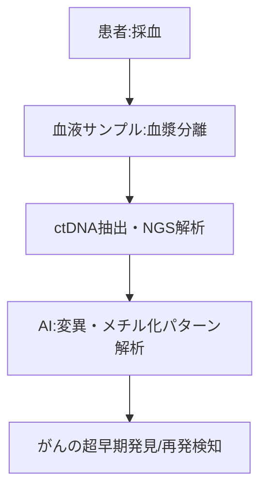

--- 
title: T11-02-02 リキッドバイオプシー（血液中循環がん細胞・DNA検出）
url: https://www.guardanthealth.com/jp/
date: 2025-11-16
tags:
  - リキッドバイオプシー
  - ctDNA
  - 超早期発見
  - がんスクリーニング
  - 非侵襲
  - 個別化医療
source: テクノロジーロードマップ2026-2035 第2部第11章、Google検索
---

# T11-02-02 リキッドバイオプシー（血液中循環がん細胞・DNA検出）

## Summary（5つの要点）

1.  **非侵襲的ながん検出**: **少量**の**血液**を**採取**するだけで、**がん**が**放出**する**微量**な**循環腫瘍DNA（ctDNA）**や**循環腫瘍細胞（CTC）**を**検出**する技術。

2.  **超早期スクリーニング**: **画像診断**では**検出不可能**な**ステージ0**や**ステージI**の**超早期**がんを**検出**できる**可能性**があり、**予防医療**の**ゲームチェンジャー**として期待される。

3.  **高感度検出技術**: **次世代シーケンサー（NGS）**と**AI**を**駆使**し、**血液中**に**ごく微量**（0.01%以下）しか**存在**しない**ctDNA**の**変異**を**高感度**に**検出**する。

4.  **マルチがん検出**: **一度**の**採血**で**複数**の**がん種**（肺がん、大腸がん、乳がんなど）の**存在**を**同時**に**スクリーニング**できる**「マルチキャンサー検出」**が**実用化**されている（例：Grail社のGalleri）。

5.  **再発モニタリング**: **手術後**の**患者**に対して**定期的**に**検査**を**行い**、**目**に**見えない**レベルでの**微小**な**残存がん**や**再発**の**兆候**を**早期**に**捉える**。

#### 概念図

---

### 技術評価表（定量的な視点）

| 評価項目 | 評価 | 根拠 |
| :--- | :--- | :--- |
| 導入コスト | ⭐⭐☆☆☆ | NGS解析とAI解析に**高額なコスト**がかかる。**保険適用**が**限定的**で、**自由診療**が中心。 |
| 技術成熟度 | ⭐⭐⭐☆☆ | **進行がん**の**治療選択（コンパニオン診断）**や**再発モニタリング**は**実用化**。**健常者**の**超早期スクリーニング**は**発展途上**。 |
| 日本の競争力 | ⭐⭐☆☆☆ | **米国**の**Grail**、**Guardant Health**、**Exact Sciences**が**市場**と**技術**を**独占**。日本企業は**追従**・**研究開発**段階。 |
| 市場性 | ⭐⭐⭐⭐⭐ | **全**ての**がん**の**早期発見**と**再発予測**に**応用可能**であり、**潜在市場**は**計り知れない**。 |
| 品質保証の重要性 | ⭐⭐⭐⭐⭐ | **偽陽性**（がんではないのに陽性）は**過剰**な**精密検査**と**精神的苦痛**を招き、**偽陰性**は**発見**の**遅れ**に**直結**する。 |

---

## 日本の立ち位置・強み弱みのSummary

### 強み

* **NGS技術**: **次世代シーケンサー**の**基礎技術**や**試薬**の**開発**において**一定**の**競争力**を持つ。

* **AIアルゴリズム**: **PreferredNetworks**などが**AI**を**活用**した**独自**の**ctDNA解析アルゴリズム**の**研究開発**を**推進**している。

* **大規模コホート**: **バイオバンク・ジャパン**など、**高品質**な**臨床情報**と**紐付**いた**血液サンプル**の**蓄積**がある。

### 弱み

* **市場の独占**: **米国**の**先行企業**が**大規模**な**臨床試験**と**膨大**な**データ**で**市場**を**席巻**しており、**参入障壁**が**極めて高い**。

* **承認プロセスの遅れ**: **健常者**を**対象**とした**超早期スクリーニング検査**の**薬事承認**や**保険適用**の**議論**が**米国**に**比べ**て**遅れている**。

* **コスト競争力**: **検査コスト**を**数万円**レベルまで**下げる**ための**技術革新**と**スケールメリット**の**確保**が**課題**。

---

## 技術ロードマップ（短期/中期/長期）

### 短期目標（～2027年）

* **進行がん患者**の**治療薬選択（コンパニオン診断）**目的での**リキッドバイオプシー**が**保険適用**のもと**標準化**される。

* **手術後**の**再発モニタリング**目的での**検査**が、**主要ながん**（大腸がん、乳がんなど）で**実用化**される。

### 中期目標（2028年～2031年）

* **AI**による**解析精度**が**向上**し、**偽陽性・偽陰性率**が**大幅**に**改善**された**超早期スクリーニング検査**が**薬事承認**される。

* **がん検診**の**オプション**として、**マルチがん**の**リキッドバイオプシー**が**人間ドック**などで**広く提供**される。

### 長期目標（2032年～2035年）

* **リキッドバイオプシー**が**画像診断**と**同等**、あるいは**それ以上**の**精度**を持つ**がん検診**の**第一選択（プライマリースクリーニング）**となる。

* **がん**だけでなく、**アルツハイマー病**などの**神経変性疾患**の**超早期リスク**も**血液**で**診断**できる**技術**が**確立**される。

### 📚 参照リンク

1.  Guardant Health（ガーダントヘルスジャパン）: [https://www.guardanthealth.com/jp/]

2.  リキッドバイオプシーの最新動向（国立がん研究センター）: [https://www.ncc.go.jp/jp/]
