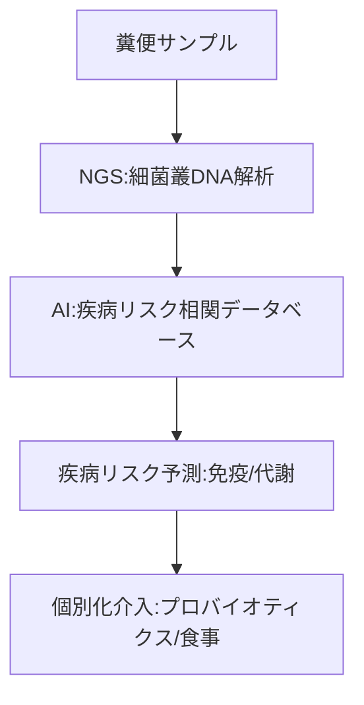

--- 
title: T11-02-03 腸内マイクロバイオーム解析・疾病リスク予測
url: https://www.metagen.co.jp/
date: 2025-11-16
tags:
  - マイクロバイオーム
  - 腸内細菌
  - NGS
  - プロバイオティクス
  - 未病
  - AI解析
source: テクノロジーロードマップ2026-2035 第2部第11章、Google検索
---

# T11-02-03 腸内マイクロバイオーム解析・疾病リスク予測

## Summary（5つの要点）

1.  **腸内細菌叢の網羅的解析**: **次世代シーケンサー（NGS）**を用いて**糞便中**の**細菌**の**遺伝子（16S rRNA、メタゲノム）**を**網羅的**に**解析**し、**腸内細菌**の**種類**と**構成比率**を**同定**する。

2.  **疾病リスクとの相関**: **腸内細菌叢**の**バランス（ディスバイオーシス）**が、**メタボリックシンドローム**、**免疫疾患**（アレルギー、炎症性腸疾患）、**精神疾患**（うつ病）、**がん**と**強**い**相関**があることが**解明**されつつある。

3.  **AIによるリスク予測**: **数万人規模**の**細菌叢データ**と**臨床データ**を**AI**で**解析**し、**個人**の**腸内環境**が**将来**どのような**疾病**に**かかりやすいか**を**予測**する**モデル**を**構築**する。

4.  **個別化介入（プロバイオティクス）**: 解析結果に基づき、**個人**に**最適**な**プロバイオティクス（有用菌）**、**プレバイオティクス（菌の餌）**、**食事指導**を**提供**し、**腸内環境**を**改善**することで**疾病**を**予防**する。

5.  **メタボローム解析との統合**: **細菌**が**産生**する**代謝物（メタボローム）**も**同時**に**解析**することで、**腸内環境**が**宿主（ヒト）**に**与える****影響**を**より****直接的**に**評価**する。

#### 概念図

---

### 技術評価表（定量的な視点）

| 評価項目 | 評価 | 根拠 |
| :--- | :--- | :--- |
| 導入コスト | ⭐⭐⭐⭐☆ | NGS解析コストが低下し、**数千円～数万円**の**DTC（Direct-to-Consumer）検査**として普及。 |
| 技術成熟度 | ⭐⭐☆☆☆ | 解析技術は成熟。**相関関係**から**因果関係**への**科学的証明**と、**有効な介入法**の**確立**は**発展途上**。 |
| 日本の競争力 | ⭐⭐⭐⭐☆ | **慶應義塾大学**、**理化学研究所**などの**基礎研究**が**世界**を**リード**。**メタジェン**、**サイキンソー**などの**有力ベンチャー**も存在。 |
| 市場性 | ⭐⭐⭐⭐⭐ | **健康食品**、**サプリメント**、**製薬**、**保険**など、**極めて広範**な**産業**への**波及効果**が**期待**される。 |
| 品質保証の重要性 | ⭐⭐⭐☆☆ | 予防・ウェルネス分野が中心だが、**介入**（サプリ等）の**有効性**の**科学的根拠（エビデンス）**が**重要**。 |

---

## 日本の立ち位置・強み弱みのSummary

### 強み

* **基礎研究の蓄積**: **慶應義塾大学先端生命科学研究所**（福田真嗣教授ら）など、**メタボローム解析**を**含めた****腸内細菌研究**で**世界**を**リード**。

* **有力なスタートアップ**: **メタジェン**、**サイキンソー**、**アネリス**など、**大学発**の**有力**な**マイクロバイオームベンチャー**が**多数存在**する。

* **発酵食品文化**: **納豆**、**味噌**、**乳酸菌飲料**など、**腸内環境**への**関心**が**国民的**に**高**く、**市場**として**成熟**している。

### 弱み

* **相関から因果への壁**: 「**腸内細菌叢の乱れが病気の原因か、結果か**」という**因果関係**の**証明**が**科学的**に**困難**であり、**介入**の**有効性**を**示し**にくい。

* **DTC市場の乱立**: **科学的根拠**が**不十分**な**簡易検査サービス**が**乱立**し、**市場**の**信頼性**を**損なう**リスクがある。

* **標準化の欠如**: **糞便**の**採取方法**、**DNA抽出法**、**解析パイプライン**が**企業**ごとに**異なり**、**データ**の**互換性**が**低**い。

---

## 技術ロードマップ（短期/中期/長期）

### 短期目標（～2027年）

* **腸内細菌叢**の**解析**が**人間ドック**や**健康診断**の**標準オプション**として**普及**する。

* **メタボリックシンドローム**や**便秘**など、**比較的**エビデンスが**強固**な**分野**で**個別化**された**プロバイオティクス**・**食事指導**が**提供**される。

### 中期目標（2028年～2031年）

* **AI**が**マイクロバイオーム**と**メタボローム**の**関係性**を**解明**し、**個人**の**健康状態**を**高精度**に**予測**する**モデル**が**確立**される。

* **腸内細菌叢**を**標的**とした**「細菌製剤（ライブバイオセラピューティクス）」**が、**炎症性腸疾患（IBD）**などの**難病治療薬**として**承認**される。

### 長期目標（2032年～2035年）

* **マイクロバイオーム解析**が**精神疾患**（うつ病など）や**免疫疾患**（アレルギーなど）の**診断**・**治療**に**不可欠**な**ツール**となる。

* **個人**の**腸内環境**を**最適**な**状態**に**デザイン**する**「腸内細菌叢エンジニアリング」**が**確立**され、**究極**の**個別化予防医療**が**実現**する。

### 📚 参照リンク

1.  株式会社メタジェン (Metagen Inc.): [https://www.metagen.co.jp/]

2.  慶應義塾大学先端生命科学研究所（福田研究室）: [https://www.iab.keio.ac.jp/]
