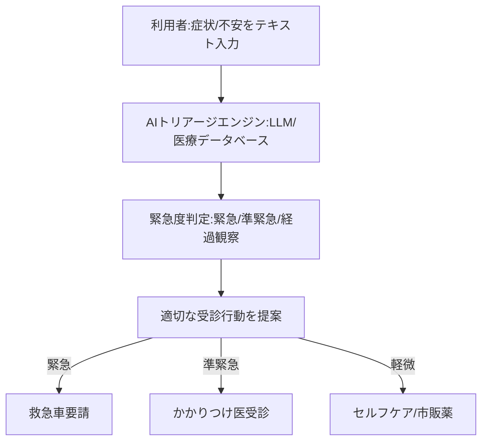

--- 
title: T11-02-04 AIチャットボット健康相談・トリアージシステム
url: https://linehealthcare.co.jp/
date: 2025-11-16
tags:
  - AIチャットボット
  - 医療相談
  - トリアージ
  - LLM
  - 予防医療
  - 受診行動変容
source: テクノロジーロードマップ2026-2035 第2部第11章、Google検索
---

# T11-02-04 AIチャットボット健康相談・トリアージシステム

## Summary（5つの要点）

1.  **24時間365日対応**: **夜間**や**休日**など**医療機関**が**閉まっている**時間帯でも、**健康**に関する**不安**や**症状**について**AI**が**即時**に**対応**する。

2.  **症状トリアージ**: **入力**された**症状**（例：「38度の熱と頭痛」）に基づき、**AI**が**緊急度**を**判定**。**救急車**の**要請**、**即時受診**、**翌日の受診**、**市販薬**での**セルフケア**など、**適切**な**受診行動**を**提案**する。

3.  **LLM（大規模言語モデル）の活用**: **従来**の**ルールベース**や**単純**な**AI**から**進化**し、**LLM**を**活用**することで、**曖昧**な**表現**や**複雑**な**文脈**を**理解**し、**人間**の**看護師**と**対話**するような**自然**な**健康相談**を**実現**する。

4.  **医療リソースの適正化**: **軽症者**の**不要**な**救急受診**（コンビニ受診）を**抑制**し、**重症者**の**早期発見**を**促す**ことで、**医療現場**の**逼迫**を**緩和**し、**医療リソース**の**適正配分**に**貢献**する。

5.  **予防医療への誘導**: **急性症状**だけでなく、**日常的**な**健康**の**悩み**（「疲れが取れない」など）に対し、**生活習慣**の**改善**や**予防医療サービス**（T11-01-04など）へ**誘導**する**窓口**としての**役割**も担う。

#### 概念図

---

### 技術評価表（定量的な視点）

| 評価項目 | 評価 | 根拠 |
| :--- | :--- | :--- |
| 導入コスト | ⭐⭐⭐⭐☆ | アプリやWebサービスとして提供され、利用者コストは低い。医療機関側の導入も比較的安価。 |
| 技術成熟度 | ⭐⭐⭐☆☆ | **LLM**の**登場**により**急速**に**進化中**。**医療情報**の**正確性**と**安全性**の**担保**が**課題**。 |
| 日本の競争力 | ⭐⭐⭐⭐☆ | **LINE**など**強力**な**プラットフォーマー**が**参入**。**高品質**な**医療辞書**との**連携**に**強み**。 |
| 市場性 | ⭐⭐⭐⭐⭐ | **医療費抑制**、**医療DX**の**入り口**として**政府**・**自治体**からの**需要**が**極めて高い**。 |
| 品質保証の重要性 | ⭐⭐⭐⭐⭐ | **トリアージ**の**判断ミス**（特に**重症**の**見逃し**）は**生命**に**直結**するため、**医療機器**としての**厳格**な**品質管理**が**必要**。 |

---

## 日本の立ち位置・強み弱みのSummary

### 強み

* **プラットフォーム基盤**: **LINE**のような**国民的**な**コミュニケーションインフラ**を**活用**でき、**国民**への**リーチ**が**容易**。

* **医療情報の信頼性**: **Ubie**（ユビー）など、**現役医師**が**監修**する**高品質**な**症状検索エンジン**や**医療データベース**が**存在**する。

* **AI技術**: **日本語**の**自然言語処理（NLP）**および**医療分野**に**特化**した**LLM**の**開発**が**活発**。

### 弱み

* **薬事承認のハードル**: **トリアージ**を**行う**システムは**医療機器プログラム（SaMD）**と**みなされる**ため、**厳格**な**臨床試験**と**薬事承認**が**必要**であり、**開発**が**長期化**する。

* **LLMの正確性**: **生成AI**は**「ハルシネーション」（虚偽）**を**生成**する**リスク**があり、**医療**という**ドメイン**での**安全性担保**が**至難**の**業**。

* **責任の所在**: **AI**の**判断**に**基づき**、**受診**を**見送った**結果、**重症化**した場合の**法的**・**倫理的**な**責任**の**所在**が**未整備**。

---

## 技術ロードマップ（短期/中期/長期）

### 短期目標（～2027年）

* **医療機器**として**承認**された**AIトリアージシステム**が、**自治体**の**救急相談窓口（#7119など）**や**オンライン診療**の**初期問診**として**導入**される。

* **LLM**を**搭載**した**チャットボット**が、**一般的**な**健康相談**や**市販薬**の**推奨**を**安全**に**行える**よう**実用化**される。

### 中期目標（2028年～2031年）

* **AIチャットボット**が**PHR**（T11-01-05）と**連携**し、**個人**の**既往歴**や**アレルギー情報**を**踏まえ**た**高精度**な**トリアージ**を**実現**する。

* **トリアージ**から**オンライン診療**、**処方箋発行**、**医療機関**の**予約**までを**シームレス**に**連携**する**プラットフォーム**が**確立**される。

### 長期目標（2032年～2035年）

* **AI**が**医療相談**の**第一窓口**として**社会**に**定着**し、**医療リソース**の**最適配分**が**実現**する。

* **AI**が**ウェアラブル**からの**微細**な**体調変化**（T11-01-02）を**検知**し、**チャット**で**先制的**に**介入**する**「プッシュ型」**の**健康管理**が**実現**する。

### 📚 参照リンク

1.  LINEヘルスケア: [https://linehealthcare.co.jp/]

2.  症状検索エンジン「ユビー（Ubie）」: [https://ubie.app/]
