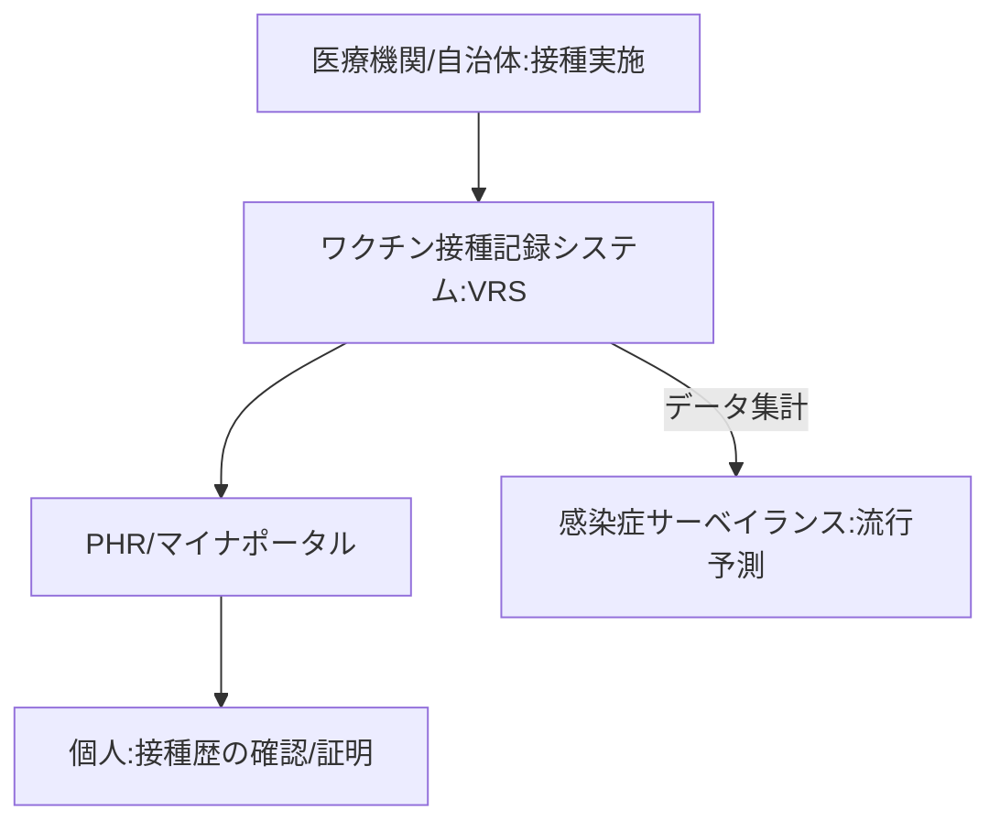

--- 
title: T11-02-05 予防接種・ワクチン接種管理デジタル基盤
url: https://www.digital.go.jp/policies/vaccine/
date: 2025-11-16
tags:
  - 予防接種
  - ワクチン管理
  - VRS
  - デジタル基盤
  - PHR
  - 感染症対策
source: テクノロジーロードマップ2026-2035 第2部第11章、Google検索
---

# T11-02-05 予防接種・ワクチン接種管理デジタル基盤

## Summary（5つの要点）

1.  **接種歴の一元管理**: **乳幼児期**の**定期接種**から**高齢者**の**肺炎球菌ワクチン**、**新型インフルエンザ**などの**臨時接種**まで、**すべて**の**接種履歴**を**デジタル**で**一元的**に**管理**する。

2.  **PHR・マイナポータル連携**: **ワクチン接種記録システム（VRS）**と**PHR基盤**（T11-01-05）、**マイナポータル**を**連携**させ、**個人**が**自身**の**接種履歴**を**スマートフォン**などで**容易**に**確認・証明**できる**環境**を**整備**する。

3.  **自動通知・予約システム**: **次回**の**接種時期**や**新**たに**推奨**される**ワクチン**を**自動**で**リマインド**し、**医療機関**の**予約**までを**シームレス**に**行う**システムを**構築**する。

4.  **感染症サーベイランス**: **接種状況**の**データ**を**リアルタイム**で**集計・分析**し、**地域**ごとの**免疫獲得状況**を**可視化**。**感染症**の**流行予測**や**ワクチン**の**最適配分**に**活用**する。

5.  **国際標準準拠**: **WHO**が**推進**する**「SMART Guidelines」**や**国際標準規格（HL7 FHIR）**に**準拠**し、**海外渡航時**の**ワクチンパスポート**など、**国際的**な**相互運用性**を**確保**する。

#### 概念図

---

### 技術評価表（定量的な視点）

| 評価項目 | 評価 | 根拠 |
| :--- | :--- | :--- |
| 導入コスト | ⭐⭐☆☆☆ | **全国民**を**対象**とする**国家規模**の**インフラ整備**であり、**初期**・**運用コスト**は**莫大**。 |
| 技術成熟度 | ⭐⭐⭐☆☆ | **VRS**は**稼働**。**既存**の**紙ベース**の**記録（母子手帳など）**からの**デジタル移行**と**PHR**への**完全統合**が**課題**。 |
| 日本の競争力 | ⭐⭐⭐⭐☆ | **デジタル庁**の**強力**な**リーダーシップ**のもと、**VRS**の**構築**・**運用**を**短期間**で**実現**した**実績**がある。 |
| 市場性 | ⭐⭐⭐⭐⭐ | **公衆衛生**・**感染症対策**の**根幹**であり、**国策**として**必須**の**インフラ**。 |
| 品質保証の重要性 | ⭐⭐⭐⭐⭐ | **接種記録**の**誤り**は**国民**の**健康**と**信頼**に**直結**。**データ**の**正確性**と**セキュリティ**が**最優先**。 |

---

## 日本の立ち位置・強み弱みのSummary

### 強み

* **VRSの構築実績**: **新型コロナワクチン**接種において、**デジタル庁**が**主導**し、**VRS**を**短期間**で**構築**・**運用**した**経験**と**実績**。

* **マイナンバー基盤**: **マイナポータル**という**全国民**を**対象**とした**デジタル基盤**が**存在**し、**PHR**との**連携**が**容易**。

* **公衆衛生体制**: **自治体**を**中心**とした**公衆衛生**・**予防接種**の**実施体制**が**強固**である。

### 弱み

* **過去データのデジタル化**: **新型コロナ以前**の**接種履歴**の**大部分**が**紙（母子手帳など）**で**管理**されており、これらの**データ**を**遡及的**に**デジタル化**することが**困難**。

* **自治体間のシステム分断**: **予防接種**の**管理システム**が**自治体**ごとに**異なり**、**データ**の**標準化**と**連携**が**進んでいない**。

* **法制度の壁**: **個人**の**接種情報**を**集約**・**分析**する際の**個人情報保護法**との**調整**や、**法的な枠組み**の**整備**が**必要**。

---

## 技術ロードマップ（短期/中期/長期）

### 短期目標（～2027年）

* **VRS**と**マイナポータル**の**連携**が**完了**し、**国民**が**自身**の**接種履歴**（**新型コロナ以外**も**含む**）を**デジタル**で**一覧**できる**環境**を**整備**する。

* **自治体**の**予防接種システム**の**標準化**（**HL7 FHIR**準拠）を**推進**し、**転居**などに**伴う****接種履歴**の**引き継ぎ**を**自動化**する。

### 中期目標（2028年～2031年）

* **デジタル基盤**が**PHR**と**完全**に**統合**され、**AI**が**個人**の**接種履歴**と**健康状態**に**基づき**、**最適**な**接種スケジュール**を**自動**で**提案・予約**する。

* **接種データ**と**感染症発生データ**を**リアルタイム**で**突合**し、**ワクチン**の**有効性**や**副反応**を**迅速**に**評価**する**システム**（**リアルワールドデータ**）が**確立**される。

### 長期目標（2032年～2035年）

* **予防接種デジタル基盤**が**アジア**・**太平洋地域**の**ハブ**となり、**国際的**な**感染症対策（パンデミック対応）**において**主導的**な**役割**を**果たす**。

* **ゲノム情報**（T11-01-01）と**連携**し、**個人**の**免疫応答**を**予測**し、**ワクチン**の**種類**や**接種量**を**最適化**する**個別化ワクチンプログラム**が**実現**する。

### 📚 参照リンク

1.  ワクチン接種記録システム（VRS）について（デジタル庁）: [https://www.digital.go.jp/policies/vaccine/]

2.  データヘルス改革の推進（厚生労働省）: [https://www.mhlw.go.jp/stf/seisakunitsuite/bunya/kenkou_iryou/iryou/johoka/index.html]
