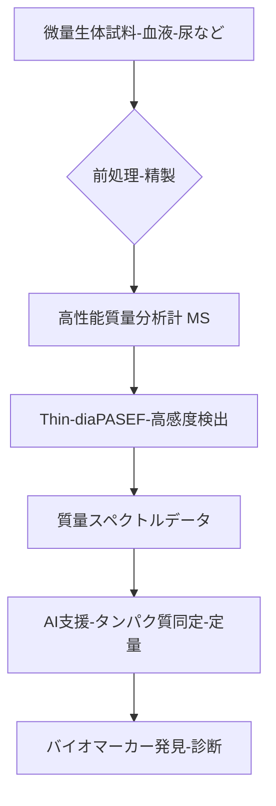

# T11-05-01 質量分析計高感度タンパク質検出

## 技術の位置づけ
プロテオミクスの基盤となるこの技術は、高性能な質量分析装置（MS）を用いて、生体内の微量なタンパク質を大規模かつ定量的に分析する技術です。従来の技術では検出が困難であった極めて少ない量のタンパク質を捉えることで、病気の早期発見や治療効果予測に役立つ**バイオマーカー**の発見を加速させます。用いる主な計測技術は、**高性能質量分析計 (MS)**と、検出感度を劇的に向上させる**Thin-diaPASEF**などの新しい分析技術です。

## Summary（5つの要点）
1. **検出感度の飛躍的向上**: Thin-diaPASEFなどの新技術により、細胞から一度の分析で**9,400種類**ものタンパク質を定量的に検出可能となった \`1\`。
2. **市場の安定成長**: 生物医学研究、がん診断、精密医療の需要増加を背景に、タンパク質検出・定量化市場は**年平均成長率（CAGR）6〜8％**で拡大している \`8\`。
3. **AI支援の標準化**: リアルタイム画像処理、クラウド接続に加え、AI支援分析機能が新しいMSシステムの標準機能となり、データ解析の高度化が進む \`8\`。
4. **信頼性の確保**: 検出感度の向上により、今まで見つけられなかった微量のタンパク質も分析でき、より信頼性の高い情報が得られるようになった \`1\`。
5. **個別化医療への貢献**: 疾患特異的なタンパク質の変動を正確に捉えることで、個別化医療における**診断技術**と**治療法開発**の基盤を提供する。

#### 概念図

## 具体的プロダクト事例
* **日本企業**:
    * **島津製作所**: 高速・高分解能の液体クロマトグラフィー質量分析計（LC-MS）システムを提供し、プロテオミクス研究の基盤を支える。
    * **かずさDNA研究所**: **Thin-diaPASEF**技術を開発し、プロテオミクスの検出感度を大幅に向上させる研究成果を発表した \`1\`。
* **グローバル**:
    * **Thermo Fisher Scientific**: Orbitrap技術を搭載した質量分析計は、高い分解能と質量精度でプロテオミクス分野のデファクトスタンダードとなっている。
    * **Bruker**: paSCOPEやdiaPASEFなどの革新的な技術を搭載した質量分析計を提供し、プロテオーム解析時間の短縮と網羅性の向上を実現。

---
### 技術評価表（定量的な視点）
| 評価項目 | 評価 | 根拠 |
| :--- | :--- | :--- |
| 導入コスト | ⭐⭐☆☆☆ | 装置本体が高額で、専門的なメンテナンスが必要。 |
| 技術成熟度 | ⭐⭐⭐⭐☆ | 装置としての技術は確立。検出感度向上技術が急速に進化中。 |
| 日本の競争力 | ⭐⭐⭐☆☆ | 装置開発・製造では欧米が先行。応用研究・新技術開発は国内で活発。 |
| 市場性 | ⭐⭐⭐⭐⭐ | がん、認知症、感染症診断におけるバイオマーカー探索需要が高く、市場は拡大 \`8\`。 |
| 品質保証の重要性 | ⭐⭐⭐⭐⭐ | 微量サンプルの**定量精度**、**再現性**、**測定感度**が診断結果に直結。 |

---
## 日本の立ち位置・SWOT分析
### 強み
* 高性能な**前処理技術**および**分離技術（LC）**の基盤技術が高い。
* 国内研究機関（かずさDNA研究所など）による**独自の高感度化手法**（例: Thin-diaPASEF）の開発が進んでいる \`1\`。
* 臨床検体解析における**精密なプロトコル**の確立と、医療機器としての品質管理ノウハウ。

### 弱み
* 最新鋭の**質量分析計本体**の多くを海外メーカー（Thermo, Bruker）に依存している。
* プロテオミクスデータを扱う**専門人材（バイオインフォマティクス）**の育成が追い付いていない。
* 臨床検体を大規模に扱うための**標準化された解析パイプライン**の整備が遅れている。

## 専門家視点の技術調査ポイント
### 品質保証エンジニアの視点
* **測定精度と再現性**: 極微量（アトモルレベル）のタンパク質に対する**定量精度**と、複数施設・複数ロットでの**再現性**の厳格な検証。
* **ノイズ対策と干渉除去**: サンプル中の夾雑物やマトリックス効果による**イオン化抑制**を防ぐための前処理とMSパラメータの最適化。
* **データ信頼性評価**: 検出されたペプチド/タンパク質の**偽陽性率（FDR）**を低く抑えるための解析アルゴリズムの検証。

### 化学系大学生への示唆
* **分析化学・機器分析**: 高度な**質量分析計**（イオン化、質量分離）の原理と、液体クロマトグラフィーなどの**分離技術**の習得。
* **プロテオーム解析技術**: ペプチドの**酵素分解**（トリプシン処理）、**化学修飾**、**標識化技術**（iTRAQ/TMT）など、サンプル調製プロセスへの理解。
* **データサイエンス・ケモインフォマティクス**: 膨大な質量スペクトルデータからタンパク質を同定・定量するための**統計学**、**機械学習**、**Python**を用いたデータ解析能力。

---
## 技術ロードマップ（短期/中期/長期）
### 短期目標（～2027年）
* 高感度化技術（Thin-diaPASEFなど）の商用MSへの搭載と、臨床研究への適用拡大。
* AIを用いた質量スペクトル解析アルゴリズムの精度向上と、解析時間の半減。
* リキッドバイオプシー検体（血漿、エクソソーム）からの**定量バイオマーカーパネル**の臨床検証開始。

### 中期目標（2028年～2031年）
* 質量分析ベースの診断薬（IVD）の**薬事承認**取得と、保険適用に向けた臨床試験の実施。
* 単一細胞レベルのプロテオミクス解析（Single-Cell Proteomics）の**安定化**と、がん・免疫疾患研究への普及。
* **メタボローム解析**や**脂質解析**との統合解析プラットフォームの確立。

### 長期目標（2032年～2035年）
* 質量分析計が医療現場で**ルーチン診断機器**として広く普及し、早期診断・予後予測に貢献。
* ウェアラブルセンサーと連動した**パーソナルプロテオミクス**の実現。
* タンパク質の動的変化（修飾など）をリアルタイムで捉える**動的プロテオミクス**の確立。

### 📚 参照リンク
1.  [タンパク質大規模解析の検出感度を向上させる新技術を開発 | かずさDNA研究所](https://www.kazusa.or.jp/news/pr250814/)
2.  [タンパク質分析技術：検出と定量化の新時代 - UPRtek](https://www.uprtek.com/ja/blogs/protein-analysis-techniques)
3.  [製薬業界のAI活用事例17選！創薬・研究の効率化・自動化を実現【2025年最新版】](https://ai-market.jp/industry/ai-medical-medicine/)
