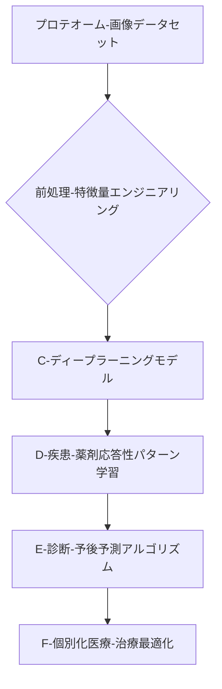

# T11-05-02 AI機械学習タンパク質パターン解析

## 技術の位置づけ
質量分析計や画像診断などで取得された膨大な**プロテオームデータ**を、機械学習（特にディープラーニング）を用いて解析し、疾患の有無、進行度、薬剤応答性などのパターンを抽出する技術です。従来の統計解析では困難な**多種類のタンパク質の複合的・非線形な関連性**を明らかにし、診断や創薬の精度を向上させます。用いる主な計測技術は、**高性能質量分析計 (MS)**および、**位相差顕微鏡**などの光学測定による画像データです。

## Summary（5つの要点）
1. **非侵襲的細胞内解析**: 位相差像などの非染色・非固定の画像から、生きたままの細胞内タンパク質の発現量をAIが推定可能となった \`2\`。
2. **高い診断性能**: エクソソームに含まれるタンパク質パネルを用いたがん診断AIでは、感度**95%**、特異度**90%**という高い判別性能が示されている \`6\`。
3. **創薬期間の短縮**: AIがタンパク質配列の生成や最適化を担うことで、従来の開発期間を最大**50%短縮**し、実験回数を**70%以上**削減するスタートアップも登場している。
4. **オーダーメイド治療**: 患者のプロテオームパターンを解析することで、個別化されたがんワクチン（例: NEC/Transgeneの共同開発）や治療法の開発が進む。
5. **多角的データ統合**: 複数のオミクスデータ（ゲノミクス、トランスクリプトミクス）とプロテオミクスデータを統合し、生命現象をシステムレベルで理解する基盤となる。

#### 概念図

## 具体的プロダクト事例
* **日本企業**:
    * **株式会社ファンケル / サイトロニクス株式会社**: 培養細胞の画像から、生きた細胞内の複数種のタンパク質を推定できるAI技術を開発 \`2\`。
    * **NEC**: フランスのTransgene社と共同で、AIを活用し、患者ごとのネオアンチゲン（新しい抗原）を標的とするオーダーメイドのがんワクチンを開発。
* **グローバル**:
    * **Cradle**: 生成AIモデルと実験データを統合し、タンパク質工学のプロセスを劇的に加速させる技術を提供。Johnson & Johnsonなど大手と提携実績を持つ。
    * **Deep Genomics**: AIを用いて遺伝子変異がタンパク質に与える影響を予測し、RNA治療薬のターゲットを特定。

---
### 技術評価表（定量的な視点）
| 評価項目 | 評価 | 根拠 |
| :--- | :--- | :--- |
| 導入コスト | ⭐⭐⭐☆☆ | ソフトウェア、AI基盤（GPU）、大規模データストレージへの投資が必要。 |
| 技術成熟度 | ⭐⭐⭐☆☆ | 特定の応用（画像解析、創薬支援）で成果が出始めているが、汎用モデルは途上。 |
| 日本の競争力 | ⭐⭐⭐☆☆ | 創薬・ヘルスケア分野でのAI導入は積極的だが、基盤となるAIモデル開発で欧米に一日の長がある。 |
| 市場性 | ⭐⭐⭐⭐⭐ | 創薬研究の効率化、新規診断法の開発という医療の最重要課題を解決するため市場は急拡大。 |
| 品質保証の重要性 | ⭐⭐⭐⭐⭐ | **学習データセットのバイアス**や、モデルの**誤判定率**が誤診や治療方針決定に重大な影響を与える。 |

---
## 日本の立ち位置・SWOT分析
### 強み
* **高品質な臨床データ**: 均一で質の高い医療体制により、AI学習に利用可能な**高品質な臨床・生体データ**が蓄積されている。
* **異業種連携**: ライフサイエンス企業（ファンケル）とAIベンチャーの連携など、**実用化に向けた共同研究**が活発 \`2\`。
* **エクソソーム研究の先進性**: 東京工業大学など、エクソソームプロテオーム解析を用いたがん診断技術の開発に先行 \`6\`。

### 弱み
* **データガバナンスと連携の遅れ**: 個人情報保護法の制約や、医療機関間のデータ連携体制の未整備が**大規模データセット構築**の障壁。
* **AI専門人材不足**: 医療・生命科学の知識を持つ**バイオインフォマティクス**と**AIエンジニア**の融合人材が不足。
* **海外プラットフォームへの依存**: 解析用ライブラリやAI開発フレームワークの多くが海外発。

## 専門家視点の技術調査ポイント
### 品質保証エンジニアの視点
* **モデルの汎用性と堅牢性**: 異なる計測機器や異なる人種集団のデータに対する**AIモデルの予測安定性**と**外挿性**の検証。
* **説明可能性（XAI）**: 診断結果に至るまでの**判断根拠**を定量的に提示し、臨床医の信頼性を確保する技術の検証。
* **データ収集の品質管理**: AI学習に用いるプロテオームデータの**前処理プロトコル**、**欠損値処理**、**ラベル付け**の標準化。

### 化学系大学生への示唆
* **データ解析・機械学習**: **ディープラーニング**、特に**畳み込みニューラルネットワーク (CNN)** や**トランスフォーマー**などを用いた配列・画像解析技術の習得。
* **生物統計学**: プロテオミクスデータの**多変量解析**、**統計的仮説検定**、**モデル評価指標**（ROC曲線、感度・特異度）の理解。
* **生体分子間相互作用**: タンパク質、脂質、核酸などの**分子間ネットワーク**を化学的に理解し、AIモデルの解釈に役立てる。

---
## 技術ロードマップ（短期/中期/長期）
### 短期目標（～2027年）
* AIによる特定の疾患バイオマーカーパネルの**精度90%超**での同定と、臨床研究への適用。
* AI創薬における**リード化合物探索**の初期段階における導入率の増加（30%以上）。
* 生きた細胞のタンパク質推定AIの**多種類タンパク質**への適用拡大と、創薬初期スクリーニングへの利用。

### 中期目標（2028年～2031年）
* AI解析による疾患診断モデルの**医療機器承認（SaMD）**の取得。
* **マルチオミクス統合解析AI**（ゲノム・プロテオーム・メタボローム）のプラットフォーム化。
* **生成AI**を用いた新規機能性タンパク質（酵素、抗体）の**in silico設計**の実現。

### 長期目標（2032年～2035年）
* AIが主導する**リアルタイムな個別化治療戦略**（投薬量、組み合わせ）の臨床現場への普及。
* 健康診断データ、ウェアラブルデータと統合された**予防医療AI**が、タンパク質パターンから疾患を**発症の数年前に予測**。
* ヒトの細胞内タンパク質ネットワークの**動的シミュレーション**をAIが担う。

### 📚 参照リンク
1.  [生きた細胞内のタンパク質発現量を推定するAI技術を開発 - ファンケル](https://www.fancl.jp/news/20240091/news_20240091.html)
2.  [製薬業界のAI活用事例17選！創薬・研究の効率化・自動化を実現【2025年最新版】](https://ai-market.jp/industry/ai-medical-medicine/)
3.  [AIを活用しタンパク質工学に革新をもたらすバイオテックスタートアップ「Cradle」｜AI #13 - note](https://note.com/saas_penguin/n/n8ff17a3ddd78)
4.  [血液内のエクソソームをバイオマーカーとしたがん診断法の開発 - 東京工業大学](https://www.titech.ac.jp/news/2020/047710)
5.  [AIを用いてタンパク質結晶構造を評価する技術を確立 | 田辺三菱製薬株式会社](https://www.mt-pharma.co.jp/news/2021/MTPC211220.html)
