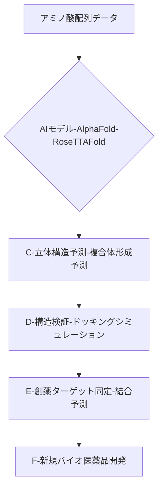

# T11-05-03 タンパク質構造予測AI（AlphaFoldなど）

## 技術の位置づけ
タンパク質のアミノ酸配列情報から、その機能に不可欠な**立体構造**をコンピュータ上で高精度に推定する技術です。従来の実験的手法に要する**時間とコストを劇的に削減**し、創薬ターゲットの特定や新規タンパク質の設計を加速させる、生命科学におけるブレークスルーとなりました。用いる主な計測技術（関連技術）は、**ディープラーニング**を用いた**配列解析**と、**分子動力学シミュレーション**による構造安定性評価です。

## Summary（5つの要点）
1. **予測精度の革命**: **AlphaFold 2**以降、予測精度が飛躍的に向上し、多くのタンパク質で実験的に決定された構造とほぼ同等の精度を達成した \`7\`。
2. **適用範囲の拡大**: 最新の**AlphaFold 3**では、タンパク質単体だけでなく、DNA、RNA、リガンドなどの**複合体構造**の予測も可能になり、生命現象の理解が深化する \`3\`。
3. **創薬プロセスの短縮**: 標的タンパク質の構造決定がボトルネックではなくなり、創薬の初期段階が大幅に短縮され、**研究開発のスピード**が加速している \`3\`。
4. **市場の急拡大**: AIを活用した創薬技術全体の売上高は急拡大しており、2027年には**40億米ドル**に達すると予測されている \`9\`。
5. **新たな設計領域の開拓**: 予測技術を応用し、特定の機能を持つ**新規タンパク質（バイオ医薬品）の設計**や**人工酵素の作成**など、タンパク質デザインへの応用が進む \`7\`。

#### 概念図

## 具体的プロダクト事例
* **日本企業**:
    * **中外製薬**: AlphaFoldなどのAI技術を活用し、社内で誰もがアクセスでき、**1日1,000個**程度の配列情報を推論可能なタンパク質構造予測システム構築を目指している。
    * **田辺三菱製薬**: AIを用いてタンパク質結晶構造の品質を評価する技術を確立し、構造解析の効率化を図っている \`5\`。
* **グローバル**:
    * **DeepMind (Google)**: **AlphaFold**の開発元であり、タンパク質構造予測技術のデファクトスタンダードを確立。
    * **Baker Lab (ワシントン大学)**: AlphaFoldと同様の性能を持つオープンソースのAI予測ツール**RoseTTAFold**を開発し、研究コミュニティに貢献。

---
### 技術評価表（定量的な視点）
| 評価項目 | 評価 | 根拠 |
| :--- | :--- | :--- |
| 導入コスト | ⭐⭐⭐☆☆ | モデル利用自体は無料のケースもあるが、GPU計算リソースや専門インフラ構築が必要。 |
| 技術成熟度 | ⭐⭐⭐⭐⭐ | 特定の領域（単一構造予測）では既に実用レベル。複合体予測、動的構造予測が次の焦点。 |
| 日本の競争力 | ⭐⭐⭐☆☆ | 基盤AI技術は海外依存だが、創薬企業や大学での応用研究・活用は世界的にも活発。 |
| 市場性 | ⭐⭐⭐⭐⭐ | 全てのバイオ医薬品、診断薬、バイオテクノロジー分野の基盤技術として必須であり、需要は爆発的 \`9\`。 |
| 品質保証の重要性 | ⭐⭐⭐⭐☆ | 予測構造の**精度検証**（RMSDなど）と、予測できない構造・機能の**信頼区間評価**が重要。 |

---
## 日本の立ち位置・SWOT分析
### 強み
* **計算科学インフラ**: スパコン「富岳」など、AIの学習・推論に不可欠な**高性能な計算リソース**を保有している。
* **応用研究の推進**: 製薬企業（中外製薬など）がAI導入に積極的で、**創薬プロセスへの組み込み**に向けた応用研究が進んでいる。
* **実験科学との連携**: X線、クライオ電顕などの**構造解析技術**も高く、AI予測の**検証・補完**が可能な体制がある。

### 弱み
* **AIモデル開発の起源**: AlphaFoldなど、ブレークスルーとなる**基盤AIモデル**は海外発であり、技術の主導権を握れていない。
* **計算機リソースの障壁**: 高負荷な計算リソースの調達と、社内での**汎用的な利用システム**の確立が遅れている。
* **動的構造予測の遅れ**: タンパク質の機能発現に重要な**動的構造**（折れ曲がり、アロステリック効果）の予測技術で課題が残る。

## 専門家視点の技術調査ポイント
### 品質保証エンジニアの視点
* **予測信頼性評価**: 予測された構造が**実験データ**とどの程度一致するか（RMSD値など）を定量的に評価するプロトコルの確立。
* **モデルのブラックボックス性**: AIの判断ロジック（特に誤予測時）を分析し、**予測の限界**と**リスク**を明確にするための検証。
* **複合体予測の精度**: 複数のタンパク質やリガンドが関わる複雑な複合体の**結合界面**や**親和性**の予測精度検証。

### 化学系大学生への示唆
* **計算化学・分子動力学**: タンパク質の**自由エネルギー**、**結合定数**、**安定性**を評価するための**計算化学**および**シミュレーション技術**の習得。
* **構造生物学の基礎**: アミノ酸の**立体化学**、**二次・三次・四次構造**の規則、そして**翻訳後修飾**が構造に与える影響の深い理解。
* **プログラミングスキル**: Python/PyTorch/TensorFlowを用いた**AIモデルの実装・調整**、およびHPC（高性能計算）環境での**計算実行スキル**。

---
## 技術ロードマップ（短期/中期/長期）
### 短期目標（～2027年）
* 主要な創薬企業がAlphaFold等のAIツールを**ルーチンワーク**に組み込み、創薬初期段階の**期間を30%短縮**。
* タンパク質-リガンドの**結合親和性**の予測精度向上と、ヒット化合物の探索への適用。
* 既存のタンパク質データベース（PDB）の予測構造データによる**大幅な拡充**。

### 中期目標（2028年～2031年）
* AIによる**新規機能性タンパク質のin silico設計**と、設計されたタンパク質の**実験的検証**の成功率向上。
* タンパク質の**動的構造変化**（構造遷移）を予測するAIモデルの確立。
* AI予測技術を基盤とした、**特定の疾患を標的とする抗体医薬品**の創出。

### 長期目標（2032年～2035年）
* AIが創薬における**ボトルネックを完全に解消**し、創薬ターゲットの発見から臨床試験入りまでの期間が**半分以下**に短縮。
* 細胞内の全ての分子（プロテオーム、メタボローム）の**相互作用ネットワーク**をAIがシミュレートし、疾患メカニズムを完全に解明。
* 完全に機能する**人工生命体**の設計・合成に向けた基盤技術の確立。

### 📚 参照リンク
1.  [AlphaFoldとは？AIによるタンパク質構造予測の革命と今後の展望を徹底解説 | AI総合研究所](https://www.ai-souken.com/article/what-is-alphafold)
2.  [AlphaFoldの衝撃：AIが生命の謎を解き明かす？創薬研究の最前線 - BringRitera](https://ritera.bring-flower.com/articles/alphafold/)
3.  [タンパク質の構造予測にAIが貢献｜もっと知りたいメガトレンド - ピクテ・ジャパン](https://www.pictet.co.jp/sustainability/mega/2024/power-of-proteins.html)
4.  [膨大なパターン解析にAIを活用して創薬のプロセスを効率化 - ミライト・ワン](https://www.mirait-one.com/miraiz/5g/column065.html)
5.  [AIを用いてタンパク質結晶構造を評価する技術を確立 | 田辺三菱製薬株式会社](https://www.mt-pharma.co.jp/news/2021/MTPC211220.html)
