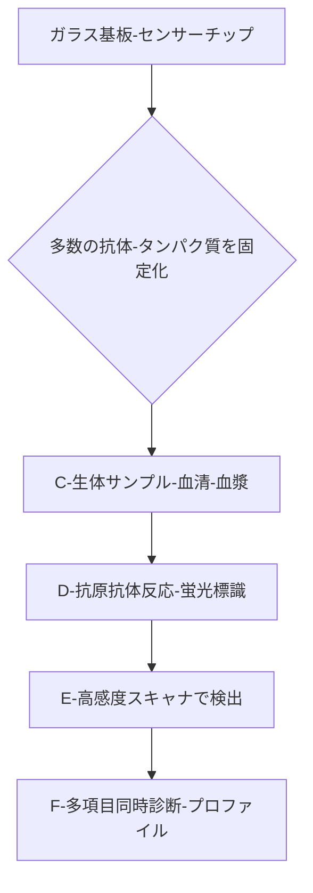

# T11-05-04 プロテインチップ・マイクロアレイ

## 技術の位置づけ
ガラス基板やセンサーチップ上に、数百から数千種類の異なる**抗体やタンパク質**を規則的に固定化し、微量の生体サンプル（血液、血清など）と反応させることで、**多項目を同時に**、かつ**網羅的に**分析する技術です。DNAマイクロアレイから発展し、疾患関連の自己抗体やサイトカインなどの**バイオマーカーのプロファイリング**に不可欠なツールとして、体外診断薬（IVD）への展開が加速しています。用いる主な計測技術は、**蛍光検出**や**表面プラズモン共鳴 (SPR)**などの高感度光学測定です。

## Summary（5つの要点）
1. **多項目同時解析**: チップ上の多数のスポットにより、一度の検査で数百種類のタンパク質や抗体の発現レベルを網羅的に解析可能。
2. **市場の成長予測**: プロテインチップ市場は、プロテオミクス研究と創薬開発の増加を背景に、2030年までに**33.6億米ドル**規模に達すると予測されている \`4\`。
3. **診断薬への展開**: 複数の遺伝子を同時に検査するDNAマイクロアレイ（例: Roche社の**AmpliChip P450**）が既に体外診断薬として承認されており、プロテインチップも臨床応用が進む \`10\`。
4. **自己免疫疾患への応用**: がん、自己免疫疾患、神経変性疾患に関連する**自己抗原**を検出する精密タンパク質マイクロアレイプラットフォームが登場している \`4\`。
5. **高速・低コスト化**: 少量サンプルで高スループットの解析を実現することで、従来のELISA法などに比べ、時間と試薬コストの削減に貢献する。

#### 概念図

## 具体的プロダクト事例
* **日本企業**:
    * **富士フイルム**: 高感度な蛍光検出技術やイメージング技術を応用したプロテインチップ関連の研究開発を推進。
    * **東芝**: リウマチ薬の効き目や副作用の発生確率を判定できるDNAマイクロアレイ開発に成功しており、この技術基盤がプロテインチップにも応用可能 \`10\`。
* **グローバル**:
    * **Sengenics Corporation LLC**: 特許技術KREXを利用した精密タンパク質マイクロアレイプラットフォーム**i-Ome Discovery**を発表 \`4\`。
    * **Luminex Corporation**: xMAPテクノロジーなど、マイクロアレイとは異なる原理で多項目同時検出を実現するプラットフォームを提供。

---
### 技術評価表（定量的な視点）
| 評価項目 | 評価 | 根拠 |
| :--- | :--- | :--- |
| 導入コスト | ⭐⭐⭐☆☆ | 装置（スキャナー）は高額だが、使い捨てチップは大量生産でコストダウン可能。 |
| 技術成熟度 | ⭐⭐⭐⭐☆ | DNAアレイの技術は成熟。タンパク質の安定固定化、定量性の担保が技術的な課題。 |
| 日本の競争力 | ⭐⭐⭐⭐☆ | 精密製造技術、バイオチップの基盤技術は高い。診断薬としての承認事例を積み重ねる段階。 |
| 市場性 | ⭐⭐⭐⭐⭐ | がん、アレルギー、自己免疫疾患の診断、創薬ターゲット探索など幅広い分野で需要増 \`4\`。 |
| 品質保証の重要性 | ⭐⭐⭐⭐⭐ | チップ上のタンパク質の**固定化の均一性**と**保存安定性**、**測定の感度・特異度**が極めて重要。 |

---
## 日本の立ち位置・SWOT分析
### 強み
* **精密加工・製造技術**: 基板の微細加工技術、タンパク質の**正確なスポッティング技術**など、製造基盤が世界トップクラス。
* **光学・センサー技術**: 富士フイルム、東芝などに代表される、高感度な**光学検出技術**や**イメージング技術**のノウハウ。
* **バイオマーカー探索研究**: 大学・研究機関において、疾患特異的な**抗体・抗原**の発見が活発に行われている。

### 弱み
* **タンパク質の安定性**: チップ上のタンパク質の**活性を維持**し、**長期保存**するための化学的・材料的な技術課題。
* **標準化の遅れ**: チップの設計、測定プロトコル、データ解析手法に関する**業界標準化**が欧米に比べ遅れている。
* **診断薬承認プロセス**: 研究用から**体外診断薬（IVD）**としての承認・実用化までのプロセスが長期化する傾向がある。

## 専門家視点の技術調査ポイント
### 品質保証エンジニアの視点
* **固定化プロセスの品質**: チップ表面へのタンパク質の**固定化密度**と**均一性**をロット間で保証するための工程管理。
* **安定性・劣化評価**: チップの**保存期間**における固定化タンパク質の**活性（機能）の維持率**を評価する長期安定性試験。
* **偽陽性・偽陰性対策**: サンプル中の**非特異的吸着**を抑え、診断における**感度**（真陽性率）と**特異度**（真陰性率）を臨床要件に合わせて最適化。

### 化学系大学生への示唆
* **表面化学・高分子化学**: 基板表面の**化学修飾**、**タンパク質の固定化技術**（共有結合、物理吸着）に関する知識。
* **バイオコンジュゲーション**: 検出のための**蛍光色素**や**ナノ粒子**を用いた**標識化技術**（コンジュゲーション）の基礎。
* **生化学・免疫学**: 抗原抗体反応の**分子機構**、**結合親和性**の評価、そしてターゲットとする**バイオマーカーの機能**に関する深い理解。

---
## 技術ロードマップ（短期/中期/長期）
### 短期目標（～2027年）
* 自己免疫疾患やアレルギー疾患領域で、**多項目同時検査チップ**が研究用途から臨床検証へ移行。
* タンパク質の**安定固定化技術**の向上により、チップの**保存期間を2倍**に延長。
* リキッドバイオプシー検体との統合を前提とした、**エクソソーム由来タンパク質**専用チップの開発。

### 中期目標（2028年～2031年）
* がんの**早期診断・予後予測**を目的としたプロテインチップが、**体外診断薬（IVD）**として承認される。
* **表面プラズモン共鳴 (SPR)**などのラベルフリー検出技術との統合による、**定量精度**のさらなる向上。
* 製造プロセスの自動化とスケールアップにより、**チップあたりのコストを半減**。

### 長期目標（2032年～2035年）
* 血液一滴で数百項目の健康状態をチェックできる**パーソナルヘルスケアチップ**が一般化。
* **治療薬候補**に対する患者の反応を**in vitro**で予測する**コンパニオン診断**としての利用が標準化。
* チップの情報をAIで統合解析し、**疾患発症リスク**をリアルタイムで通知するシステムが確立。

### 📚 参照リンク
1.  [プロテインチップ市場| 市場規模 シェア 動向分析 予測 2024～2030年まで](https://www.gii.co.jp/report/grvi1474900-protein-chip-market-size-share-trends-analysis.html)
2.  [マイクロアレイ・バイオチップの最新動向](https://mhlw-grants.niph.go.jp/system/files/2007/072031/200712002B/200712002B0003.pdf)
3.  [生きた細胞内のタンパク質発現量を推定するAI技術を開発 - ファンケル](https://www.fancl.jp/news/20240091/news_20240091.html)
