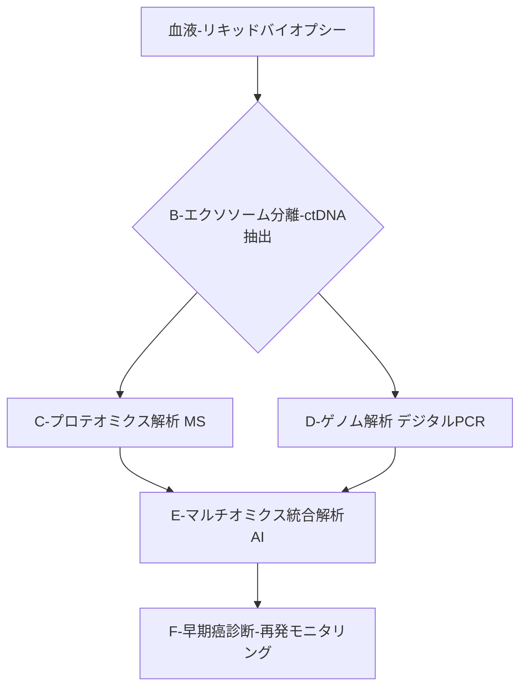

# T11-05-05 リキッドバイオプシー統合プロテオミクス解析

## 技術の位置づけ
血液、尿などの**体液（リキッドバイオプシー）**から、主に**循環腫瘍DNA（ctDNA）**や**エクソソーム**といった細胞外小胞に含まれる**タンパク質（プロテオーム）**を抽出し、両方の情報を統合的に解析することで、高精度な疾患診断・モニタリングを行う技術です。非侵襲的な検査で、がんの**再発リスク**や**治療効果**の予測に有効性を発揮し、従来の組織生検の課題を解決する次世代の診断プラットフォームです。用いる主な計測技術は、**高性能質量分析計 (MS)**、**デジタルPCR**、および**AI統合解析アルゴリズム**です。

## Summary（5つの要点）
1. **非侵襲的な再発モニタリング**: 血液検査でctDNAやエクソソームを調べるリキッドバイオプシーは、手術後の**がん再発リスク**や**術後治療効果**の予測に有効性が確認されている \`5\`。
2. **エクソソームの活用**: エクソソームに含まれるタンパク質パネルを機械学習で解析することで、がんの有無だけでなく**がん種の特定**にも有効であることが示されている \`6\`。
3. **高感度検出が必須**: ctDNAやエクソソームは体液中に微量しか含まれないため、デジタルPCRなど**超高感度かつ信頼性の高い検出技術**が必要不可欠となる \`7\`。
4. **マルチマーカー戦略**: ctDNA（遺伝子情報）とエクソソームプロテオーム（タンパク質情報）の**両方を統合**することで、単一のマーカーでは見落とされがちな情報を補完し、診断精度を高める。
5. **治療レジメンの最適化**: 治療前後の動的な変化を繰り返し測定できるため、薬剤耐性の獲得や治療効果の減衰を早期に察知し、**リアルタイムで治療方針を調整**することを可能にする。

#### 概念図

## 具体的プロダクト事例
* **日本企業**:
    * **国立がん研究センター**: CIRCULATE-Japan GALAXY研究において、リキッドバイオプシーによる大腸がんの再発リスク予測の有効性を発表し、臨床応用を推進 \`5\`。
    * **東京工業大学**: 血中エクソソームのタンパク質を用いたがん診断マーカーを開発し、がんの有無・種類の判別が可能であることを証明した \`6\`。
* **グローバル**:
    * **Guardant Health**: ctDNA解析を主軸としたリキッドバイオプシー検査を提供し、がんの治療選択、再発モニタリングを実用化。
    * **Exosome Diagnostics (Bio-Techne)**: エクソソームに特化した解析技術を提供し、前立腺がんなどの診断に活用。

---
### 技術評価表（定量的な視点）
| 評価項目 | 評価 | 根拠 |
| :--- | :--- | :--- |
| 導入コスト | ⭐⭐⭐☆☆ | デジタルPCR装置や高性能MSが必要だが、検査自体の侵襲性は低く低コスト化の余地がある。 |
| 技術成熟度 | ⭐⭐⭐☆☆ | ctDNAの遺伝子解析は実用段階。エクソソームプロテオミクスとの**統合解析**は研究段階。 |
| 日本の競争力 | ⭐⭐⭐⭐☆ | エクソソーム解析、基礎研究は世界トップクラス。臨床への大規模応用が今後の焦点。 |
| 市場性 | ⭐⭐⭐⭐⭐ | がんの早期診断・術後モニタリングという巨大市場をターゲットとしており、将来性極めて高い。 |
| 品質保証の重要性 | ⭐⭐⭐⭐⭐ | サンプル中の微量物質の**分離効率**、**定量精度**、**統合解析アルゴリズムの信頼性**が診断の成否を分ける。 |

---
## 日本の立ち位置・SWOT分析
### 強み
* **エクソソーム研究の先進性**: エクソソームの分離・精製技術や、プロテオミクス解析技術において世界的に高い研究水準にある \`6\`。
* **高精度医療データ**: 国立がん研究センターなどによる**大規模な臨床研究体制**が整備され、リキッドバイオプシーの検証を強力に推進 \`5\`。
* **精密機器の製造技術**: デジタルPCRや高性能質量分析計に必要な**精密な光学・機械技術**の基盤がある。

### 弱み
* **標準化の遅れ**: リキッドバイオプシー検体の**採取・輸送・保存**、および**エクソソーム分離**プロトコルの標準化が国際的に遅れている。
* **AI統合解析の経験不足**: ゲノムとプロテオームの**大規模なマルチオミクスデータ統合解析**におけるAIモデル構築の経験値が、海外先行企業に劣る。
* **規制・承認の遅延**: 新規のIVDとしての**薬事承認プロセス**が複雑で、実用化までの期間が長期化しやすい。

## 専門家視点の技術調査ポイント
### 品質保証エンジニアの視点
* **エクソソーム分離・精製効率**: サンプル中のエクソソームを**高純度**かつ**高回収率**で得るための、超遠心やマイクロ流体デバイスの性能評価。
* **低頻度変異の定量性**: ctDNA解析における**デジタルPCR**や**超深層シーケンス**の**真の定量限界**と、**偽陽性・偽陰性率**の厳格な評価。
* **統合アルゴリズムの頑健性**: 異なる計測技術や施設で得られたデータ間で、**統合解析AIモデル**が安定した診断性能を発揮できるかの検証。

### 化学系大学生への示唆
* **コロイド・表面化学**: エクソソームの**物理化学的性質**（サイズ、表面電荷）と、**分離技術**（抗体固定化、メンブレン分離）への応用。
* **分子診断学**: ctDNAやタンパク質バイオマーカーの**化学的安定性**、**標的分子の設計**（プローブ、プライマー）に関する知識。
* **バイオインフォマティクス**: ゲノム（ctDNA）とプロテオーム（エクソソームタンパク質）の**異種データを統合**するための**統計学**と**機械学習**スキル。

---
## 技術ロードマップ（短期/中期/長期）
### 短期目標（～2027年）
* リキッドバイオプシーによる**がんの再発モニタリング**が、一部の固形がん（大腸がん、肺がんなど）で**保険適用**を開始 \`5\`。
* エクソソームプロテオミクスに特化した**高性能な分離・精製モジュール**の商用化。
* AIを用いた**ctDNAとプロテオームの二重チェックシステム**の臨床研究での有効性確立。

### 中期目標（2028年～2031年）
* リキッドバイオプシー統合解析が**早期がん（ステージI/II）のスクリーニング**への適用を拡大。
* がん以外の疾患（アルツハイマー病、心疾患など）を標的とした**非がん領域**でのバイオマーカーパネルの実用化。
* 在宅でのサンプル採取と自動搬送を可能とする**リキッドバイオプシー検査サービス**の立ち上げ。

### 長期目標（2032年～2035年）
* **年1回**の血液検査で、個人のがん、認知症、心血管疾患などの**複合的な疾患リスク**を予測・診断する**パーソナルプロテオミクス診断**が普及。
* リキッドバイオプシーデータが、治療薬の開発・承認に不可欠な**サロゲートマーカー**として規制当局に認知される。
* 血液中タンパク質の**リアルタイムセンシング**とAI予測による**未病段階での介入**が実現。

### 📚 参照リンク
1.  [CIRCULATE-Japan GALAXY、リキッドバイオプシーによる大腸がんの再発リスクと術後治療効果の予測に有効性を確認 - 国立がん研究センター](https://www.ncc.go.jp/jp/information/pr_release/2024/0917_1/index.html)
2.  [血液内のエクソソームをバイオマーカーとしたがん診断法の開発 - 東京工業大学](https://www.titech.ac.jp/news/2020/047710)
3.  [がんとリキッドバイオプシー：Application｜タカラバイオ株式会社](https://catalog.takara-bio.co.jp/com/tech_info_detail.php?mode=3&masterid=M100007727)
4.  [エクソソームによるがん診断 - Hoshino Lab.](https://hoshinolab-edu.com/research/c1/)
