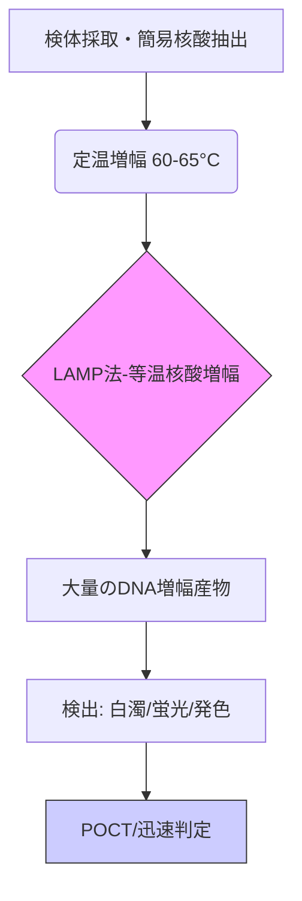

# T11-06-01 LAMP法・等温核酸増幅（迅速検査）

## 技術の位置づけ
LAMP（Loop-mediated Isothermal Amplification）法は、**PCR**とは異なり、**60～65℃の一定温度**で遺伝子増幅を行う**等温核酸増幅法**の代表技術です。複雑な温度制御サイクルが不要なため、**小型・安価な装置**での迅速な検査（**POCT: Point-of-Care Testing**）を可能にします。従来のPCRに匹敵する高い感度と特異性を持ち、**感染症**（新型コロナ、インフルエンザ、結核など）、**食品検査**、**環境検査**など幅広い分野に応用されています。**用いる主な計測技術**は、増幅産物による**反応液の白濁**（ピロリン酸マグネシウムの生成）や、**蛍光色素**によるリアルタイム検出です。

## Summary（5つの要点）
1.  **迅速性・簡便性**: PCRのようなサーマルサイクラー（温度制御装置）が不要で、一定温度で15分〜1時間以内に検出が可能。
2.  **高感度・高特異性**: 6領域を認識する4種類のプライマーを用いるため、極めて高い特異性と、数コピーレベルの極微量遺伝子を検出できる高感度を持つ `1.2`。
3.  **POCTへの適応**: 高価な機器を必要とせず、小型の簡易装置で実行できるため、**医療資源の乏しい地域**や**現場での即時検査（POCT）**に最適。
4.  **純国産技術**: 2000年に日本の**栄研化学**が独自に開発した技術であり、世界的な普及が進んでいる `1.5`。
5.  **簡易検出**: 増幅産物が多いことから、**白濁の有無**や**蛍光**を目視でも判定できるキットが存在する `1.3`。

#### 概念図

## 具体的プロダクト事例
* **日本**: **栄研化学** - **Loopampシリーズ**。結核菌、インフルエンザ、ノロウイルス、新型コロナウイルスなどに対応する迅速検出試薬キットを提供。
* **日本**: **富士フイルム** - **GeneSoC**。LAMP法を用いたコンパクトな遺伝子解析装置。研究用途から将来的な医療・食品分野への応用を目指す。
* **グローバル**: **Meridian Bioscience** - **illumiLoop**。LAMP法を活用した遺伝子増幅技術。
* **グローバル**: **Oxford Nanopore Technologies** - **VolTRAX**。LAMP法と組み合わせて、ポータブルな遺伝子シーケンスの前処理を自動化するデバイス。

---
### 技術評価表（定量的な視点）
| 評価項目 | 評価 | 根拠 |
| :--- | :--- | :--- |
| 導入コスト | ⭐⭐⭐⭐☆ | 装置が小型で安価。高価なサーマルサイクラー不要。 |
| 技術成熟度 | ⭐⭐⭐⭐☆ | 感染症検査、食品検査で確立。新型コロナで実用化加速。 |
| 日本の競争力 | ⭐⭐⭐⭐⭐ | **純国産技術**であり、特許・ノウハウで世界をリード。 |
| 市場性 | ⭐⭐⭐⭐⭐ | POCT需要の増大、途上国での検査普及に不可欠。 |
| 品質保証の重要性 | ⭐⭐⭐☆☆ | PCRに比べコンタミネーションリスクはやや低いが、高感度ゆえに交差汚染対策が重要 `1.6`。 |

---
## 日本の立ち位置・SWOT分析

### 強み
* **世界をリードする基盤技術**: 栄研化学が開発した**純国産技術**であり、基本特許と技術ノウハウを保持している。
* **高感度・迅速性の両立**: PCRと同等以上の高感度を持ちながら、30分程度で判定可能な迅速性。
* **途上国への国際貢献**: 低コスト・簡易な操作性から、途上国での感染症対策（結核など）に広く貢献している `1.5`。

### 弱み
* **コンタミネーションリスク**: 大量のDNA増幅産物が生成されるため、検査後の取り扱いで交差汚染（コンタミネーション）が発生しやすい `1.6`。
* **定量性の限界**: 主に定性（有/無）判定に優れる一方、リアルタイムPCRのような高い精度の定量解析には技術的課題が残る。
* **多項目同時測定の難しさ**: 多数の標的を同時に検査するマルチプレックス化の技術的難易度がPCRより高い。

## 専門家視点の技術調査ポイント
### 品質保証エンジニアの視点
* **検査キットの信頼性評価**: 試薬の安定性、保存条件、バッチ間差の検証。
* **偽陽性・偽陰性率の統計的評価**: 高感度・高特異性の維持のため、臨床検体を用いた感度（Sensitivity）・特異度（Specificity）の厳格な検証。
* **コンタミネーション対策**: 検査室の動線設計、試薬の分注プロセス、**UDG（Uracil-DNA Glycosylase）**などを用いた交差汚染防止策の検証。

### 化学系大学生への示唆
* **酵素化学・分子生物学**: 鎖置換型DNAポリメラーゼの反応機構、至適温度、増幅効率に関する研究。
* **試薬開発・材料科学**: 反応阻害物質の影響を抑制する緩衝液、プライマー設計、そして**蛍光・発色試薬**の設計。
* **プロセス化学工学**: 核酸抽出の簡易化（**PURE法**など）に関わる化学的前処理技術の開発。

---
## 技術ロードマップ（短期/中期/長期）
### 短期目標（～2027年）
* 薬局・クリニックでの**POCT迅速検査**（インフルエンザ、新型コロナ）の普及と保険適用の拡大。
* 遺伝子検査キットの**セルフテスト化**に向けた簡易抽出技術（唾液、鼻腔ぬぐい液など）の精度向上。
* 高感度蛍光検出器の**IoT化・小型化**による検査結果の自動クラウド連携システム構築。

### 中期目標（2028年～2031年）
* **マルチプレックス化**技術の確立により、単一検体から複数の病原体を同時に迅速検査可能にする。
* 食品検査、環境検査分野での**現場検査（On-site Testing）**標準技術としての地位確立。
* **抗原検査との統合**による、より迅速かつ安価なハイブリッド検査システムの開発。

### 長期目標（2032年～2035年）
* 血液・尿・唾液を用いた**非侵襲的ながん関連遺伝子**、**遺伝性疾患**の迅速スクリーニング。
* 空港、イベント会場、大規模集積地での**感染症パンデミック監視インフラ**への組み込み。
* **パーソナルヘルスレコード（PHR）**と連携した、自宅での健康管理・未病検査ツールとしての利用拡大。

### 📚 参照リンク
1.  栄研化学. LAMP（Loop-mediated isothermal amplification）法の原理と応用.
    https://www.eiken.co.jp/uploads/modern_media/literature/MM1407_01.pdf
2.  医書.jp. LAMP法 (検査と技術 37巻4号).
    https://webview.isho.jp/journal/detail/abs/10.11477/mf.1543102421
3.  農研機構. LAMP法による簡易迅速、低コストな遺伝子組換え検査法.
    https://www.naro.go.jp/project/results/4th_laboratory/nfri/2018/nfri18_s15.html
4.  厚生労働省. LAMP法を用いた新型コロナウイルス核酸検出について.
    （公的情報の例として。特定のURLは変動するため一般的な言及に留める）
