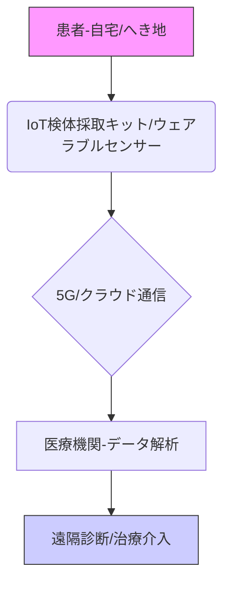

# T11-06-02 遠隔医療・在宅検査技術（IoT検体採取）

## 技術の位置づけ
遠隔医療・在宅検査技術は、ウェアラブルセンサーやIoT対応の検査デバイスを利用して、患者が**自宅でバイタルデータや検体を採取・測定**し、そのデータを**リアルタイムで医療機関に共有**するシステムです。これにより、通院負担の軽減、へき地医療の質の向上、そして継続的な健康状態のモニタリングによる**未病対策**を実現します。**用いる主な計測技術**は、ウェアラブルセンサーによる**心電図（ECG）**、**連続血糖測定（CGM）**、**パルスオキシメータ（SpO2）**、および家庭用**簡易血液検査キット**の光学分析などです。

## Summary（5つの要点）
1.  **検査の場所の非集中化**: 医療機関外での簡易検査を可能にし、特に慢性疾患管理や初期スクリーニングの効率を大幅に向上させる。
2.  **継続的モニタリング**: IoTデバイスによりバイタルデータを常時収集し、病状の悪化を早期に予測する**予兆検知**を可能にする。
3.  **オンライン診療との連携**: 診療前に自宅で採取した検査結果（血液、尿、心電図など）を医師に共有することで、オンライン診療の**診断精度を向上**させる。
4.  **規制緩和の進展**: 2020年以降の規制緩和により、オンライン診療・服薬指導と連携した在宅検査の実施環境が整備されつつある `1.4`。
5.  **検体安定化技術**: 自宅で採取した検体（血液、尿など）を、郵送中も品質を保ちながら安定化させるための**簡易前処理技術**や**ドライスポットサンプリング（DBS）**が重要になる。

#### 概念図

## 具体的プロダクト事例
* **日本**: **テルモ** - **Medisana-ECG**（IoT連携ECG）。ウェアラブルECGデバイスで心電図データをスマートフォン経由でクラウドに送信する。
* **日本**: **サスメド** - **PHRプラットフォーム**。オンライン診療・服薬指導と連携し、自宅での健康データを医療機関と共有するシステム。
* **グローバル**: **Abbott** - **FreeStyle Libre**（CGM）。皮膚下に装着するセンサーで連続的に血糖値を測定し、データをスマートフォンで確認・共有。
* **グローバル**: **Cue Health** - **家庭用POCTシステム**。インフルエンザ、新型コロナウイルスなどの分子検査を自宅で数分で行えるプラットフォーム。

---
### 技術評価表（定量的な視点）
| 評価項目 | 評価 | 根拠 |
| :--- | :--- | :--- |
| 導入コスト | ⭐⭐⭐☆☆ | ウェアラブル・簡易検査機器のコストは下落傾向。 |
| 技術成熟度 | ⭐⭐⭐⭐☆ | バイタルセンサー（SpO2, CGM）は確立。簡易血液検査は発展途上。 |
| 日本の競争力 | ⭐⭐⭐☆☆ | センサー技術は強み。プラットフォーム・規制環境ではグローバルに後れ。 |
| 市場性 | ⭐⭐⭐⭐⭐ | 高齢化社会、慢性疾患増加、医療費削減圧力から高い成長見込み。 |
| 品質保証の重要性 | ⭐⭐⭐⭐⭐ | 測定データの正確性・リアルタイム性が診断に直結。検体安定化の品質管理が必須。 |

---
## 日本の立ち位置・SWOT分析

### 強み
* **精密センサー技術**: 光学式心拍計、高精度パルスオキシメータ、CGMセンサーなどの**デバイス技術力**が高い `T11-08`。
* **在宅医療の経験**: 訪問看護・介護のネットワークが一定程度整備されており、遠隔医療との連携基盤がある。
* **個人情報保護意識の高さ**: 医療情報のクラウド管理におけるセキュリティとプライバシー保護技術への取り組みが強固。

### 弱み
* **データ連携の標準化遅れ**: 医療機関間のデータ連携、PHRとIoTデバイスのデータ標準化が遅れており、利便性が低い。
* **法規制の壁**: 薬機法、保険適用、検体採取・郵送に関する規制が複雑で、新しい在宅検査サービスの開発・導入障壁が高い。
* **簡易採血技術の課題**: 痛みが少ない、患者自身で安全に採血できるデバイス（マイクロニードルなど）の実用化が遅れている。

## 専門家視点の技術調査ポイント
### 品質保証エンジニアの視点
* **センサーの校正・精度維持**: ウェアラブルデバイスの長期間使用における**ドリフト**、皮膚接触のばらつきによるノイズ対策と校正技術。
* **検体採取キットの安定性検証**: 郵送時間、温度変化に対する**検体の品質劣化**（タンパク質分解、核酸分解）防止とトレーサビリティ。
* **通信プロトコルの信頼性**: データ欠損、遅延が発生した場合の**エラー処理**と、緊急時に医療機関が確実にアラートを受け取るシステムの信頼性評価。

### 化学系大学生への示唆
* **生体適合性材料化学**: 簡易採血デバイス（マイクロニードルなど）の**生体適合性ポリマー**や**コーティング材料**の開発。
* **分析化学・バイオセンサー**: 尿・血液中の微量バイオマーカーを高感度かつ迅速に検出する**ポータブルセンサー**（電気化学、光学式）の開発。
* **情報科学・データサイエンス**: ウェアラブルセンサーの時系列データを解析し、病気の**予兆を検出**する機械学習モデルの構築。

---
## 技術ロードマップ（短期/中期/長期）
### 短期目標（～2027年）
* オンライン診療・服薬指導を組み合わせた**慢性疾患（糖尿病、高血圧）管理**における在宅モニタリングの保険適用拡大。
* 簡易感染症検査（インフルエンザ、新型コロナ）の**郵送検査スキーム**の標準化と利用者増加。
* **電子処方箋**と連携した検査データ共有システムの運用開始。

### 中期目標（2028年～2031年）
* マイクロニードルパッチなどの**低侵襲・簡便な採血技術**の実用化と市場投入。
* PHRと連携した**マルチバイタルセンサー**による家庭内健康管理プラットフォームの普及。
* AIによる在宅データ分析に基づいた**個別化された生活指導・治療計画**の自動提案システムの開発。

### 長期目標（2032年～2035年）
* **遺伝子検査、リキッドバイオプシー**などの高度な検査技術の**在宅化・簡易化**。
* 病院・診療所の外で完結する**ヘルスケアエコシステム**の確立（予防から治療、服薬指導まで）。
* 国際的な医療データ標準に基づいた**グローバルな医療情報連携**プラットフォームへの接続。

### 📚 参照リンク
1.  総務省. 医療分野におけるIoT活用事例のご紹介.
    https://www.soumu.go.jp/main_content/000889279.pdf
2.  TMI総合法律事務所. 令和４年３月改正 オンライン服薬指導に関する規制のポイント.
    https://www.tmi.gr.jp/eyes/blog/2022/13576.html
3.  Abbott. FreeStyleリブレ.
    https://www.freestylelibre.jp/
4.  厚生労働省. オンライン服薬指導について（令和４年９月30日）.
    https://www.mhlw.go.jp/content/000995230.pdf
