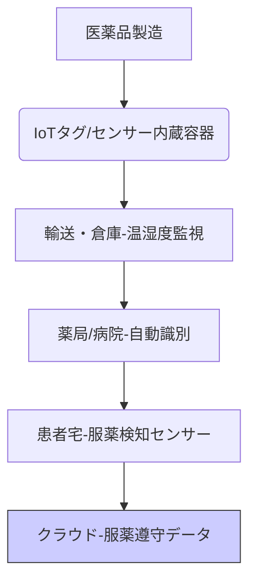

# T11-06-03 スマートアンプル・IoT医薬品管理

## 技術の位置づけ
スマートアンプル・IoT医薬品管理は、医薬品の**容器やパッケージにセンサーや通信機能を組み込む**ことで、**温度・湿度などの保管環境**、**使用期限**、**開封・服用状況**をリアルタイムで監視・記録する技術です。これにより、医療機関内での**薬剤取り違えミス**の防止、患者の**服薬アドヒアランス（服薬遵守率）**の向上、そして**医薬品サプライチェーンのトレーサビリティ**強化に貢献します。**用いる主な計測技術**は、**RFIDタグ**、**NFCタグ**による非接触ID識別、パッケージ内蔵の**温湿度センサー**、**光センサー**（開封検知）です。

## Summary（5つの要点）
1.  **服薬遵守の向上**: 患者の**服薬タイミング**を自動記録し、飲み忘れや過剰摂取を検知・アラートすることで、慢性疾患患者の治療効果を最大化する。
2.  **ヒューマンエラーの防止**: 医療現場において、薬品の**ロット番号**、**使用期限**、**投与量**を自動照合し、薬剤師や看護師による**取り違えミスを劇的に減少**させる。
3.  **リアルタイムトレーサビリティ**: 医薬品がサプライチェーン内のどこにあるか、適切な環境で保管されているかを常時監視し、**偽造品流通の防止**や品質管理を強化する。
4.  **コールドチェーンの監視**: 特に**ワクチン**や**バイオ医薬品**など厳格な温度管理が必要な薬剤の、輸送・保管中の温度逸脱を正確に記録・証明する。
5.  **データ連携とAI分析**: 収集された服用データをPHRやAIに連携し、患者ごとの**最適な投薬プロトコル**を導き出すための基盤データとして活用する。

#### 概念図

## 具体的プロダクト事例
* **日本**: **大塚製薬** - **服薬管理システム**。抗精神病薬などの錠剤に内蔵されたセンサーで服薬を検知し、患者のスマートフォンを通じて医療提供者にデータを送信。
* **日本**: **富士フイルム富山化学** - **アンプル識別システム**。アンプルにRFIDタグを付与し、調剤・投与時の薬剤情報を照合することで、薬剤取り違えを防止。
* **グローバル**: **Proteus Digital Health**（買収） - **Ingestible Sensor**。錠剤に組み込まれた超小型センサーが胃酸に触れると信号を発し、服薬を記録。
* **グローバル**: **AdhereTech** - **スマートピルボトル**。専用のIoTピルボトルで、開封時間、服薬量を自動記録し、飲み忘れ時にアラートを発信。

---
### 技術評価表（定量的な視点）
| 評価項目 | 評価 | 根拠 |
| :--- | :--- | :--- |
| 導入コスト | ⭐⭐⭐☆☆ | センサー/タグ/通信モジュールのコストは下落傾向だが、全医薬品への導入は高コスト。 |
| 技術成熟度 | ⭐⭐⭐☆☆ | RFID/NFCは確立。服薬検知センサーは特定薬剤で実用化段階。 |
| 日本の競争力 | ⭐⭐⭐☆☆ | 製薬企業の取り組みはあるが、全体的な標準化・普及ではグローバルに後れ。 |
| 市場性 | ⭐⭐⭐⭐⭐ | 薬剤ミス防止、アドヒアランス向上、偽造対策のニーズから巨大な市場規模。 |
| 品質保証の重要性 | ⭐⭐⭐⭐⭐ | 薬剤取り違えは患者の生命に関わる。タグの誤識別、センサーの故障は厳禁。 |

---
## 日本の立ち位置・SWOT分析

### 強み
* **精密タグ技術**: 小型で安価なRFID、NFCタグの製造技術と、医療機器への組み込み技術。
* **コールドチェーン品質**: 厳格な温度管理技術（保冷剤、断熱材）と、それを支えるセンサー技術。
* **医療機器・医薬品メーカーの連携**: 国内大手製薬企業と医療機器メーカーが共同でシステム開発に取り組んでいる事例がある。

### 弱み
* **全医薬品への導入コスト**: 安価な一般薬まで含めた全医薬品へのタグ導入は、コスト増を招き、保険償還上の課題となる。
* **標準化の遅れ**: 医薬品ID、データフォーマット、通信プロトコルの業界標準化が遅れ、異なるシステム間の相互運用性が低い。
* **患者側のITリテラシー**: 高齢者などの服薬遵守支援が必要な層が、IoTデバイスの操作やアラート対応に慣れていない。

## 専門家視点の技術調査ポイント
### 品質保証エンジニアの視点
* **タグの耐久性・識別信頼性**: 滅菌処理、薬剤成分、長期保管環境に対するRFID/NFCタグの耐久性と、読取時の**誤識別率（False Read）**の検証。
* **センサーの校正と精度**: 容器内・輸送中の温湿度センサーの**長期安定性**と、使用期限が近づいた際の**自動アラート機構**の信頼性。
* **データセキュリティと監査**: 収集された服用データが改ざんされていないことの証明、およびPHRへの安全な連携と**監査証跡（Audit Trail）**の確保。

### 化学系大学生への示唆
* **材料科学**: 医薬品と反応しない**生体不活性なパッケージ材料**、センサー内蔵型錠剤のコーティング技術。
* **物理化学・電気化学**: センサー駆動のための**極小電源**（ワイヤレス給電、超小型電池）や、薬剤成分の溶解を検知する電気化学センサーの開発。
* **情報科学・IoTアーキテクチャ**: 多数のデバイスからのデータを処理する**エッジコンピューティング**と**クラウド連携**のシステム設計。

---
## 技術ロードマップ（短期/中期/長期）
### 短期目標（～2027年）
* 高価な**バイオ医薬品**や**特定管理医薬品**へのRFIDタグ貼付義務化、または推奨の開始。
* 病院・薬局内での**注射薬調製時**におけるRFID/NFCを活用した**自動照合システム**の普及。
* 治験薬管理における**服薬遵守データ**の電子収集システムの標準化。

### 中期目標（2028年～2031年）
* 一般の処方薬における**PTPシートへの小型センサー/タグ埋め込み技術**のコスト削減と実用化。
* 医薬品サプライチェーン全体（製造→卸→薬局）の**IoTトレーサビリティプラットフォーム**構築。
* 自宅での服薬遵守データに基づき、**処方量や服薬時間をAIが最適化**するシステムの臨床導入。

### 長期目標（2032年～2035年）
* 全ての処方薬にIoTタグが標準装備され、**投薬ミスゼロ**、**偽造品ゼロ**のサプライチェーンを実現。
* **患者主導型**の医薬品管理（PHRと連携した自宅での在庫・服薬履歴の管理）が一般化。
* AIとIoTデータに基づき、疾患の進行度に応じた**動的な服薬指示**（スマートドージング）の実現。

### 📚 参照リンク
1.  総務省. 医療分野におけるIoT活用事例のご紹介.
    https://www.tele.soumu.go.jp/resource/j/ele/medical/lecture/202306_03.pdf
2.  AdhereTech. Smart Pill Bottles.
    https://www.adheretech.com/
3.  大塚製薬. 服薬アドヒアランス向上への取り組み.
    https://www.otsuka.co.jp/
4.  富士フイルム富山化学. 薬剤関連システム.
    https://www.fujifilm.com/fftc/ja/product/medical/pharmaceutical_systems
