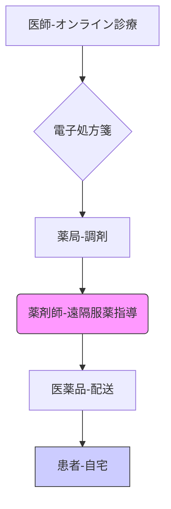

# T11-06-04 遠隔服薬指導・オンライン薬局

## 技術の位置づけ
遠隔服薬指導・オンライン薬局は、**情報通信機器（主にビデオ通話）**を用いて、薬剤師が患者に対して**調剤した医薬品の使用方法、注意事項などを指導**し、医薬品を**配送**するサービスです。2020年以降の薬機法改正により全国で解禁され、特に**移動困難な患者**や**感染症対策**として重要性が増しています。**電子処方箋**と連携することで、処方から服薬指導、配送までを一貫したデジタルプロセスで実現し、薬局の業務効率化と患者の利便性向上を図ります。**用いる主な計測技術**は、ビデオ通話による**患者の表情・状態の視覚的評価**、およびオンライン問診票による**服薬履歴・アレルギー情報のデータ化**です。

## Summary（5つの要点）
1.  **規制緩和の進展**: 2022年3月改正の薬機法施行規則により、**初回から**オンライン服薬指導が可能となり、対面と同等の薬剤師の判断と責任に基づき実施される `1.2`。
2.  **利便性の向上**: 患者は**自宅や任意の場所**で服薬指導を受けられ、特に慢性疾患患者や多忙な現役世代の**通院・待機時間**を削減する。
3.  **質の確保**: 原則として**映像と音声**による通信が必要であり、対面と同程度のプライバシー配慮や薬剤師による適切な判断が求められる `1.5`。
4.  **デジタル基盤との連携**: **電子処方箋**の普及により、処方情報のデジタル共有がスムーズになり、オンライン服薬指導・配送の効率が大幅に向上する。
5.  **薬剤師の役割の変化**: 単なる薬の受け渡しから、ITツールを活用した**継続的な服薬フォローアップ**や**在宅医療との連携**へと役割が拡大する。

#### 概念図

## 具体的プロダクト事例
* **日本**: **日本調剤** - **NiCOMS**。オンライン服薬指導プラットフォームを提供し、患者と薬剤師をビデオ通話で繋ぎ、服薬指導から配送まで一括で実施。
* **日本**: **MICIN（マイシン）** - **curon（クロン）お薬サポート**。オンライン診療システムと連携したオンライン服薬指導サービス。
* **グローバル**: **PillPack（Amazon Pharmacy）** - **オンライン薬局サービス**。服薬指導は電話やチャットで行い、処方薬を小分けにして定期的に配送するモデル。
* **グローバル**: **CVS Health** - **Virtual Care Platform**。オンライン診療からオンライン薬局、慢性疾患管理までを統合したデジタルヘルスケアを提供。

---
### 技術評価表（定量的な視点）
| 評価項目 | 評価 | 根拠 |
| :--- | :--- | :--- |
| 導入コスト | ⭐⭐⭐⭐☆ | 既存のPC/タブレットとシステム導入費用。対面薬局の改装費に比べ低コスト。 |
| 技術成熟度 | ⭐⭐⭐⭐☆ | ビデオ通話技術は確立。電子処方箋との連携が進化途上。 |
| 日本の競争力 | ⭐⭐⭐☆☆ | 規制緩和は進んだが、普及率（薬局での実施率）は未だ低い `4.2`。 |
| 市場性 | ⭐⭐⭐⭐⭐ | 規制緩和と利便性向上により、大きな成長市場。 |
| 品質保証の重要性 | ⭐⭐⭐⭐⭐ | 通信途絶、本人確認ミス、配送中の医薬品品質劣化防止が極めて重要。 |

---
## 日本の立ち位置・SWOT分析

### 強み
* **高度な薬剤師教育**: 薬剤師による対面指導のノウハウを、オンライン環境で再現しようとする努力。
* **電子処方箋の普及**: 政府主導で電子処方箋の導入が進んでおり、オンライン薬局のデジタル基盤が整いつつある。
* **宅配インフラ**: 医薬品配送における温度管理やセキュリティの高い宅配サービス網が整備されている。

### 弱み
* **普及率の遅れ**: 規制緩和は進んだが、実際にオンライン服薬指導を「実施している」薬局は一部に留まる `4.2`, `4.4`。
* **対面指導の限界**: 患者のフィジカルアセスメント（体調変化の視覚的判断、吸入手技の確認など）が対面指導に比べて難しい `4.4`。
* **薬局外からの実施制限**: 薬剤師がオンライン服薬指導を行う場所が、原則として調剤を行った薬局内に限定されている（規制緩和検討中） `1.6`。

## 専門家視点の技術調査ポイント
### 品質保証エンジニアの視点
* **通信品質・セキュリティ**: ビデオ通話の**低遅延性**と**安定性**（途切れによる指導中断防止）、医療情報システム間の通信の**暗号化**と**本人認証**。
* **医薬品配送の品質管理**: 温度・湿度・振動などのロジスティクスにおける**品質トレーサビリティ**と、特に要冷蔵医薬品の**コールドチェーン**の信頼性。
* **記録の完全性・監査証跡**: 服薬指導の内容、指導時間、薬剤師の氏名などを**電子薬歴に正確に記録**し、規制当局の監査に対応できる体制。

### 化学系大学生への示唆
* **データサイエンス・AI**: 服薬遵守データ、電子薬歴データを用いた**飲み合わせリスク**や**副作用予測**のAIモデル開発。
* **サプライチェーンマネジメント**: 医薬品の**在庫最適化**、**配送ルート最適化**、およびT11-06-05で扱う**ブロックチェーン**技術の応用。
* **薬事法規・医療経済学**: オンライン服薬指導に関する最新の法規制（薬機法、調剤報酬）の理解と、医療経済性への影響分析。

---
## 技術ロードマップ（短期/中期/長期）
### 短期目標（～2027年）
* 薬局外からの遠隔服薬指導（サテライトオフィスなど）の**規制緩和と実証実験**の開始。
* 電子処方箋の全国的な普及と、オンライン服薬指導システムとの**シームレスな連携**。
* オンラインでの**吸入薬、インスリン注射薬**などの手技指導を補助する**AR/VR技術**の導入。

### 中期目標（2028年～2031年）
* AIによる服薬指導の**質問応答、情報提供の自動化**（最終確認は薬剤師が行う）。
* オンライン薬局が**地域包括ケアシステム**に組み込まれ、在宅医療・介護との連携を強化。
* オンライン診療・オンライン服薬指導の**調剤報酬改定**による、より積極的な導入インセンティブの提供。

### 長期目標（2032年～2035年）
* オンライン薬局が対面薬局と**同等以上のシェア**を獲得し、薬局機能の**デジタル変革**が完了。
* **スマートアンプル**などのIoT医薬品と連携し、服薬遵守データに基づいた**超個別化された服薬指導**。
* 国境を越えた**国際的なオンライン薬局サービス**の検討（規制調和が課題）。

### 📚 参照リンク
1.  厚生労働省. 薬生発0930第１号 令和４年９月30日.
    https://www.mhlw.go.jp/content/000995230.pdf
2.  NiCOMS. 「オンライン服薬指導」がより身近に！法改正のポイントを解説.
    https://nicoms.nicho.co.jp/news/20220427/
3.  TMI総合法律事務所. 薬局外からのオンライン服薬指導の解禁（パブコメ）【最新法令ニュース】.
    https://www.tmi.gr.jp/eyes/blog/2022/13774.html
4.  J-Stage. 薬局薬剤師を対象としたオンライン服薬指導の現状および教育ニーズに関する調査.
    https://www.jstage.jst.go.jp/article/jjphe/8/0/8_2024-006/_html/-char/ja
