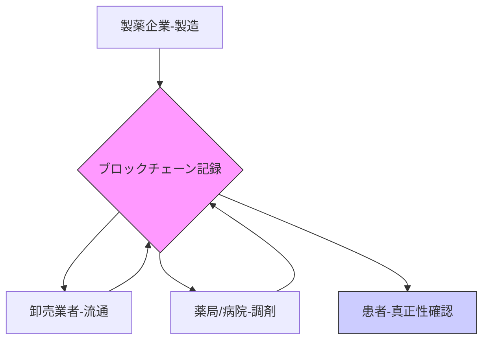

# T11-06-05 医薬品サプライチェーンのブロックチェーン活用

## 技術の位置づけ
医薬品サプライチェーンにおけるブロックチェーン活用は、**製造から患者への投薬に至る全プロセス**の情報を、**改ざん不可能な分散型台帳**に記録する技術です。これにより、医薬品の**真正性（本物であること）**を保証し、**偽造品の流通を防止**するとともに、輸送・保管中の**品質データ（温湿度など）**を透明性高く共有することで、トレーサビリティと信頼性を飛躍的に向上させます。**用いる主な計測技術**は、医薬品パッケージに付与された**シリアル番号**や**二次元コード（GS1 DataMatrix）**の読み取り、およびT11-06-03で言及された**IoTセンサー**による環境データの自動記録です。

## Summary（5つの要点）
1.  **偽造医薬品の流通防止**: 医薬品の製造元から消費者に届くまでの全履歴をブロックチェーンに記録し、誰でも真正性を確認できる `3.4`。
2.  **トレーサビリティの強化**: 医薬品がサプライチェーン内のどの時点にあり、誰が関与したか、適切な温度管理がされていたかをリアルタイムで追跡可能にする `5.1`。
3.  **データセキュリティの向上**: 医療データを分散管理することで、単一のシステム障害やサイバー攻撃による**データ改ざんリスクを排除**する `3.5`。
4.  **リコール（回収）の迅速化**: 問題が発生した医薬品のロットを即座に特定し、関連する全ての関係者（卸、薬局、患者）に**迅速かつ正確に通知**できる。
5.  **スマートコントラクトの活用**: 医薬品が特定の品質基準（例: 温度範囲）を満たした時に**自動的に支払い**を実行するなど、サプライチェーンの自動化に貢献する。

#### 概念図

## 具体的プロダクト事例
* **グローバル**: **The MediLedger Project** (米)。主要製薬会社や流通業者が参加し、ブロックチェーンを用いて**DSCSA（米国の医薬品サプライチェーンセキュリティ法）**準拠のトレーサビリティシステムを構築。
* **グローバル**: **IBM Health Pass**。ブロックチェーン技術を健康情報管理に応用し、サプライチェーンの透明性確保を目指す。
* **日本**: **日本IBMとHBC**。ブロックチェーンによる**治験プロセスの改善**や、医療情報連携に関する実証実験 `3.1`。
* **日本**: **各社共同プロジェクト**。国内の製薬・流通業界でも、偽造対策や流通コスト削減を目的としたブロックチェーン導入に向けた共同実証が進められている。

---
### 技術評価表（定量的な視点）
| 評価項目 | 評価 | 根拠 |
| :--- | :--- | :--- |
| 導入コスト | ⭐⭐☆☆☆ | 参加者全員のシステム改修、データ記録・管理コストが高額。 |
| 技術成熟度 | ⭐⭐⭐☆☆ | PoC（概念実証）は進んでいるが、業界横断での本格運用はこれから。 |
| 日本の競争力 | ⭐⭐☆☆☆ | 技術研究は進むが、業界全体の協調体制と実運用実績で米中に後れ。 |
| 市場性 | ⭐⭐⭐⭐⭐ | 偽造医薬品の脅威、国際規制の厳格化（DSCSA等）により導入は不可避。 |
| 品質保証の重要性 | ⭐⭐⭐⭐⭐ | データの改ざん防止は、医薬品の品質と患者の安全に直結する。 |

---
## 日本の立ち位置・SWOT分析

### 強み
* **高い品質管理基準**: 製造・流通における日本の既存の品質管理（GMP, GDP）基準が厳格であり、ブロックチェーン導入の土台がある。
* **IoT技術との連携**: T11-06-03のIoT医薬品管理技術と連携することで、**温湿度データ**を自動でブロックチェーンに記録できる。
* **コンソーシアムの設立**: 業界団体やITベンダーが連携し、ブロックチェーン活用の**共同研究・実証実験**が進められている。

### 弱み
* **業界協調の難しさ**: 製薬企業、卸、薬局といった異なる立場の企業間での**データ共有の合意形成**と**ガバナンス構築**が難しい。
* **レガシーシステムとの連携**: 既存の複雑な基幹システムをブロックチェーンに対応させるための**システム改修コスト**と**時間**。
* **法規制・ガイドラインの整備遅れ**: ブロックチェーンで記録されたデータ（真正性、品質証明）を**法的にどう位置づけるか**の議論が不十分。

## 専門家視点の技術調査ポイント
### 品質保証エンジニアの視点
* **記録データの真正性**: 物理的な医薬品とブロックチェーン上のデータが一致していることの**確証性（Proof of Existence）**。
* **IoTセンサーデータの信頼性**: ブロックチェーンに記録されるIoTセンサーの**校正状態**、**測定精度**、およびデータ入力時の**ノイズ・エラー処理**。
* **GxPコンプライアンス**: 医薬品製造管理（GMP）、流通管理（GDP）などの**GxP基準**を満たすためのブロックチェーンシステム設計（データの不変性、監査証跡）。

### 化学系大学生への示唆
* **分散システム工学**: ブロックチェーンの**コンセンサスアルゴリズム**、**スマートコントラクト**、および**ノード運用**に関する知識。
* **暗号技術**: データのハッシュ化、電子署名、ゼロ知識証明など、**セキュリティとプライバシー**を両立させる暗号技術。
* **サプライチェーンマネジメント**: 医薬品の**流通最適化モデル**、**在庫管理システム**とブロックチェーン技術の統合。

---
## 技術ロードマップ（短期/中期/長期）
### 短期目標（～2027年）
* 業界団体主導による**ブロックチェーンPoC（概念実証）**を完了し、導入効果の検証とコスト分析を実施。
* **高価な抗がん剤**や**特殊な医薬品**など、偽造リスクの高い特定薬剤群に限定した**トレーサビリティシステム**のプロトタイプ運用開始。
* 米DSCSAなどの**国際規制への対応**を目的としたブロックチェーン技術の導入検討。

### 中期目標（2028年～2031年）
* 主要な製薬企業・卸売業者が参加する**業界横断型のブロックチェーンコンソーシアム**を設立し、実運用を開始。
* IoT医薬品（T11-06-03）からの**温湿度・位置情報データ**のブロックチェーンへの**自動記録**を標準化。
* **スマートコントラクト**を活用し、品質条件を満たした際の**自動決済**や**自動リコール通知**を実現。

### 長期目標（2032年～2035年）
* **全ての処方医薬品**のトレーサビリティがブロックチェーン上で管理され、**グローバルな医薬品サプライチェーン**の標準技術となる。
* PHR（患者主導の医療情報管理）と連携し、患者自身が**医薬品の真正性**と**品質履歴**を確認できる社会の実現。
* AIによるリアルタイム分析とブロックチェーンの不変性を組み合わせた**動的な品質リスク管理システム**の確立。

### 📚 参照リンク
1.  Pharma Insight Lab. 医薬品サプライチェーンにおけるブロックチェーン革命：偽造防止とトレーサビリティの未来.
    https://note.com/pharma_insight/n/n88b9cb711f81
2.  トレードログ株式会社. 医療とブロックチェーンの関係性とは？医薬品・ヘルスケアの事例も紹介！.
    https://trade-log.io/column/684
3.  The MediLedger Project.
    https://www.mediledger.com/
4.  デジタルイノベーション. 医療業界でブロックチェーンが解決できる課題とは? 海外・国内の活用事例も紹介.
    https://www.digital-innovation.jp/blog/blockchain-healthcare
