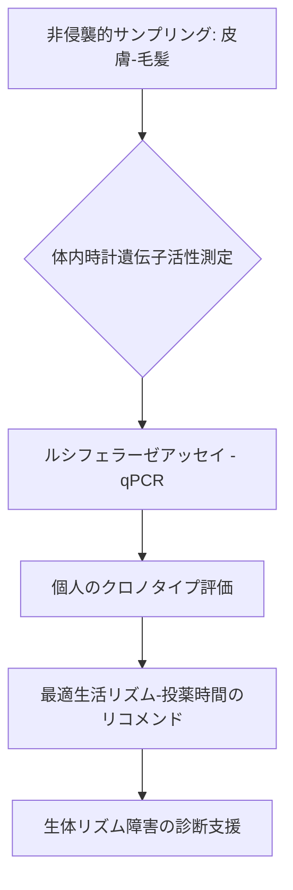

# T11-07-01 体内時計遺伝子発現・活性測定技術

## 技術の位置づけ
血液、皮膚細胞、毛髪などから**時計遺伝子（Per, Cry, Bmal1など）の発現リズムや活性度**を測定する技術である。これにより、個人のクロノタイプ（朝型/夜型）を客観的に評価し、最適な生活リズム、投薬時間、食事時間を決定するための基盤情報を提供する。従来の特定の時間での測定ではなく、**蛍光レポーター法**や**ルシフェラーゼアッセイ**を用いて連続的かつ自動定量的に測定する手法が開発されている。主な計測技術は**リアルタイムPCR（qPCR）**、**ルシフェラーゼアッセイ**である。

## Summary（5つの要点）
1. **非侵襲的サンプリング**: 皮膚細胞や毛髪など、より簡便な生体サンプルから体内時計周期を測定する手法が開発され、臨床応用が期待される。
2. **連続測定技術**: **ルシフェラーゼアッセイ**を用いた自動連続測定システムにより、食品や薬物が時計遺伝子の発現量に与える影響を経時的に高精度で評価可能となった。
3. **診断精度の向上**: 体内時計周期の長短がクロノタイプ（朝型/夜型）と相関することが確認され、生体リズム障害の客観的な診断基盤を提供する。
4. **疾患早期段階の捕捉**: 時計遺伝子発現リズムの自動定量化により、糖尿病など体内時計関連疾患の**極めて初期段階**を捉える研究が進められている。
5. **普遍的リズム解明**: 理論物理学的なアプローチを用いて遺伝子活性の波形が周期を保つ仕組みなど、体内時計の新たな分子機構の解明が進んでいる。

#### 概念図

## 具体的プロダクト事例
* **日本企業**: 
    * **JFRL（日本食品分析センター）**: ルシフェラーゼアッセイを用いた時計遺伝子発現解析試験を食品・機能性素材開発向けに提供し、ローズマリー抽出液などの効果を評価。
    * **京都大学/理化学研究所**: 高精度な時系列解析技術と組織透明化技術を組み合わせ、全脳レベルでの活動リズムを可視化する研究を実施。
* **グローバル**:
    * **Circadian Technologies**: 独自の血液/細胞ベースの概日リズム測定技術を用いた、企業向け交代勤務最適化コンサルティング。
    * **TimeScope**: 皮膚細胞バイオプシーなどを用いて個人のクロノタイプを測定し、臨床試験や個別化医療へ応用するサービス。

---
### 技術評価表（定量的な視点）
| 評価項目 | 評価 | 根拠 |
| :--- | :--- | :--- |
| 導入コスト | ⭐⭐☆☆☆ | 機器（リアルタイムPCR等）および検査試薬が高価。細胞培養などの専門施設が必要。 |
| 技術成熟度 | ⭐⭐⭐☆☆ | 基礎研究レベルでは確立しているが、一般臨床でのルーチン化はこれから。 |
| 日本の競争力 | ⭐⭐⭐⭐☆ | ルシフェラーゼアッセイなどの自動連続測定システムや細胞利用技術は世界トップレベルの研究水準。 |
| 市場性 | ⭐⭐⭐☆☆ | 個別化医療・予防医療の基盤技術として需要は高いが、非侵襲型センサー（T11-07-05）が普及すると検査市場が縮小する可能性。 |
| 品質保証の重要性 | ⭐⭐⭐⭐☆ | 遺伝子発現の**定量値の再現性**、**測定タイミングの標準化**が個別化リコメンドの精度に直結する。 |

---
## 日本の立ち位置・SWOT分析
### 強み
* **研究基盤**: 体内時計研究の世界的権威を多数輩出しており、**ルシフェラーゼレポーターアッセイ**や**生体組織の時系列解析**などの基礎技術が優位。
* **非侵襲技術**: 皮膚細胞を用いた体内時計測定法など、簡便な測定手法に関する特許・研究が進んでいる。
* **産学連携**: 食品・健康分野での時計遺伝子発現解析の応用が積極的である。
### 弱み
* **臨床応用**: 研究レベルでの成果が多く、一般の病院やクリニックでの**実用化・普及**が欧米に比べ遅れている。
* **コストと時間**: 測定にかかるコストと、細胞培養等に要する時間が、ウェアラブルによる間接測定との競合において不利。
* **標準化の遅れ**: サンプリング方法やデータ解析結果の**標準化**が国際的に未確立であり、データの相互利用が進まない。

## 専門家視点の技術調査ポイント
### 品質保証エンジニアの視点
* **測定精度**: qPCRやアッセイにおける**定量値の再現性**と**絶対値の正確性**の検証。
* **ノイズ対策**: 培養環境や温度、試薬のロット差など、**外部要因による発現ノイズ**の最小化と補正アルゴリズムの開発。
* **信頼性評価**: 測定結果に基づいたクロノタイプ診断の**感度・特異度**を、客観的な睡眠データ（PSGなど）と比較して評価。
### 化学系大学生への示唆
* **リアルタイム分子計測技術**: 蛍光・発光プローブ設計、特に**ルシフェラーゼシステム**の反応機構と高感度化に関する化学研究。
* **バイオ分析化学**: 皮膚や毛髪などの**微量サンプルから高分子を抽出・精製**する技術と**高感度な分析手法**の開発。
* **生体高分子の動態解析**: 時計遺伝子やタンパク質などの**発現リズムを時系列で解析**し、化学的・物理的要因が動態に与える影響を評価する能力。

---
## 技術ロードマップ（短期/中期/長期）
### 短期目標（～2027年）
* 非侵襲的サンプリング技術（皮膚細胞等）を用いた体内時計測定の**精度と再現性**の確立。
* 時計遺伝子発現の自動連続測定システムの**小型化**と、コストダウンのプロトタイプ開発。
* 食品・栄養分野での、**時計遺伝子発現量変化**を指標とする機能性評価試験の標準化。
### 中期目標（2028年～2031年）
* 大規模臨床コホート研究を通じた、体内時計遺伝子発現パターンと**疾患リスク**の定量的関連性確立。
* 医療機器承認を見据えた**高信頼性**の測定システム開発と、医療機関への本格導入開始。
* T11-07-04（時間薬理学）と連携した**最適な投薬時間決定システム**のプロトコル確立。
### 長期目標（2032年～2035年）
* 一般健診や予防医療プログラムに体内時計測定を組み込み、**個別化された生活指導**の標準化。
* 全自動で安価な、家庭用遺伝子発現測定デバイスの開発と市場普及。
* 体内時計を基準とした、**健康ビッグデータプラットフォーム**の構築と運用。

### 📚 参照リンク
1. [理論物理学が解き明かす体内時計の新たな仕組み―遺伝子活性の時間的な変化の形がカギ― | 京都大学](https://www.kyoto-u.ac.jp/ja/research-news/2025-07-25-1)
2. [皮膚細胞を用いて体内時計を測る手法を開発（詳細）](http://labo.sleepmed.jp/release/20130704.html)
3. [JFRL ニュース Vol.6 No.25 Dec. 2019](https://www.jfrl.or.jp/storage/file/news_vol6_no25.pdf)
4. [KAKEN — 研究課題をさがす | 時計遺伝子発現の自動定量化技術を用いた体内時計関連疾患発症機構解析システムの開発 (KAKENHI-PROJECT-17H04022)](https://kaken.nii.ac.jp/ja/grant/KAKENHI-PROJECT-17H04022/)
5. [T11_health_technologies.md (ファイル内容)]()