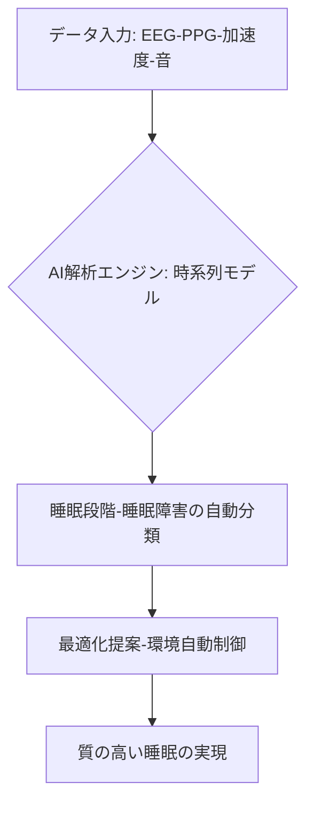

# T11-07-02 睡眠・覚醒パターンAI解析システム

## 技術の位置づけ
ウェアラブルデバイスや非接触センサーから得られた睡眠時の脳波（**EEG**）、心拍（**PPG**）、体動（**加速度**）などの生体信号をAIで解析し、睡眠段階（REM, N1-N3）や睡眠障害パターンを高精度に自動分類・評価するシステムである。AIは単なる記録に留まらず、膨大なデータを解析してユーザーごとに最適な環境調整や**改善提案**を行う。主な計測技術は、**脳波(EEG)・PPGセンサー**による生体信号計測と、**時系列データ解析AI（LSTM、Transformer）**である。

## Summary（5つの要点）
1. **個別最適化と環境制御**: AIは睡眠データ（室温、寝具、生活習慣）を学習し、**リアルタイムで環境（照明、空調）を自動調整**したり、最適な改善提案を行ったりする。
2. **大規模データからのパターン分類**: 加速度センサデータから睡眠・覚醒状態を判別するアルゴリズム「ACCEL」を用い、**約10万人の睡眠パターンを16種類**に統計的に分類することに成功した。
3. **非接触での診断支援**: スマートフォンで録音された**睡眠環境音（いびき、歯ぎしり）**を機械学習で解析し、睡眠ポリソムノグラフィ（PSG）検査結果と高い関連性を示す睡眠パターンを可視化できる。
4. **生成AIの活用**: 生成AIを活用した睡眠改善プログラムにより、総睡眠時間や深い睡眠の割合など、**睡眠の質を年間で10%向上**させることが可能であるとの研究データが示されている。
5. **医療・法人利用の拡大**: 従来の煩雑なPSG検査に代わる**簡易的な自宅検査システム**として医療機関でのスクリーニング導入が進み、企業の健康経営プログラムとしても活用が拡大している。

#### 概念図

## 具体的プロダクト事例
* **日本企業**:
    * **ACCELStars**: 東京大学の研究成果である**ACCELアルゴリズム**を応用し、腕時計型デバイスデータから睡眠障害リスクを早期に発見する睡眠健診サービスへの展開。
    * **大阪大学グループ**: スマホ録音された睡眠環境音から個人の睡眠パターンを可視化・評価するAI技術を開発。
* **グローバル**:
    * **Oura Ring/Whoop**: スマートリングやバンドで心拍変動（HRV）や体温を測定し、AIで睡眠の質とリカバリーレベルを詳細に分析するサービスを提供。
    * **Garmin Index Sleep Monitor**: アームバンド型の非侵襲デバイスで睡眠状態をモニタリングし、日中の活動データと統合してアドバイスを提供する。

---
### 技術評価表（定量的な視点）
| 評価項目 | 評価 | 根拠 |
| :--- | :--- | :--- |
| 導入コスト | ⭐⭐⭐⭐☆ | ウェアラブルデバイスの普及により、導入コストは比較的低い。 |
| 技術成熟度 | ⭐⭐⭐⭐☆ | 睡眠段階の分類や簡易的な睡眠障害スクリーニングは実用化レベルに到達している。 |
| 日本の競争力 | ⭐⭐⭐☆☆ | 基礎アルゴリズム開発力は高いが（ACCEL等）、グローバルのウェアラブル市場では後れを取っている。 |
| 市場性 | ⭐⭐⭐⭐⭐ | 現代人の睡眠不足問題解消、健康経営、医療スクリーニングなど市場ニーズが非常に高い。 |
| 品質保証の重要性 | ⭐⭐⭐⭐☆ | 睡眠時無呼吸症候群（SAS）などの診断支援に用いる場合、医療機器レベルの**誤判定率の低さ**が求められる。 |

---
## 日本の立ち位置・SWOT分析
### 強み
* **アルゴリズム開発力**: 大規模な睡眠データ解析に基づく**高精度な機械学習アルゴリズム（ACCEL）**など、アカデミアの研究成果が優位。
* **非侵襲性技術**: 音響解析など、**簡便で日常的な環境での測定技術**に独自性がある。
* **データ基盤**: 医療分野における睡眠ポリグラフ検査（PSG）データ蓄積量は豊富。
### 弱み
* **商業化の遅れ**: 高い技術力を有しながらも、OuraやWhoopのような**グローバル市場で影響力を持つコンシューマー向けデバイス**の展開が遅れている。
* **医療承認プロセス**: 診断支援システムとしての**医療機器承認**に時間がかかり、実用化のスピード感が欠ける。
* **データの標準化**: 異なるウェアラブルデバイス間で取得される睡眠データの**標準形式と互換性**が確立されていない。

## 専門家視点の技術調査ポイント
### 品質保証エンジニアの視点
* **AIモデルの精度評価**: 臨床で標準とされる**PSGとの一致率（Kappa係数など）**を、多種多様な睡眠パターンで検証。
* **ノイズ対策**: 体動、環境音、デバイス装着状態の変化など、**測定ノイズが解析結果に与える影響**を定量化し補正する技術。
* **信頼性評価**: 長期間の連続使用における**センサーのドリフト**や**バッテリー残量**が解析精度に与える影響評価。
### 化学系大学生への示唆
* **信号処理化学**: **微弱なPPG・脳波信号**からノイズを除去し、特徴量を抽出するための**高度なフィルタリング技術**。
* **センサー材料科学**: ウェアラブルデバイスにおける**電極や光センサーの生体適合性**と**検出効率**を高める材料開発。
* **データサイエンス**: **時系列深層学習（RNN/Transformer）**を用いた睡眠サイクルの予測モデリングと、**因果推論**による改善提案ロジックの開発。

---
## 技術ロードマップ（短期/中期/長期）
### 短期目標（～2027年）
* 加速度・PPGデータ解析に基づく睡眠解析アルゴリズムの**医療機器認定**を目指した臨床試験の完了。
* **生成AI**を活用した**パーソナライズされた睡眠改善プラン**提供サービスの実装と市場投入。
* 法人向け**健康経営パッケージ**へのAI睡眠解析システムの本格導入。
### 中期目標（2028年～2031年）
* 非接触型センサー（レーダー、圧電素子）を用いた高精度AI解析システムの**自宅での普及**。
* 睡眠解析結果と**遺伝子情報・腸内環境データ**を統合した**多角的健康管理プラットフォーム**の実現。
* **遠隔医療**における睡眠障害スクリーニングの標準ツールとしての確立。
### 長期目標（2032年～2035年）
* 脳波（EEG）やホルモン（T11-07-05）など、より**高度な生体情報**を統合した**次世代のAI睡眠診断システム**の完成。
* AIによる**リアルタイム環境制御**が、ほぼ全ての住居・オフィスで実現される。
* 睡眠データを活用した**創薬研究**への応用（睡眠・覚醒パターンに基づいた新薬ターゲット探索）。

### 📚 参照リンク
1. [AIと最新デバイスで劇的改善！睡眠の質を高める最新テクノロジー活用法](https://add.gig.co.jp/magazine/ai-solution/3221/)
2. [生成AIと睡眠：年間10%の睡眠向上効果 - テクノロジーで実現する質の高い眠り｜AIdeasHD](https://note.com/aideashd/n/n064802ca3447)
3. [AI技術により音から睡眠個性を視覚化、快適な眠りのパーソナル化に期待 - 大阪大学 ResOU](https://resou.osaka-u.ac.jp/ja/research/2017/20170324_3)
4. [AIが睡眠を分析・改善する仕組みとは？最新の活用事例も紹介 - CREX](https://crexgroup.com/ja/sleep/digital-tools/ai-sleep-analysis-improvement/)
5. [ACCELStarsが独占ライセンスを取得している東京大学大学院医学研究科が、同技術を利用した「大規模な睡眠解析から成人の睡眠パターンを16に分類」の論文を発表いたしました - PR TIMES](https://prtimes.jp/main/html/rd/p/000000009.000082124.html)
6. [T11_health_technologies.md (ファイル内容)]()