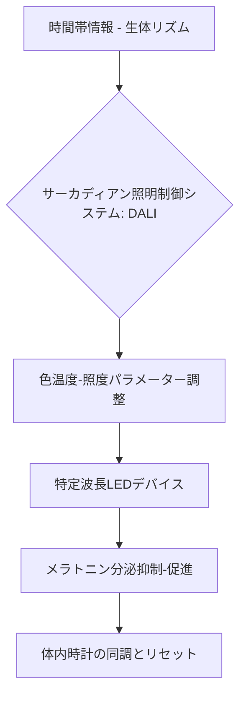

# T11-07-03 光療法デバイス・サーカディアンライティング

## 技術の位置づけ
メラトニン分泌を抑制または促進する**特定の波長（特に青色光）や照度**を、時間帯に応じて自動で調整し、体内時計を望ましい方向にリセットする照明・デバイス技術である。オフィス、医療施設、家庭などへの導入が進んでおり、時差ボケや交代勤務者の睡眠障害対策に活用される。主な計測技術は、**特定波長LED制御技術**と**照度・色温度の自動調整システム**であり、生体リズムに合わせた光を供給し体内時計の同調を促す。

## Summary（5つの要点）
1. **体内時計の非視覚的制御**: 光の視覚情報ではなく、特定の波長（青色光）がメラトニン分泌を抑制する作用を利用し、生体リズムを調整する。
2. **医療・福祉施設での応用**: 入院病棟など、時間の変化を感じづらい環境に**サーカディアンリズムに基づいた照明**を導入し、患者やスタッフの概日リズム維持を支援している。
3. **デジタル制御システムの活用**: 照明制御システム**DALI（Digital Addressable Lighting Interface）**などと連携し、病室など個別の空間で照度や色温度の細かな自動調整を実現している。
4. **環境演出との統合**: オフィスビルや商業施設において、時間の移ろいに合わせた光環境を演出することで、快適性とウェルビーイングを両立させている。
5. **AI連動型デバイス**: 睡眠サイクルを解析し、最も浅い眠りのタイミングで徐々に光を強くすることで、**自然で快適な目覚め**を促す光目覚まし時計も開発されている。

#### 概念図

## 具体的プロダクト事例
* **日本企業**:
    * **山田医療照明株式会社**: 医療法人公仁会 明石仁十病院の病室に、サーカディアンリズムに基づいた照明とDALI制御システムを導入。
    * **大手照明メーカー各社**: オフィスや商業施設向けに、時間帯に応じて光を動的に変化させるHuman Centric Lighting (HCL) ソリューションを提供。
* **グローバル**:
    * **Philips Hue**: アプリケーションを通じて、日の出・日没をシミュレートする光のシーンを家庭で再現できるスマートライティング製品。
    * **Ketra（Lutron買収）**: 美術館や高級オフィスビル向けに、自然光を忠実に再現し、生体リズムに合わせた動的な光を提供するシステム。

---
### 技術評価表（定量的な視点）
| 評価項目 | 評価 | 根拠 |
| :--- | :--- | :--- |
| 導入コスト | ⭐⭐☆☆☆ | 既存照明からの交換、およびデジタル制御システムの導入が必要であり、初期投資は高い。 |
| 技術成熟度 | ⭐⭐⭐⭐☆ | LEDの調色・調光技術やDALI制御は成熟しており、システムインテグレーションが進んでいる。 |
| 日本の競争力 | ⭐⭐⭐☆☆ | LED技術、制御技術は高いが、生体影響評価や個別化アルゴリズムにおいて欧米が先行。 |
| 市場性 | ⭐⭐⭐⭐⭐ | 病院、オフィス、学校など、ウェルビーイングを重視する施設で必須技術となりつつある。 |
| 品質保証の重要性 | ⭐⭐⭐☆☆ | 光の**波長特性の経年変化**や、制御システムの**動作信頼性**が、治療効果に影響を及ぼす。 |

---
## 日本の立ち位置・SWOT分析
### 強み
* **LED・照明技術**: 高品質なLED素子、レンズ技術、および照明機器の製造技術に強みを持つ。
* **システム制御**: DALIなどのデジタル制御システム構築に関する技術力と、施工実績の蓄積。
* **医療施設との連携**: 病院など特殊環境における導入事例が多く、臨床応用への知見が豊富。
### 弱み
* **個別化技術の遅れ**: 個人の**体内時計測定データ（T11-07-01, T11-07-05）**に基づいた、動的な**リアルタイム個別光制御アルゴリズム**の開発が世界的に遅れている。
* **効果の定量評価**: サーカディアンライティングの**臨床的な有効性（睡眠改善効果）**を示す統一された評価基準が未確立。
* **規制・標準化**: 建築基準や照明規格における**HCL（Human Centric Lighting）**の明確な基準設定が途上にある。

## 専門家視点の技術調査ポイント
### 品質保証エンジニアの視点
* **波長・照度の再現性**: LEDの**スペクトル分布**が、経年変化や温度変化によって変動しないことの**長期安定性評価**。
* **制御システムの信頼性**: DALIなどの**デジタル通信エラー**や**電源異常**が、光の急激な変化や誤動作を引き起こさないかの検証。
* **安全性評価**: 不適切な光曝露による**網膜への影響**や、光過敏症などの**健康被害リスク**の評価と対策。
### 化学系大学生への示唆
* **光化学**: LEDチップの**発光効率と波長の精密制御**を可能にする蛍光体、半導体材料の研究。
* **生体光応答メカニズム**: **非視覚的受容体（メラノプシン）**と光の相互作用、およびそれを通じたホルモン分泌調節の化学的メカニズム研究。
* **材料科学**: 長期間の使用に耐えうる、**熱安定性の高い**LEDパッケージング材料やレンズ材料の開発。

---
## 技術ロードマップ（短期/中期/長期）
### 短期目標（～2027年）
* DALIなどの制御システムと連携した、**標準的なサーカディアンライティングプロトコル**のオフィス・医療施設への普及。
* 光目覚まし時計など、**家庭用デバイス**におけるAI連携による目覚めタイミングの最適化。
* 光療法デバイスの**医療機器**としての認可に向けた臨床試験の開始。
### 中期目標（2028年～2031年）
* T11-07-05で得られた**ホルモンデータ**など、個人の生体情報に基づく**動的な光制御システム**の実用化。
* 光環境を総合的に管理する**IoTプラットフォーム**の構築と、他家電・設備との連携強化。
* 学校など**教育環境**でのサーカディアンライティング導入による**学習効果向上**の検証。
### 長期目標（2032年～2035年）
* 個人宅の照明・窓・ブラインドが全て自動制御され、**シームレスな体内時計サポート**が実現。
* 光暴露履歴と健康データを統合し、精神疾患（季節性うつ病など）の**予防・治療**に活用される。
* HCLが**建築物の標準的な要件**となり、エネルギー効率と健康の最適化が両立。

### 📚 参照リンク
1. [光で整える体内時計。サーカディアンリズム照明の事例紹介 | 神田通信機株式会社](https://www.kandt.co.jp/lab/post/20250630-collabo.html)
2. [【初導入】サーカディアンリズムに基づいた照明・制御システムを病室に設置（医療法人公仁会 明石仁十病院 様）～LED導光板 薄型照明 - PR TIMES](https://prtimes.jp/main/html/rd/p/000000003.000086412.html)
3. [AIと最新デバイスで劇的改善！睡眠の質を高める最新テクノロジー活用法](https://add.gig.co.jp/magazine/ai-solution/3221/)
4. [T11_health_technologies.md (ファイル内容)]()