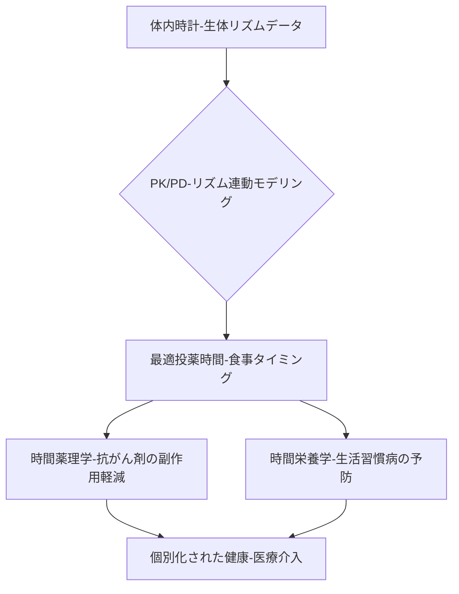

# T11-07-04 時間栄養学・時間薬理学のアプリケーション

## 技術の位置づけ
体内時計のリズムに合わせて、食事のタイミングや内容（**時間栄養学**）、または薬物の投与時間や量を最適化する技術（**時間薬理学**）である。体内時計の周期に応じて、栄養素の代謝や薬物吸収・効果、副作用発現のタイミングが変動することを利用する。生活習慣病の予防や、抗がん剤などの**薬効を最大化し副作用を最小限に抑える**個別化医療への応用を目指す。主な計測技術は、**薬物動態学（PK/PD）と体内時計の連動モデリング**、および**バイオマーカーのリアルタイムモニタリング**である。

## Summary（5つの要点）
1. **薬物効率の最大化**: 多くの薬物代謝酵素や標的分子が概日リズムを持つため、投与時間を最適化（**時間治療**）することで薬効を大幅に高める。
2. **副作用の軽減**: 特に抗がん剤治療において、正常細胞への毒性が最小となる時間帯に投与することで、重篤な副作用を軽減できる可能性がある。
3. **食事タイミングの最適化**: **時間栄養学**に基づき、朝食の適切な摂取や夕食時間のコントロールが、血糖値、脂質代謝、体重管理といった生活習慣病の予防に寄与する。
4. **個別化リコメンドAI**: 個人の**生体リズム情報**（T11-07-01, T11-07-05）に基づき、最適な食事・投薬タイミングを推奨するAIアプリケーションの開発が進行中である。
5. **PK/PDモデリングの高度化**: 薬物動態学・薬力学モデルに概日リズムの変動因子を組み込み、薬物効果の時間変動をより正確に予測する研究が進んでいる。

#### 概念図

## 具体的プロダクト事例
* **日本企業**:
    * **大学病院・製薬会社**: 大腸がん治療薬など、特定の抗がん剤に対する**時間治療プロトコル**の確立を目指した多施設共同臨床研究。
    * **食品メーカー**: 時間栄養学の知見に基づき、特定の時間帯の摂取を推奨する機能性食品やサプリメントの開発。
* **グローバル**:
    * **Chrono Therapeutics**: 生体リズムに合わせてニコチンパッチの放出量を自動で調整する**薬物送達システム（DDS）**を開発（ニコチン依存症治療）。
    * **大手製薬会社**: 特定の慢性疾患治療薬について、投与時間の違いによる有効性・安全性の比較を目的とした国際的な大規模臨床試験。

---
### 技術評価表（定量的な視点）
| 評価項目 | 評価 | 根拠 |
| :--- | :--- | :--- |
| 導入コスト | ⭐⭐⭐☆☆ | 個人の体内時計を測定する検査費用や、最適化された服薬指導コストが必要。 |
| 技術成熟度 | ⭐⭐☆☆☆ | 基礎研究は進んでいるが、個別化された時間治療・時間栄養学の臨床ガイドラインは未確立。 |
| 日本の競争力 | ⭐⭐⭐☆☆ | 時間生物学の基礎研究では強みがあるが、それを応用した治療デバイスやAIシステムの開発で欧米が先行する可能性。 |
| 市場性 | ⭐⭐⭐⭐☆ | 生活習慣病、がん、精神疾患など幅広い疾患への応用が期待され、市場の潜在性は非常に高い。 |
| 品質保証の重要性 | ⭐⭐⭐⭐⭐ | 誤った服薬タイミングは薬効の低下や副作用の増強に直結し、**患者の生命に関わる**ため極めて重要。 |

---
## 日本の立ち位置・SWOT分析
### 強み
* **基礎研究の蓄積**: 時間生物学・時間薬理学の分野で国際的に高い評価を受けており、学術的な知見が豊富。
* **栄養学との融合**: 健康志向が高く、伝統的に食と健康の関連性が重視されてきたため、**時間栄養学**の社会実装が進みやすい土壌がある。
* **高齢化社会のニーズ**: がんや生活習慣病の治療・予防において、**副作用を軽減する個別化医療**へのニーズが極めて高い。
### 弱み
* **リアルタイムモニタリングの遅れ**: 個人の体内時計をリアルタイムで高精度に把握するための**非侵襲型センサー（T11-07-05）**の実用化が国際的に遅れている。
* **規制面の課題**: 投与タイミングを個別化する治療法に対する**規制当局の承認プロセス**が確立されていない。
* **複合的データ解析人材不足**: 薬物動態学、体内時計、AIを統合的に扱える**データサイエンティスト**や**臨床薬理学者**が不足している。

## 専門家視点の技術調査ポイント
### 品質保証エンジニアの視点
* **PK/PDモデルの精度**: 体内時計因子を組み込んだ薬物動態予測モデルの**信頼区間と予測精度**を、多検体・多時間点で検証。
* **臨床的検証**: 時間治療の**有効性・安全性**を評価するための**大規模かつ多施設共同のランダム化比較試験（RCT）**の設計とデータ管理。
* **DDSの精度**: 生体リズムに合わせて薬物放出量を制御する**DDS（ドラッグデリバリーシステム）デバイス**の**放出制御の信頼性**と**再現性**。
### 化学系大学生への示唆
* **薬物動態学**: 薬物の**吸収、代謝、排泄**経路における**概日リズム依存的な変動**を分子レベルで解明する研究。
* **バイオインフォマティクス**: **遺伝子発現データ**と**薬物代謝酵素**の関連性を解析し、最適な薬物投与時間を予測するAIモデル構築。
* **栄養化学**: 食事の**栄養素組成**、**摂取時間**と体内時計遺伝子・代謝酵素の**分子レベルの相互作用**を解明する研究。

---
## 技術ロードマップ（短期/中期/長期）
### 短期目標（～2027年）
* 時間栄養学に基づいた**食事時間リコメンドアプリ**の市場投入と、その効果を測定する実証研究。
* 特定の**抗がん剤**や**降圧剤**に対する時間治療プロトコルの策定と、小規模臨床試験の実施。
* PK/PDモデリングへの体内時計因子の組み込みに向けた**データ統合基盤**の構築。
### 中期目標（2028年～2031年）
* T11-07-01やT11-07-05のセンサー技術を活用し、**個人の生体リズム**をリアルタイムで反映した**動的な投薬リコメンドシステム**の実用化。
* 時間治療・時間栄養学を組み込んだ**生活習慣病予防プログラム**の保険適用を目指した検証。
* **自動投与デバイス**と連携した、服薬タイミング制御技術の高度化。
### 長期目標（2032年～2035年）
* 時間治療が**がん治療**や**慢性疾患治療**の**標準的な個別化医療**として確立。
* ウェアラブルデバイスやIoTを活用し、全ての個人が**最適な食事・投薬タイミング**を知り、実行できる社会の実現。
* 体内時計の乱れを予測・診断する**時間薬理学的バイオマーカー**の発見と臨床応用。

### 📚 参照リンク
1. [新薬開発のキーワード② 時間薬理学と時間栄養学 - 早稲田大学](https://www.waseda.jp/inst/weekly/academics/2015/04/01/31005/)
2. [T11_health_technologies.md (ファイル内容)]()