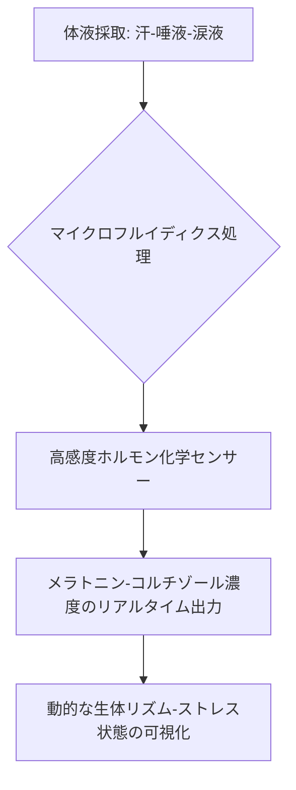

# T11-07-05 メラトニン分泌/コルチゾール等のリアルタイムモニタリング

## 技術の位置づけ
唾液、汗、涙などの体液中の**メラトニン**（睡眠ホルモン）や**コルチゾール**（ストレスホルモン）といった体内時計関連ホルモンの濃度を、**ウェアラブルセンサー**や**マイクロフルイディクス技術**を用いて、非侵襲的かつリアルタイムで連続測定する技術である。これにより、従来の血液検査や一時点の測定では困難だった、ホルモン分泌の**動的なリズム**を捉えることが可能になる。客観的な生体リズム指標を提供し、T11-07-01の遺伝子発現測定を補完し、睡眠・ストレス管理の基盤データを提供する。主な計測技術は、**汗/唾液中ホルモン高感度センサー**と**マイクロフルイディクスを用いた非侵襲的サンプリング**である。

## Summary（5つの要点）
1. **非侵襲的連続測定**: 血液採取の必要がなく、汗、唾液、涙液といった体液を用いて、**低負荷**で**長期的**なホルモン濃度モニタリングを可能にする。
2. **客観的指標の提供**: 睡眠・ストレスの主観的な評価を補完し、メラトニンやコルチゾールのリズムに基づいた**客観的な体内時計指標**を提示できる。
3. **マイクロフルイディクスとの融合**: **微小流路技術（マイクロフルイディクス）**により、ウェアラブルデバイス内で微量の体液を精密に採取・分析し、高感度な検出を可能にする。
4. **ストレス管理への応用**: コルチゾールはストレス応答の指標となるため、日中の精神的・身体的ストレスレベルの**リアルタイム可視化**と**早期警告**システムへの応用が期待される。
5. **次世代ウェアラブルへの統合**: 従来の心拍、体動センサーに加え、ホルモンセンサーが**スマートリング**や**スマートパッチ**などの次世代ウェアラブルデバイスに組み込まれる。

#### 概念図

## 具体的プロダクト事例
* **日本企業**:
    * **理化学研究所/東京大学など**: 柔軟性の高いエレクトロニクスと、汗中の各種バイオマーカー（電解質、乳酸など）を測定するウェアラブルセンサーの基礎研究が先行。
    * **各社ウェアラブルデバイスメーカー**: 睡眠トラッキングに特化した製品（例：脳波センサー搭載アイマスクなど）が、将来的にはホルモンモニタリング機能の追加を見据えている。
* **グローバル**:
    * **Stanford University**: 汗センサーを用いた薬物やストレスホルモン（コルチゾール）の非侵襲的連続モニタリングに関する研究開発が進んでいる。
    * **Garmin/Fitbit**: 現行製品はPPGやHRVによる間接的な睡眠・ストレス測定に留まるが、将来的にはホルモンセンサーを統合する方向性が示唆されている。

---
### 技術評価表（定量的な視点）
| 評価項目 | 評価 | 根拠 |
| :--- | :--- | :--- |
| 導入コスト | ⭐⭐☆☆☆ | ウェアラブルデバイスとしての販売価格は抑えられるが、使い捨てのセンサーチップなど消耗品コストが高い。 |
| 技術成熟度 | ⭐⭐☆☆☆ | ホルモン検出には極めて高い感度・選択性が必要であり、実用化はまだ研究開発段階にある。 |
| 日本の競争力 | ⭐⭐⭐☆☆ | センサー技術、微細加工技術といった基盤技術は世界的に優位だが、ホルモン特化の化学センサー実用化では先行事例が少ない。 |
| 市場性 | ⭐⭐⭐⭐☆ | 睡眠・ストレス管理市場に加え、時間薬理学（T11-07-04）の基盤データとして必須であり、市場ポテンシャルは高い。 |
| 品質保証の重要性 | ⭐⭐⭐⭐⭐ | 測定値の僅かな誤差が、**時間薬理学における投薬タイミングの誤り**に直結し、医療行為の安全性に影響を及ぼす。 |

---
## 日本の立ち位置・SWOT分析
### 強み
* **化学センサー技術**: 電気化学センサーや表面プラズモン共鳴（SPR）など、高感度な**化学センサーの基礎研究・製造技術**に強みがある。
* **微細加工技術**: マイクロ流路チップ（マイクロフルイディクス）を精密に製造する**半導体・MEMS技術**が優位。
* **生体適合材料**: 長時間装着を可能にする**柔軟性、生体適合性に優れた材料**開発に実績がある。
### 弱み
* **感度・選択性の課題**: 体液中のホルモン濃度は極めて低く、**高感度かつ、共存物質の干渉を受けない高選択性**のセンサー開発が難航している。
* **校正の課題**: 汗や唾液の**pHや温度変化**による測定値の変動を補正する**キャリブレーション技術**の確立が困難。
* **臨床データ不足**: ウェアラブルセンサーによるホルモン値と**血中ホルモン値**の**相関性**を示す大規模な臨床データが不足している。

## 専門家視点の技術調査ポイント
### 品質保証エンジニアの視点
* **センサーの感度・選択性**: ホルモン分子に特異的に結合する**分子プローブ**の**化学的安定性**と、臨床的に意味のある**微量濃度の検出限界**の検証。
* **ノイズ対策**: センサー表面の**汚染（ファウリング）**や、**汗の蒸発速度**といった環境要因による**測定ドリフト**の補正アルゴリズム開発。
* **信頼性評価**: 連続使用時の**センサーの劣化速度**と、家庭での使用環境を想定した**耐久性、防水性**の評価。
### 化学系大学生への示唆
* **電気化学**: ホルモンの**酸化還元反応**を利用した**高感度な電気化学センサー（FET、バイオセンサー）**の開発と、界面化学的な研究。
* **有機合成化学**: ホルモンに特異的に結合する**分子インプリントポリマー（MIP）**や**アプタマー**などの**分子認識素子**の設計と合成。
* **マイクロ流体制御**: 体液を一定量かつ正確にセンサー部位へ導くための**微細な流路構造**の設計と、**ポンプ・バルブレス制御**の研究。

---
## 技術ロードマップ（短期/中期/長期）
### 短期目標（～2027年）
* 研究室レベルでの**高感度ホルモンセンサー**プロトタイプの開発と、**血中濃度との相関性**を示す小規模臨床検証。
* マイクロフルイディクス技術を用いた**非侵襲的な体液採取技術**の小型化。
* 汗・唾液における**ホルモン濃度変動の標準的なデータベース**の構築。
### 中期目標（2028年～2031年）
* センサー、電源、通信モジュールを統合した**ウェアラブルホルモンモニター**の製品化と、一般消費者向けの発売。
* T11-07-04（時間薬理学）と連携し、**投薬タイミングの最適化**を目的とした臨床試験の実施。
* センサーの**長期安定性**と**再校正不要**な技術の開発。
### 長期目標（2032年～2035年）
* **医療機器**として承認されたウェアラブルホルモンモニターが、睡眠障害、ストレス関連疾患の**診断・治療支援**に広く普及。
* ホルモンデータが**AI健康管理プラットフォーム**の中核データの一つとして機能し、未病対策に活用される。
* メラトニンやコルチゾール以外の**広範なストレス・代謝ホルモン**の連続モニタリング実現。

### 📚 参照リンク
1. [Garmin初！アームバンド型睡眠モニタリングデバイス誕生『Index Sleep Monitor』を今年8月に発売予定 | プレスリリース](https://www.garmin.co.jp/news/pressroom/news2025-0625-garmin-index-sleep-monitor/)
2. [短時間のお昼寝にも! 脳波をモニタリングするアイマスク「LUUNA」 - 家電 Watch](https://kaden.watch.impress.com/docs/column/sleeptech/1142584.html)
3. [T11_health_technologies.md (ファイル内容)]()