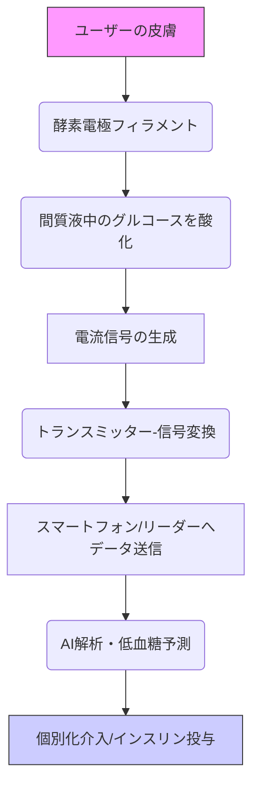

# T11-08-01 連続血糖測定(CGM)センサー
## 技術の位置づけ
CGMセンサーは、皮下に挿入された極細フィラメントにより間質液中のグルコース濃度を連続的に測定する技術である。従来の指先穿刺による断続的な血糖測定と比較し、血糖値の変動パターンをリアルタイムで把握できる優位性を持つ。これにより、糖尿病患者の低血糖・高血糖を未然に防ぎ、より個別化されたインスリン投与や食事管理を可能にする。**用いる主な計測技術**は、グルコース酸化酵素を用いた**酵素電極法（電気化学センサー）**である。将来的には完全非侵襲化が主要な開発目標である。

## Summary（5つの要点）
* **リアルタイム血糖管理**: 24時間365日、血糖値を連続的にモニタリングし、低血糖・高血糖の予防に貢献する。
* **市場リーダーの存在**: AbbottのFreeStyle LibreやDexcom G7などの製品が市場を牽引し、高精度化と小型化が進んでいる。
* **デジタルヘルスへの統合**: スマートフォン連携やインスリンポンプ（SAP/AIDシステム）との連動により、糖尿病管理の自動化・高度化が進展している。
* **完全非侵襲化の挑戦**: 採血や穿刺が不要な、光音響分光法やマイクロ波センサーなどを用いた次世代の完全非侵襲型CGMが研究されている。
* **保険適用と普及**: 1型糖尿病患者に加え、2型糖尿病患者への保険適用範囲拡大が進み、予防医療・未病対策としての活用も期待される。

#### 概念図

## 具体的プロダクト事例
* **Abbott FreeStyle Libre (米国)**: 穿刺不要のフラッシュグルコースモニタリング（FGM）として世界的なシェアを持つ。スマートフォン連携でリアルタイムデータを提供。
    * URL: https://www.freestylelibre.jp/ (日本法人)
* **Dexcom G7 (米国)**: より小型化・装着期間延長を実現した最新モデル。高精度とインスリンポンプ連携の安定性で評価が高い。
    * URL: https://www.dexcom.com/
* **メドトロニック Guardian Sensor 3 (米国)**: インスリンポンプとの連携を前提としたIntegrated CGM (iCGM)として知られる。
    * URL: https://www.medtronic.com/

---
### 技術評価表（定量的な視点）
| 評価項目 | 評価 | 備考 |
| :--- | :--- | :--- |
| **導入コスト** | ⭐⭐⭐⭐☆ | センサー自体は消耗品であり、継続的な費用が発生する。 |
| **技術成熟度** | ⭐⭐⭐⭐☆ | 市場に広く普及し、信頼性の高い製品が複数存在する。 |
| **日本の競争力** | ⭐⭐⭐☆☆ | センシング技術は高いが、デバイス市場は米国の後追い。 |
| **市場性** | ⭐⭐⭐⭐⭐ | 糖尿病患者の増加により、グローバル市場は急速に拡大中。 |
| **品質保証の重要性** | ⭐⭐⭐⭐⭐ | 血糖値に基づく治療判断に直結するため、精度と信頼性が最重要。 |

---
## 日本の立ち位置・SWOT分析
### 強み
* 医療機器、精密加工、微細加工技術が高く、センサーの小型化・高精度化に貢献できる基盤技術を持つ。
* カネカなど、センサー素材・電極材料における高い技術力。
* 高品質な臨床研究体制があり、日本独自のデータに基づく検証が可能。
### 弱み
* グローバル市場のデファクトスタンダードは米国企業に握られており、キャッチアップに時間がかかる。
* AIを活用した血糖予測エンジンや、インスリンポンプとの統合システム開発で遅れが見られる。
* 医療機器規制（薬機法）の対応が海外と比較して慎重であり、新技術の導入に時間を要する傾向がある。

## 専門家視点の技術調査ポイント
### 品質保証エンジニアの視点
* **測定精度**: MARD（Mean Absolute Relative Difference）値の継続的な改善と、ノイズ・体動による誤差の低減策。
* **ノイズ対策**: 外部からの電磁ノイズ、およびアセトアミノフェンなどの競合物質による干渉の排除技術。
* **信頼性評価**: センサーの装着期間中の安定性（ドリフト）評価と、ロット間・個体間のばらつき管理。
### 化学系大学生への示唆
* **酵素電極の材料科学**: グルコース酸化酵素の固定化技術と、生体適合性の高い素材開発。
* **電気化学**: センサーの応答速度、感度、選択性を高めるための電気化学的手法の理解。
* **バイオインフォマティクス**: 連続的な血糖データから食事・運動・インスリン投与量との関連性を解析するデータサイエンスのスキル。

---
## 技術ロードマップ（短期/中期/長期）
### 短期目標（～2027年）
* センサーの小型化・薄型化、装着期間の14日間から20日間への延長、低コスト化を実現する。
* スマートフォンとの連携機能の安定化と、AIによる低血糖予測精度の向上（特に夜間）を達成する。
* iCGMシステムのインスリンポンプとの相互運用性（相互接続性）の標準化を進める。
### 中期目標（2028年～2031年）
* 部分非侵襲型（パッチ型、皮膚貼付型）センサーの実用化と市場投入。
* 非糖尿病患者向けのウェルネス・未病対策用途での普及拡大。
* AIによる個別化食事・運動プログラム提案機能の高度化。
### 長期目標（2032年～2035年）
* **完全非侵襲型CGM**の臨床精度を穿刺型と同等レベルにまで高め、市場を置き換える。
* 血糖値以外の代謝物（乳酸、ケトン体など）の同時多項目測定を実現する。
* ウェアラブルデバイスとしての統合と、PHR基盤を通じた医療機関とのデータ自動共有を実現。

### 📚 参照リンク
1.  Diabetes Technology: Continuous Glucose Monitoring. *Diabetes Care*. [2024年最新論文]
    * URL: https://pubmed.ncbi.nlm.nih.gov/
2.  厚生労働省. 令和5年度 診療報酬改定の概要（個別化医療関連）. [2023年4月]
    * URL: https://www.mhlw.go.jp/
3.  Advanced Biosensors and Wearable Devices for Non-Invasive Glucose Monitoring. *Advanced Functional Materials*. [2023年]
    * URL: https://onlinelibrary.wiley.com/
