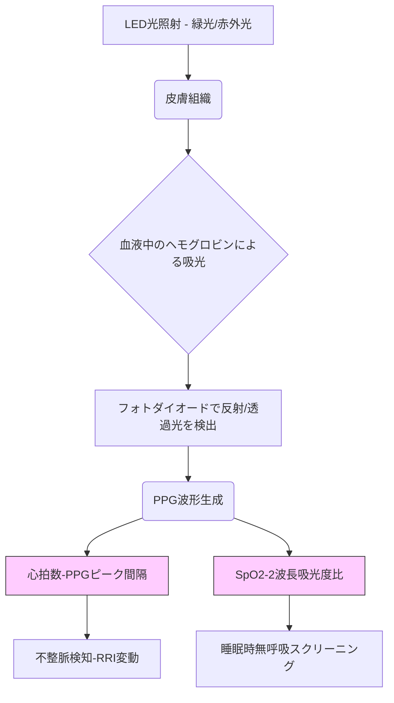

# T11-08-02 光学式心拍・血中酸素濃度(SpO2)センサー
## 技術の位置づけ
光学式センサーは、LED光を皮膚に照射し、血液の吸光度変化をフォトダイオードで捉えることで、非侵襲的に心拍数や血中酸素飽和度（SpO2）を測定する技術である。心拍数測定には**フォトプレチスモグラフィ（PPG）**が、SpO2測定には酸素化ヘモグロビンと脱酸素化ヘモグロビンの吸光度の違いを利用した**二波長PPG**が用いられる。ウェアラブルデバイスに標準搭載されており、心房細動や睡眠時無呼吸症候群の早期発見に貢献する、最も普及した生体センサー技術である。

## Summary（5つの要点）
* **普及の拡大**: スマートウォッチやフィットネストラッカーに標準搭載され、日常的な健康モニタリングのデファクトスタンダードとなっている。
* **不整脈検知**: Apple Watchなどの医療機器認証を受けた製品では、PPGデータに基づく心房細動（AFib）の検知機能が実用化されている。
* **睡眠時無呼吸症候群のスクリーニング**: 夜間の連続的なSpO2低下（無呼吸低呼吸指数AHI）を検知し、睡眠障害のスクリーニングツールとして活用されている。
* **精度向上の課題**: 体動ノイズや皮膚の色、血流などの個人差による測定誤差を低減するための信号処理技術の高度化が鍵となる。
* **低コスト高機能化**: LED・PD素子の高性能化と小型化、低消費電力化が進み、測定精度を維持しつつコストダウンが実現している。

#### 概念図

## 具体的プロダクト事例
* **Apple Watch Series (米国)**: PPGに基づき心拍数とSpO2を測定。心房細動の通知機能はFDA認証を受けており、医療機器として機能。
    * URL: https://www.apple.com/
* **Fitbit/Google (米国)**: 睡眠モニタリング機能が高度で、PPGを利用した心拍変動（HRV）やSpO2の変動を解析し、睡眠の質を評価。
    * URL: https://www.fitbit.com/
* **Garmin (米国)**: スポーツウォッチとして、高精度なPPGセンサーを搭載し、トレーニング中の心拍数や運動後のSpO2リカバリーをモニタリング。
    * URL: https://www.garmin.com/

---
### 技術評価表（定量的な視点）
| 評価項目 | 評価 | 備考 |
| :--- | :--- | :--- |
| **導入コスト** | ⭐☆☆☆☆ | 量産効果によりデバイスへの組み込みコストは非常に低い。 |
| **技術成熟度** | ⭐⭐⭐⭐⭐ | 広く普及し、安定した技術だが、医療用途の精度にはまだ課題。 |
| **日本の競争力** | ⭐⭐⭐⭐☆ | センサー部品（LED、PD）や信号処理技術で高い競争力を持つ。 |
| **市場性** | ⭐⭐⭐⭐⭐ | スマートウォッチ、ヘルスケアデバイス市場の成長と共に拡大。 |
| **品質保証の重要性** | ⭐⭐⭐⭐☆ | 誤判定は利用者の不安を招くため、体動ノイズ耐性の保証が重要。 |

---
## 日本の立ち位置・SWOT分析
### 強み
* ソニー、ローム、シャープなど、**高感度な光センサー（LED・PD）部品**の製造技術で世界的に優位性を持つ。
* PPG信号の微細な変動を解析する**信号処理アルゴリズム**の開発で実績がある（例：脈波解析）。
* 精密な**心拍変動解析（HRV）**技術を応用した自律神経評価の臨床知見が豊富。
### 弱み
* ウェアラブルデバイスの**最終製品としてのブランド力**や、OSレベルでのプラットフォーム開発で米国企業に後れを取っている。
* 医療機器としての**FDA/薬機法認証取得**戦略のスピード感が海外勢に劣る。
* 大規模な実証データに基づく**AI解析モデル（不整脈検知など）**の蓄積が不十分。

## 専門家視点の技術調査ポイント
### 品質保証エンジニアの視点
* **測定精度（体動耐性）**: 運動中や装着位置のズレによる**モーションアーチファクト**をいかに除去し、精度を維持するか。
* **ノイズ対策**: 環境光（太陽光、蛍光灯）の干渉に対する堅牢性と、低消費電力化との両立。
* **信頼性評価**: 皮膚の色（メラニン色素）や血流、温度などの**個人差**に対する測定の一貫性と普遍性の保証。
### 化学系大学生への示唆
* **光化学/分光分析**: 異なる波長光（緑、赤外）の血液成分（ヘモグロビン）に対する吸光特性の理解。
* **信号処理**: PPG波形からノイズを除去し、心拍数やSpO2を正確に抽出するデジタルフィルタリング技術。
* **統計学/機械学習**: 大規模データセットを用いた不整脈や睡眠障害の**異常パターン認識モデル**の構築。

---
## 技術ロードマップ（短期/中期/長期）
### 短期目標（～2027年）
* センサーの小型化をさらに進め、耳や指輪型デバイスへの組み込みを標準化。
* SpO2測定の精度を向上させ、**医療機器クラスII**としての認証取得を加速。
* PPGによる血圧推定（カフレス血圧計）の実用化と市場投入。
### 中期目標（2028年～2031年）
* **多波長PPG**による、より詳細な血液・組織情報の取得（例：脱水状態、ヘモグロビン量）。
* 心房細動だけでなく、他の不整脈や心不全の兆候をAIで検知する機能の高度化。
* 睡眠時無呼吸症候群の**確定診断**に近い高精度のスクリーニングツールとしての確立。
### 長期目標（2032年～2035年）
* PPGをコア技術とし、他の非侵襲センサー（例：生体インピーダンス）との**センサーフュージョン**による多角的生体情報モニタリングの実現。
* AIによるリアルタイムの健康リスク予測と、医療機関へのデータ自動連携システムの構築。

### 📚 参照リンク
4.  Apple Heart Study. *New England Journal of Medicine*. [2019年]
    * URL: https://www.nejm.org/
5.  Development of Wearable Pulse Oximetry for Sleep Apnea Screening. *Sleep Medicine Reviews*. [2023年]
    * URL: https://www.sciencedirect.com/
6.  Advances in Photoplethysmography-Based Wearable Sensors for Cardiovascular Monitoring. *Sensors*. [2024年]
    * URL: https://www.mdpi.com/
