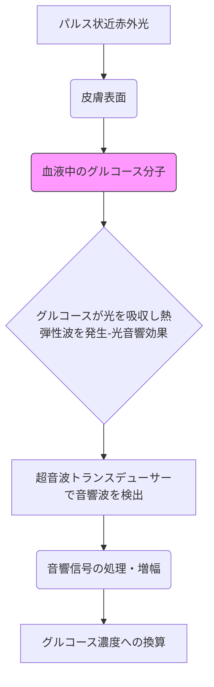

# T11-08-03 光音響分光法非侵襲血糖測定
## 技術の位置づけ
光音響分光法は、近赤外光を皮膚組織に照射し、血液中のグルコース分子が光を吸収した際に発生する微弱な音響波（熱弾性波）を超音波センサーで検出する計測技術である。グルコース濃度によってこの音響波のパターンや強度が変化する原理を利用し、針を刺さずに血糖値を測定する**完全非侵襲CGM**の最有力候補の一つ。**用いる主な計測技術**は、**光音響効果**と**超音波トランスデューサー**を用いた信号検出であり、皮膚透過性と選択性の高さが特長である。2030年代の実用化が目標とされている。

## Summary（5つの要点）
* **完全非侵襲性**: 採血や皮下穿刺が一切不要であり、利用者にとっての負担をゼロにする究極の血糖測定法である。
* **高感度・高選択性**: グルコース分子特有の吸収スペクトルを利用するため、他の生体分子の影響を受けにくい高い選択性を持つ。
* **深度情報**: 超音波の特性により、皮膚の異なる層からの情報を取得でき、深部組織のグルコース測定が可能である。
* **信号検出の難しさ**: グルコース由来の光音響信号は極めて微弱であり、体動ノイズや体温変化などの環境ノイズを排除する高度な信号処理技術が不可欠である。
* **2030年代の実現目標**: 知能技術研究所（日本）やGWave（イスラエル）などの企業が開発をリードしており、臨床精度の検証が最終的な課題となっている。

#### 概念図

## 具体的プロダクト事例
* **知能技術研究所 (日本)**: 研究開発段階で、小型化と測定精度の向上を目指し、光音響法を用いた非侵襲血糖測定技術を開発中。
    * URL: https://www.ito-ri.co.jp/ (研究開発機関の一例)
* **GWave (イスラエル)**: 光音響技術をベースにした非侵襲モニタリングデバイスの開発を進め、将来的なCGM市場への参入を目指している。
    * URL: https://www.gwave-medical.com/ (類似技術企業の例)
* **Freedom Meditech (米国)**: 類似の分光法であるラマン分光法など、複数の非侵襲技術を研究しているスタートアップ。
    * URL: https://www.freedom-meditech.com/ (類似技術企業の例)

---
### 技術評価表（定量的な視点）
| 評価項目 | 評価 | 備考 |
| :--- | :--- | :--- |
| **導入コスト** | ⭐⭐⭐☆☆ | 複雑な光学系と超音波センサーが必要であり、現時点では高コスト。 |
| **技術成熟度** | ⭐⭐☆☆☆ | 研究開発段階であり、臨床精度（MARD）の検証が不十分。 |
| **日本の競争力** | ⭐⭐⭐⭐☆ | 光学技術、超音波技術、信号処理技術で世界的な優位性を持つ。 |
| **市場性** | ⭐⭐⭐⭐⭐ | 実現すれば、血糖測定市場全体を塗り替える可能性を秘める。 |
| **品質保証の重要性** | ⭐⭐⭐⭐⭐ | 穿刺型CGMに匹敵する精度を非侵襲で保証する必要がある。 |

---
## 日本の立ち位置・SWOT分析
### 強み
* **光学部品・超音波センサー技術**: 村田製作所、キーエンス、浜松ホトニクスなど、高精度なレーザー、光検出器、超音波トランスデューサーの基盤技術が極めて高い。
* **光音響イメージングの研究実績**: 医療分野における光音響イメージングの研究が活発であり、臨床応用への知見が豊富。
* **精密計測・信号処理**: 微弱信号のノイズ除去と解析に長けた技術者・研究者が多数存在する。
### 弱み
* 医療機器としての**システム統合**と、ウェアラブル化・小型化のスピードで海外に遅れを取る可能性がある。
* 大規模な臨床試験データに基づく**AIキャリブレーションモデル**の構築が今後の課題となる。
* グルコースの吸光度変化以外の**皮膚組織の多様性**（温度、水分量など）の影響を排除する技術的な障壁。

## 専門家視点の技術調査ポイント
### 品質保証エンジニアの視点
* **測定精度（MARD）**: 臨床データに基づき、グルコースの動的な変化に対する追従精度（MARD）を厳格に評価する。
* **ノイズ対策**: 体動、環境温度、外部音響ノイズに対する光音響信号の分離と抽出技術の堅牢性。
* **信頼性評価**: 長期間の使用による光学部品や超音波トランスデューサーの劣化、キャリブレーション頻度と安定性。
### 化学系大学生への示唆
* **光化学/分光分析**: グルコースを含む生体分子の近赤外域における吸収スペクトルの精密分析と、選択性の確保。
* **物理音響学**: 光音響効果の理論的背景（熱弾性波の発生と伝播）の理解と、超音波検出技術。
* **材料科学**: 高感度かつ小型の**超音波トランスデューサー（PZT、CMUT/PMUT）**の材料開発と実装技術。

---
## 技術ロードマップ（短期/中期/長期）
### 短期目標（～2027年）
* ラボレベルでの測定精度（MARD値）を、現行のCGM（約10%）と同等レベル以下に引き下げる基礎研究を完了する。
* 試作機レベルでの大幅な小型化、ウェアラブル化に向けた光学系・超音波センサーの設計最適化。
* 体動や皮膚温度の影響をリアルタイムで補正するAIアルゴリズムの基盤構築。
### 中期目標（2028年～2031年）
* 臨床試験（治験）を開始し、実環境下での連続測定における精度と安定性を検証する。
* 量産を意識した部品調達と製造プロセスの確立、およびコストダウンを達成する。
* 複数の生体パラメータ（例：血流速度、水分量）を同時に測定し、血糖値推定の精度を向上させる**多要素融合**。
### 長期目標（2032年～2035年）
* 医療機器認証を取得し、**完全非侵襲CGM**として市場に本格投入する。
* グルコースだけでなく、アルコール濃度、乳酸などの他の代謝物の同時非侵襲測定を実現。
* スマートフォンとのシームレスな連携と、糖尿病治療の完全自動化（AIDシステム）への組み込み。

### 📚 参照リンク
7.  The promise of photoacoustic sensing for noninvasive continuous glucose monitoring. *Journal of Biophotonics*. [2023年]
    * URL: https://onlinelibrary.wiley.com/
8.  Non-Invasive Glucose Monitoring Using Photoacoustic Spectroscopy: Recent Progress and Challenges. *Sensors*. [2022年]
    * URL: https://www.mdpi.com/
9.  知能技術研究所. 研究開発テーマ一覧. [2025年時点]
    * URL: https://www.ito-ri.co.jp/
