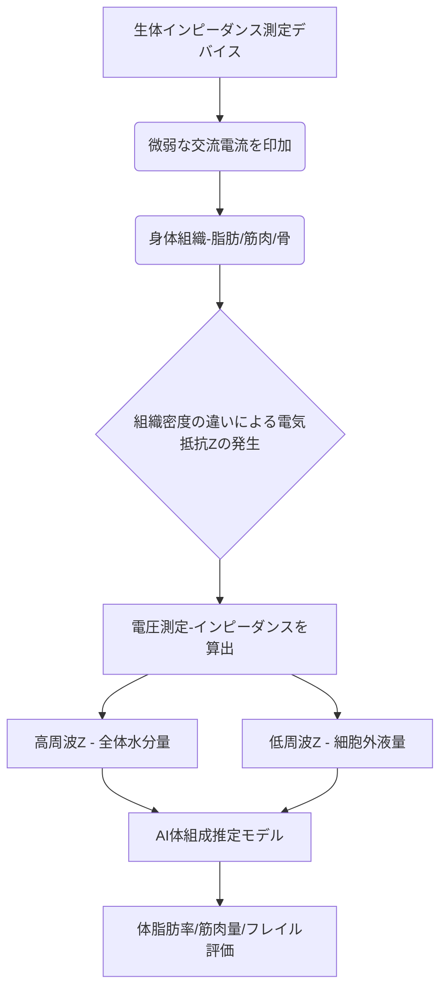

# T11-08-04 生体インピーダンス測定・体組成分析
## 技術の位置づけ
生体インピーダンス測定（Bioelectrical Impedance Analysis: BIA）は、体に微弱な交流電流を流し、その電気抵抗（インピーダンス）を測定することで、体内の水分量、ひいては体脂肪率、筋肉量、骨量などの体組成を推定する非侵襲技術である。細胞内外の水分量や組織密度によって電気抵抗が変化する原理を利用し、特に高齢者の**フレイル（虚弱）**や**サルコペニア（筋肉減少）**の早期発見・モニタリングに活用が期待されている。**用いる主な計測技術**は、**交流電流注入**と**電圧測定**による**インピーダンス分光法**である。

## Summary（5つの要点）
* **手軽な体組成分析**: スマート体重計やウェアラブルデバイスへの組み込みが進み、家庭で日常的に体脂肪率や筋肉量を把握できる。
* **フレイル・サルコペニア対策**: 高齢者の筋力低下を早期に検知し、適切な運動・栄養介入を促すための重要な客観的指標を提供する。
* **マルチ周波数化**: 複数の周波数の交流電流を用いる**インピーダンス分光法**により、細胞内液と細胞外液をより正確に分離し、精度が向上している。
* **ウェアラブルへの統合**: スマートウォッチやスマートリングに電極を組み込み、手軽に全身または局所のインピーダンスを測定する技術が進展している。
* **測定の変動要因**: 体内の水分量（脱水、浮腫）、食事、運動などの影響を受けやすく、安定した測定のための補正アルゴリズムの開発が重要である。

#### 概念図

## 具体的プロダクト事例
* **タニタ (日本)**: 体組成計のリーディングカンパニー。マルチ周波数BIA技術を用いて、高い精度で内臓脂肪や筋肉の質を評価。
    * URL: https://www.tanita.co.jp/
* **InBody (韓国)**: 8点接触電極法など、独自の技術でセグメント別（腕、脚、体幹）の体組成分析を実現。医療・フィットネス施設で広く採用。
    * URL: https://www.inbody.co.jp/ (日本法人)
* **Withings Body Smart/Scan (フランス)**: スマート体重計にBIA機能を搭載し、心拍数や血管年齢などの追加情報も統合して提供。
    * URL: https://www.withings.com/

---
### 技術評価表（定量的な視点）
| 評価項目 | 評価 | 備考 |
| :--- | :--- | :--- |
| **導入コスト** | ⭐☆☆☆☆ | 量産効果によりデバイスへの組み込みコストは非常に低い。 |
| **技術成熟度** | ⭐⭐⭐⭐☆ | 広く利用されているが、精度向上とウェアラブル化が課題。 |
| **日本の競争力** | ⭐⭐⭐⭐⭐ | タニタ、オムロンなど、体組成計製品で世界的に高い優位性。 |
| **市場性** | ⭐⭐⭐⭐☆ | フィットネス、ダイエットに加え、高齢者医療分野での需要が増加。 |
| **品質保証の重要性** | ⭐⭐⭐☆☆ | 医療判断よりウェルネス利用が多いが、フレイル診断では精度が重要。 |

---
## 日本の立ち位置・SWOT分析
### 強み
* **体組成計市場でのリーダーシップ**: タニタ、オムロン、パナソニックなど、BIA技術を応用した高精度な家庭用・業務用体組成計の開発で世界をリード。
* **医療・介護分野での臨床知見**: BIAデータをフレイル、サルコペニアの診断基準に組み込む研究が活発。
* **電極技術・回路設計**: 安定した微弱電流の印加とノイズ耐性の高い回路設計技術が高い。
### 弱み
* **ウェアラブルへの統合遅れ**: スマートウォッチやリング型デバイスへのBIA機能の統合は、海外のテック企業が先行。
* **体水分量の影響**: 体内の水分状態（脱水、浮腫）による測定誤差の補正アルゴリズムが、まだ完全ではない。
* **国際的な標準化**: 測定条件や計算式に関する国際的な標準化が不十分な側面がある。

## 専門家視点の技術調査ポイント
### 品質保証エンジニアの視点
* **測定精度**: DXA（二重エネルギーX線吸収測定法）などのゴールドスタンダードとの**相関性**および**再現性**の評価。
* **ノイズ対策**: 測定時の電極の接触状態、体動、環境温度変化によるインピーダンス変動の補正。
* **信頼性評価**: 測定周波数の範囲と安定性、電流印加の安全性（人体への影響）の保証。
### 化学系大学生への示唆
* **電気化学/物性化学**: 生体組織の電気伝導特性（誘電率、インピーダンス）と周波数依存性の理論的理解。
* **回路設計**: 微弱な交流電流を正確に印加・測定するための高精度なアナログ回路設計。
* **データサイエンス**: BIAデータと年齢、性別、人種などの補正因子を統合した高精度な**回帰分析モデル**の構築。

---
## 技術ロードマップ（短期/中期/長期）
### 短期目標（～2027年）
* スマートウォッチやリング型デバイスへのBIA機能の統合を標準化。
* **セグメント別BIA**（腕、脚などの局所測定）の家庭用デバイスへの展開を加速。
* AIによる測定誤差（体水分量、運動直後）の自動補正アルゴリズムの搭載。
### 中期目標（2028年～2031年）
* BIAとPPG（T11-08-02）などの他センサーデータとの**フュージョン解析**による健康指標の多角化。
* フレイル、サルコペニアの**診断支援ツール**として医療機器認証を取得し、医療現場での活用を拡大。
* 非侵襲で内臓脂肪や筋肉の質の詳細な評価（脂肪細胞の大きさなど）を実現する高周波数BIA技術の開発。
### 長期目標（2032年～2035年）
* 家庭用BIAデータを地域包括ケアシステムやPHR基盤に自動連携し、高齢者の**自立支援**を地域全体で実現。
* 生体インピーダンスの変化から、浮腫や心不全などの病態の早期悪化を予測するシステムの構築。

### 📚 参照リンク
10. Bioelectrical Impedance Analysis for Body Composition Assessment: A Review. *Nutrients*. [2022年]
    * URL: https://www.mdpi.com/
11. Multi-frequency Bioelectrical Impedance Analysis in Clinical Practice. *Journal of Clinical Densitometry*. [2020年]
    * URL: https://www.jcd.org/
12. タニタ. 企業情報. [2025年時点]
    * URL: https://www.tanita.co.jp/
