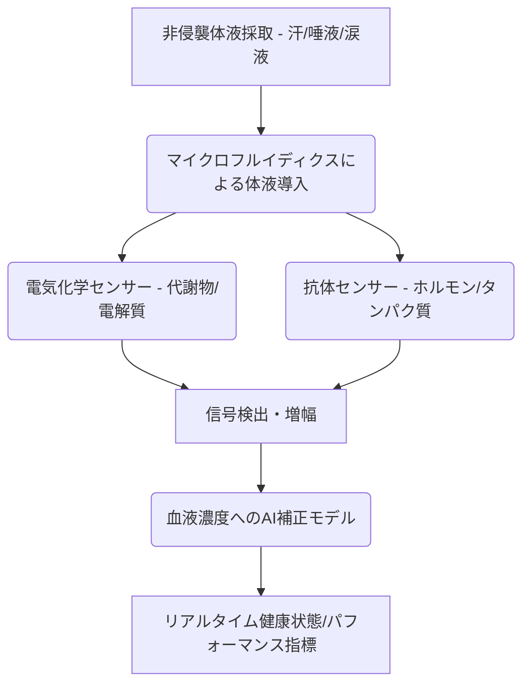

# T11-08-05 汗・唾液・涙液バイオマーカーセンサー
## 技術の位置づけ
汗、唾液、涙液といった非侵襲的な体液に含まれる代謝物（グルコース、乳酸、電解質など）やストレスホルモン（コルチゾール）をリアルタイムで測定するセンサー技術である。これらの体液は血液組成を反映しており、血液検査に代わる日常的な健康状態やパフォーマンスのモニタリングを可能にする。**用いる主な計測技術**は、体液中の特定の分子と反応する酵素を用いた**電気化学センサー**や、分子の光学的特性を利用する**蛍光・ラマン分光法**であり、主にパッチ型、マウスガード型、コンタクトレンズ型デバイスとして研究開発が進む。

## Summary（5つの要点）
* **リアルタイム生化学情報**: 採血せずに、体内の代謝状態（例：運動中の乳酸、脱水状態の電解質）を連続的に把握できる。
* **ストレス・疲労モニタリング**: 唾液中のコルチゾール（ストレスホルモン）やIgA（免疫マーカー）を測定し、メンタルヘルスや疲労度を評価できる。
* **多様なデバイス形態**: 柔軟な基板上の電極・センサーを組み込んだパッチ型、マウスガード型、コンタクトレンズ型など、様々なウェアラブル形態が提案されている。
* **血液との相関性検証**: 体液中のバイオマーカー濃度と血液中の濃度との間に、安定した相関関係を確立・補正するアルゴリズムの開発が最大の技術的課題である。
* **スポーツ・産業応用**: プロアスリートのパフォーマンス管理や、高ストレス環境下の労働者の健康モニタリングへの応用が先行している。

#### 概念図

## 具体的プロダクト事例
* **Epicore Biosystems (米国)**: 汗分析パッチを開発。運動時の発汗量、電解質、乳酸などを測定し、脱水状態や疲労度をリアルタイムで提供。
    * URL: https://www.epicorebiosystems.com/
* **Gatorade Gx Sweat Patch (米国)**: スポーツドリンクメーカーが提供する、汗の分析と水分補給の個別化を支援する使い捨てパッチ。
    * URL: https://www.gatorade.com/
* **Google/Novartis (米国/スイス)**: 涙液中のグルコース測定を目指したスマートコンタクトレンズ（プロジェクトは縮小傾向にあるが、基礎技術は発展）。
    * URL: https://www.novartis.com/ (提携先の一例)

---
### 技術評価表（定量的な視点）
| 評価項目 | 評価 | 備考 |
| :--- | :--- | :--- |
| **導入コスト** | ⭐⭐⭐☆☆ | センサーは使い捨てとなることが多く、継続的なランニングコストが発生。 |
| **技術成熟度** | ⭐⭐☆☆☆ | 研究開発段階が多く、実用化された製品はスポーツ・ウェルネス分野に限定。 |
| **日本の競争力** | ⭐⭐⭐☆☆ | センサー材料、微細加工技術は高いが、デバイス製品化ではキャッチアップが必要。 |
| **市場性** | ⭐⭐⭐⭐☆ | 究極の非侵襲モニタリングとして、ウェルネス・医療の両分野で高い潜在需要。 |
| **品質保証の重要性** | ⭐⭐⭐⭐⭐ | 血液濃度との相関性の保証、および体液採取・分析の安定性が極めて重要。 |

---
## 日本の立ち位置・SWOT分析
### 強み
* **電気化学センサー技術**: 酵素電極やイオン選択性電極（ISE）の基礎研究、特に高分子材料や電極コーティング技術が高い。
* **マイクロフルイディクス**: 体液（特に汗や唾液）を微量かつ安定的にセンサーに導入するための精密な流路設計技術。
* **フレキシブルデバイス技術**: 導電性高分子やフィルム基板技術により、皮膚に貼り付けるパッチ型センサーの実装能力。
### 弱み
* **バイオマーカーの血液相関性**: 汗や涙液中の濃度が血液濃度をどの程度正確に反映するかについての**大規模な臨床データ**の蓄積が不十分。
* **体液の採取安定性**: 発汗量や唾液分泌量、涙液層の厚さなどの変動による測定の不安定性を克服する技術的課題。
* **産業連携の遅れ**: 研究レベルの成果を、量産可能な低コストのウェアラブルデバイスとして製品化するスピードが海外に劣る。

## 専門家視点の技術調査ポイント
### 品質保証エンジニアの視点
* **測定精度（血液相関性）**: 複数のバイオマーカーについて、血液中のゴールドスタンダード値との**相関 r値**と**精度MARD**を厳格に評価する。
* **ノイズ対策**: 体液の乾燥、発汗量の変動、外部温度・湿度の変化に対するセンサー信号の安定性。
* **信頼性評価**: センサーチップの**保存安定性**、**使用期限**、および使い捨てセンサーのロット間再現性の保証。
### 化学系大学生への示唆
* **生化学/酵素化学**: ターゲットバイオマーカー（グルコース、乳酸、コルチゾールなど）に対する**酵素電極の選択性**と応答特性の設計。
* **分析化学**: 微量体液からの多成分同時測定を可能にする電気化学的および光学的分析手法（例：ボルタンメトリー、蛍光分光）の応用。
* **材料科学**: 生体適合性、通気性、柔軟性を備えた**フレキシブル電極基板**およびセンサーコーティング材料の開発。

---
## 技術ロードマップ（短期/中期/長期）
### 短期目標（～2027年）
* スポーツ・フィットネス分野において、乳酸、電解質などのウェルネス指標測定センサーの精度と信頼性を向上させる。
* 唾液コルチゾール測定による、客観的なストレスレベル評価システムの確立。
* 血液との相関性補正AIモデルの基礎構築と、少数バイオマーカーでの臨床検証。
### 中期目標（2028年～2031年）
* 汗・涙液グルコースセンサーの精度をCGMレベルに近づけ、**医療機器**としての認証を目指す。
* 複数の代謝物やホルモンを**同時に多項目測定**できる統合型バイオセンサーチップの開発。
* 非侵襲バイオマーカーと他の生体センサー（PPG、BIA）データを組み合わせた多角的健康予測モデルの構築。
### 長期目標（2032年～2035年）
* 涙液、唾液など、より安定した体液を用いた**疾患バイオマーカー（例：がん、認知症）**の早期スクリーニングへの応用。
* ウェアラブルデバイスに内蔵された**マイクロラボ**として機能し、ユーザーの健康状態を常時・自動で分析。

### 📚 参照リンク
13. Wearable Biosensors for Monitoring Health: A Comprehensive Review. *Chemical Reviews*. [2024年]
    * URL: https://pubs.acs.org/
14. Salivary Cortisol Measurement using Electrochemical Sensors for Stress Monitoring. *Analytical Chemistry*. [2023年]
    * URL: https://pubs.acs.org/
15. Advances in Wearable Sweat Sensors: from Sensing to Applications. *Advanced Materials*. [2023年]
    * URL: https://onlinelibrary.wiley.com/
