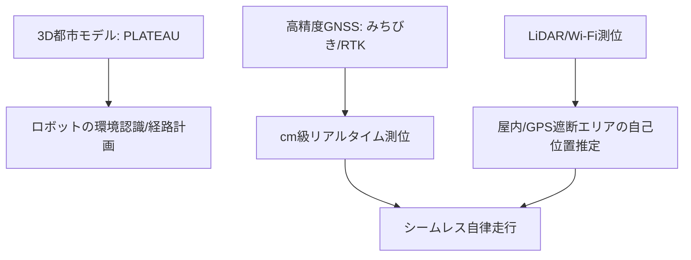

# T12-01-01 3次元地図・高精度測位インフラ

## Summary（5つの要点）

1. **ロボット自律走行の基盤**: ロボットが都市空間で人や障害物と衝突せずに移動・作業を行うために不可欠な、**cm級の精度**を持つ**絶対位置情報**と**周囲環境の3D情報**を提供する `(1)`。
2. **3D都市モデル（デジタルツイン）**: 国土交通省が推進する**PLATEAUプロジェクト**に代表される、**建物、道路、地形**を**テクスチャ付き3Dデータ**として整備するデータベース。ロボットはこれを**自己位置推定（Localization）**の基盤として利用する。
3. **高精度GNSS測位**: **GNSS（GPS, Galileo, GLONASS）**に、日本の**準天頂衛星システム（QZSS: みちびき）**を組み合わせることで、都市部でも**高仰角からの信号**を確保し、**測位可能時間を延長**。
4. **RTK-GPS/VRS**: **RTK（Real-Time Kinematic）測位**や**VRS（Virtual Reference Station）**技術により、**全国の電子基準点**からの**補正情報**をリアルタイムで受信。**cm級の動的測位精度**を実現する。
5. **屋内・シームレス測位**: 建物内部やGPSの届かない場所では、**LiDAR**による**SLAM（Simultaneous Localization and Mapping）**、**Wi-Fi/Bluetooth**による**屋内測位**とシームレスに連携。屋外・屋内の境界を意識させないナビゲーションを可能にする。

#### 概念図

---

### 技術評価表（定量的な視点）
| 評価項目 | 評価 | 根拠 |
| :--- | :--- | :--- |
| 導入コスト | ⭐⭐⭐☆☆ | 3D地図整備、RTK基地局/補正情報配信インフラの維持にコスト |
| 技術成熟度 | ⭐⭐⭐⭐☆ | 個別技術は成熟。PLATEAUデータとリアルタイム測位の**統合活用**が進化中 `(1)` |
| 日本の競争力 | ⭐⭐⭐⭐⭐ | **QZSS（みちびき）**、**PLATEAU**、**国土地理院**の**測量技術**は世界トップクラス `(2)` |
| 市場性 | ⭐⭐⭐⭐⭐ | 自動運転、ドローン、建設DX、**全ての移動ロボット**の必須インフラ |
| 品質保証の重要性 | ⭐⭐⭐⭐⭐ | **地図データの鮮度**、**測位の安定性**が**事故リスク**に直結するため最重要 |

---

## 日本の立ち位置・強み弱みのSummary

### 強み：日本企業や研究機関が持つ独自の技術、優位性などを箇条書きで記述。

* **高精度測位インフラ**: **準天頂衛星システム（QZSS: みちびき）**の整備と、それを活用した**センチメートル級測位補強サービス（CLAS）**の提供。
* **3D都市モデルの先行**: 国土交通省の**PLATEAU**による、都市全体の**3Dデータモデル**の**標準化と整備**が世界的に先行。
* **測量技術とデータ基盤**: **国土地理院**が持つ**電子基準点**ネットワークと、**地図情報システムの高度な技術**。

### 弱み：日本が抱える規制、標準化の遅れ、海外依存などを箇条書きで記述。

* **屋内地図の整備遅れ**: **屋外**の高精度地図は進んでいるが、**商業施設、オフィスビル**などの**屋内3D地図の標準化と整備**が遅れている。
* **データのリアルタイム更新性**: 交通規制、工事、一時的な障害物などの**リアルタイムな変化**を**3D地図**に反映させる**仕組み**の構築が課題。
* **データ利用のライセンス**: 整備された**PLATEAUデータ**や**高精度測位補正情報**の**商用利用**における**ライセンス体系の柔軟性**。

---

## 技術ロードマップ（短期/中期/長期）

### 短期目標（～2027年）

* **PLATEAUデータ**を**ロボット自律走行**向けに**軽量化・最適化**し、**標準API**で提供。
* **RTK測位**を**安価なGNSS受信機**で実現するための**チップセット、サービス**を普及。
* **屋内測位**と**屋外測位**の**シームレスな切り替え**を**99%以上**の成功率で実現。

### 中期目標（2028年～2031年）

* **高精度3D地図**の**自動更新システム**を構築。**ロボットや自動運転車**から得られたデータを**AI**で解析し、**変化を即座に反映**。
* **地中、水中**など、**地上以外**の**3D空間**の**測位・地図インフラ**を整備。
* **複数のロボット**が**同一の地図情報**を**リアルタイムで共有**し、**協調作業**を行うシステムを確立。

### 長期目標（2032年～2035年）

* **都市のデジタルツイン**が**リアルタイム**で**物理空間**と**同期**。ロボットは**完全な仮想空間**内で**計画**し、**現実空間**で**実行**する。
* **高精度測位**が**インフラ**として**空気のように利用可能**になり、**あらゆるデバイス**に**cm級の位置情報**を提供。

### 📚 参照リンク

1. [国土交通省 Project PLATEAU 公式サイト](https://www.gsi.go.jp/PLATEAU/index.html)
2. [内閣府 準天頂衛星システム「みちびき」戦略](https://www.cao.go.jp/pmd/space/qzss/index.html)
3. [RTK-GNSS技術の原理と応用 - 宇宙航空研究開発機構（JAXA）](https://www.jaxa.jp/press/2021/01/20210129a_j.html)