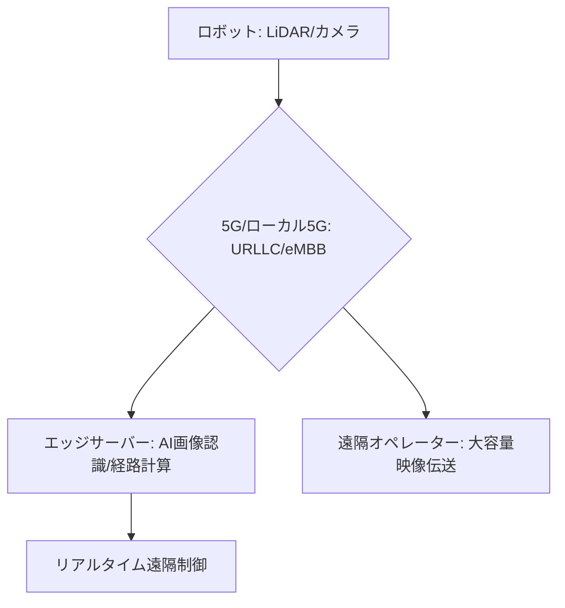

# T12-01-02 ロボット用通信インフラ（5G/ローカル5G/専用無線）

## Summary（5つの要点）

1. **超低遅延通信の必要性**: ロボットの**リアルタイム遠隔制御**や、**高速移動時の衝突回避**には、**1ミリ秒（ms）以下**の**超低遅延通信（URLLC）**が必須。これは主に**5G**の技術によって実現される `(1)`。
2. **大容量データ伝送**: ロボットに搭載された**LiDAR、高解像度カメラ**の**膨大なセンサーデータ**を**リアルタイム**でサーバーやオペレーターに伝送するために、**5Gの大容量（eMBB）**通信が活用される。
3. **ローカル5Gの役割**: **工場、倉庫、商業施設**など**特定のエリア**で、**自営の5Gネットワーク**を構築する**ローカル5G**は、**外部ネットワークの影響**を受けず、**安定した通信品質**と**セキュリティ**を確保する `(2)`。
4. **エッジコンピューティングとの統合**: ロボットからのデータを**中央のクラウド**ではなく、**基地局に近いエッジサーバー**で**高速に処理**（AI画像認識、経路計算）してからロボットにフィードバック。**遅延を最小化**し、**ロボットの自律性**を高める。
5. **日本企業の主導**: **NTTドコモ、KDDI、ソフトバンク**などのキャリアが**5G/ローカル5G**インフラを整備。**NEC、富士通**などが**機器供給**と**システム構築**を担い、**産業用途**への展開を推進 `(1, 2)`。

#### 概念図

---

### 技術評価表（定量的な視点）
| 評価項目 | 評価 | 根拠 |
| :--- | :--- | :--- |
| 導入コスト | ⭐⭐☆☆☆ | 5G/ローカル5Gインフラ、エッジサーバーの導入・維持に高コスト |
| 技術成熟度 | ⭐⭐⭐⭐☆ | 5Gは普及フェーズ。ローカル5G、URLLC技術の実用化が進行中 `(1)` |
| 日本の競争力 | ⭐⭐⭐⭐☆ | **ローカル5G**の制度設計と導入実績は世界でも先行。**機器ベンダー**も強み `(2)` |
| 市場性 | ⭐⭐⭐⭐⭐ | ロボット、自動運転、産業IoTの**全てのコアインフラ**となる |
| 品質保証の重要性 | ⭐⭐⭐⭐⭐ | **通信断**、**遅延増加**が**ロボットの暴走**や**衝突**につながるため、**信頼性**が最重要 |

---

## 日本の立ち位置・強み弱みのSummary

### 強み：日本企業や研究機関が持つ独自の技術、優位性などを箇条書きで記述。

* **ローカル5Gの法整備**: **特定の地域・建物**で**企業が独自の5Gネットワーク**を構築できる**制度**が整備され、**産業用ロボット**の活用に貢献。
* **通信機器技術**: **NEC、富士通**などの企業が持つ、**5G基地局**や**コアネットワーク**機器の**高い技術力**と**セキュリティ**。
* **エッジAI研究**: **NTT、NICT**などの研究機関が、**超低遅延**で**AI処理**を行う**エッジコンピューティング技術**を研究開発。

### 弱み：日本が抱える規制、標準化の遅れ、海外依存などを箇条書きで記述。

* **5Gカバレッジの課題**: 都市部以外での**5Gネットワークのエリア整備**が、ロボットの**広域移動**を制限する要因。
* **専用無線規格の国際標準化**: ロボット向け通信の**データプロトコル**や**周波数利用**に関する**国際標準化活動**への貢献が限定的。
* **垂直統合型の遅れ**: **通信事業者**と**ロボットメーカー**が**通信インフラ**と**ロボット制御**を**一体的**に設計する**垂直統合モデル**の構築が欧米に比べ遅れ。

---

## 技術ロードマップ（短期/中期/長期）

### 短期目標（～2027年）

* **ローカル5G**を**大規模物流倉庫、工場、商業施設**へ**標準インフラ**として導入。
* **5GのURLLC（超低遅延）機能**を活用した**遠隔操作**による**配送・警備ロボット**の**実証実験**を完了。
* **エッジAI**による**リアルタイム画像認識**を**ロボットの制御**に統合。

### 中期目標（2028年～2031年）

* **6G（Beyond 5G）**の研究を開始し、**無線通信による給電（T12-01-04）**と**超広域カバレッジ**を実現。
* **異なる通信規格**（5G, Wi-Fi, LPWA）間を**ロボットがシームレスに移動**し、**通信品質を維持**する技術を確立。
* **災害時**に**自律的に通信ネットワークを再構築**する**ロボットメッシュネットワーク**を構築。

### 長期目標（2032年～2035年）

* **都市インフラ全体**が**ロボット向け専用通信インフラ**として機能し、**通信の途絶**が**ゼロ**となる**フューチャーネットワーク**を実現。
* **人間の脳波**（T8-03-02）による**遠隔操作**（ブレイン・マシン・インターフェース）を**超低遅延通信**で実現。

### 📚 参照リンク

1. [NTTドコモ ローカル5G ソリューション](https://www.nttdocomo.co.jp/biz/service/local5g/)
2. [総務省 ローカル5G導入に関する情報](https://www.soumu.go.jp/menu_seisaku/ictseisaku/local5g/index.html)
3. [NEC 5G技術とエッジコンピューティング](https://jpn.nec.com/5g/index.html)