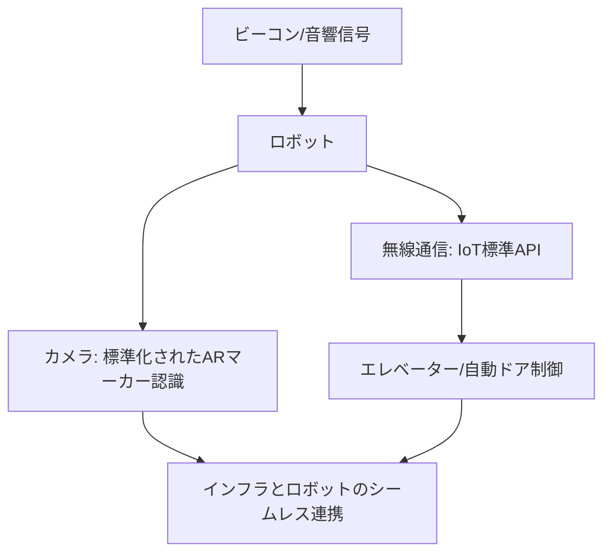

# T12-01-03 標準化された信号・サインシステム

## Summary（5つの要点）

1. **人機共存の共通言語**: ロボットと都市インフラ（エレベーター、自動ドア、信号機など）が**スムーズに連携**し、**安全かつ効率的**に都市サービスを提供するための**共通の通信プロトコルと視覚マーカー** `(1)`。
2. **視覚マーカーの標準化**: **QRコード**や**ARマーカー（fiducial marker）**など、**ロボットのカメラ**が**高精度で認識**できる**マーカーの形状、サイズ、配置位置**を標準化。これにより、ロボットは**自己位置の補正**や**目的地**を正確に把握する。
3. **IoTインターフェースの標準化**: **エレベーター、自動ドア、入退室ゲート**などに対し、**ロボットが無線（Wi-Fi, BLE）や有線で操作**できるようにするための**API（アプリケーション・プログラミング・インターフェース）**を標準化 `(2)`。
4. **電波・音響信号による誘導**: **超音波ビーコン、電磁波ビーコン**などを用い、**GPSが届かない屋内**や**一時的な障害物**がある場所で、**ロボットを誘導**するための**非視覚的な信号システム**。
5. **国際標準化活動**: **ISO（国際標準化機構）**や**IEC（国際電気標準会議）**において、**サービスロボット**と**環境インフラ**間の**通信・信号システム**に関する**標準化の議論**が活発に進行中。日本も主導的な役割を果たす `(1)`。

#### 概念図

---

### 技術評価表（定量的な視点）
| 評価項目 | 評価 | 根拠 |
| :--- | :--- | :--- |
| 導入コスト | ⭐⭐⭐⭐☆ | 主にソフトウェア、API、マーカーの設置コスト。インフラの大規模改修は不要 |
| 技術成熟度 | ⭐⭐⭐⭐☆ | 個別技術は成熟。**国際標準**に基づく**インフラ側の実装**が課題 `(1, 2)` |
| 日本の競争力 | ⭐⭐⭐⭐⭐ | **経済産業省主導**の**ロボットサービス実現のためのガイドライン策定**で先行 `(1)` || 市場性 | ⭐⭐⭐⭐⭐ | ロボットサービス導入の**障壁**を**劇的に下げる**ための**必須要素** |
| 品質保証の重要性 | ⭐⭐⭐⭐⭐ | **通信の互換性**、**マーカー認識の堅牢性**が、**ロボットの信頼性**に直接影響 |

---

## 日本の立ち位置・強み弱みのSummary

### 強み：日本企業や研究機関が持つ独自の技術、優位性などを箇条書きで記述。

* **行政主導の標準化**: 経済産業省が**「ロボットフレンドリーな環境構築」**に向けた**エレベーター・自動ドア連携**の**ガイドライン**を策定し、産業界に普及を働きかけ `(1)`。
* **建物インフラの技術力**: **エレベーター（三菱、日立）**、**自動ドア**メーカーが**IoT化**に積極的であり、**ロボット連携API**の実装が進行中。
* **視覚認識技術**: **トヨタ、ソニー**などの企業が持つ、**カメラ**や**LiDAR**からの**視覚情報**を**高速かつ高精度**に処理する**画像認識AI技術**。

### 弱み：日本が抱える規制、標準化の遅れ、海外依存などを箇条書きで記述。

* **レガシーインフラの対応**: 既存の**古い建物**や**エレベーター**への**標準インターフェースの後付け**に**コストと時間**がかかる。
* **国際標準化における発言力**: ISOなどの**国際標準化会議**での**日本の提案**が**世界のデファクトスタンダード**になるまでの**ロビー活動とスピード**が課題。
* **セキュリティの懸念**: ロボットが**インフラを操作**するための**API**の**不正利用**に対する**セキュリティ設計**と**監査**の徹底。

---

## 技術ロードマップ（短期/中期/長期）

### 短期目標（～2027年）

* **主要な商業施設、オフィスビル**で、**エレベーター・自動ドア**の**ロボット連携API**の**標準実装率を80%**以上とする。
* **ロボット用視覚マーカー**の**国内標準**を策定し、**公道や公共施設**での**試行導入**を開始。
* **ISO標準**に準拠した**ロボットとインフラ間の通信プロトコル**を確立。

### 中期目標（2028年～2031年）

* **公共交通機関（駅、空港）**の**インフラ**を**ロボット連携標準**に準拠させ、**案内・清掃ロボット**の**シームレスな移動**を実現。
* **AI危険予測**（T13-05-04）と連携し、**信号機**が**ロボットの通行を優先**させる**スマート交通管制システム**を導入。
* **国際規格**に準拠した**IoTインターフェース**を**海外市場**にも展開。

### 長期目標（2032年～2035年）

* **全ての都市インフラ**が**ロボットフレンドリー**な**標準インターフェース**を搭載し、**人間とロボット**が**完全に協調**して活動する**シームレスな都市**が実現。
* **AR**（拡張現実）で**ロボット**が**インフラ**に**非接触で指示**を送る**ジェスチャー制御システム**を導入。

### 📚 参照リンク

1. [経済産業省 ロボットフレンドリーな環境構築のためのガイドライン](https://www.meti.go.jp/policy/mono_info_service/robotics/standards/index.html)
2. [日本ロボット工業会：サービスロボットインフラとの連携](https://www.jara.jp/)
3. [ISO/TC 299 Robotics 委員会活動](https://www.iso.org/committee/629053.html)