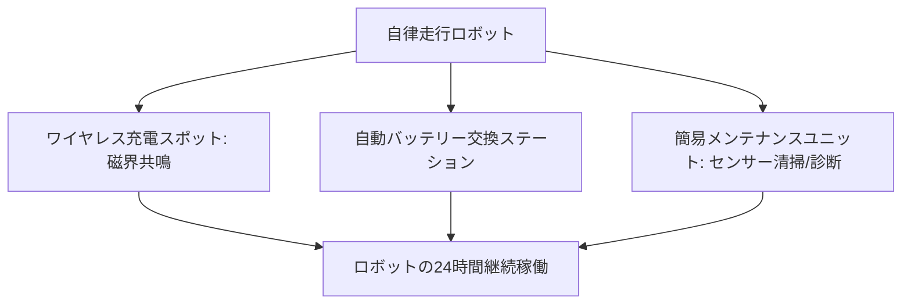

# T12-01-04 ロボット充電・メンテナンスステーション

## Summary（5つの要点）

1. **24時間稼働の実現**: ロボットが**人手を介さず**に**自律的**に**エネルギーを補給**し、**簡易な点検・修理**を行うための**都市インフラ**。これにより**ロボットの稼働率**を飛躍的に向上させる `(1)`。
2. **ワイヤレス給電の採用**: **磁界共鳴方式**や**電磁誘導方式**などによる**非接触充電技術**を採用。ロボットは**指定のスポット**に**停止するだけ**で充電が開始され、**接続の手間や故障リスク**を排除 `(2)`。
3. **バッテリー交換の自動化**: 大容量バッテリーを搭載したロボット向けに、**自動アーム**や**交換モジュール**を備えた**バッテリー交換ステーション**を設置。**充電待ち時間**をなくし、**即座に作業を再開**できるようにする。
4. **簡易メンテナンス機能**: **センサー（カメラ、LiDAR）**の**自動清掃**、**機体の簡易診断**（異常音、振動検知）、**消耗部品の自動補充**などを行う**メンテナンス機能**を統合。
5. **社会インフラへの設置**: **公共施設、商業施設、集合住宅**の**駐車場、休憩スペース**などに、これらのステーションを**設置**し、**ロボットネットワーク**を**途切れなく支援**する `(1)`。

#### 概念図

---

### 技術評価表（定量的な視点）
| 評価項目 | 評価 | 根拠 |
| :--- | :--- | :--- |
| 導入コスト | ⭐⭐⭐☆☆ | ワイヤレス給電設備、自動交換/メンテナンスシステムの導入にコスト |
| 技術成熟度 | ⭐⭐⭐⭐☆ | ワイヤレス給電技術はEV向けに成熟。**ロボットとの連携**が進化中 `(2)` |
| 日本の競争力 | ⭐⭐⭐⭐☆ | **EV、モバイル向け**の**ワイヤレス給電技術**で優位性。**自動機**の技術も高い `(2)` |
| 市場性 | ⭐⭐⭐⭐⭐ | ロボットサービス市場の拡大に伴い、**インフラ整備**は必須となる |
| 品質保証の重要性 | ⭐⭐⭐⭐⭐ | **充電・給電の効率**、**異物混入時の安全性**、**火災防止**が最重要 |

---

## 日本の立ち位置・強み弱みのSummary

### 強み：日本企業や研究機関が持つ独自の技術、優位性などを箇条書きで記述。

* **ワイヤレス給電技術**: **磁界共鳴方式（村田製作所、TDK）**などの**高効率な非接触給電技術**を保有。EV（電気自動車）向け技術の転用が可能 `(2)`。
* **自動機・ロボット技術**: **ファナック、安川電機**などの産業用ロボットメーカーが持つ、**高精度な自動アーム制御技術**をバッテリー交換に転用可能。
* **安全性基準の策定**: **電波法**に基づく**ワイヤレス給電の安全性**に関する**技術基準の整備**が進行中。

### 弱み：日本が抱える規制、標準化の遅れ、海外依存などを箇条書きで記述。

* **標準化の遅れ**: ロボットの種類ごとに**バッテリー形状、電圧、通信プロトコル**が異なり、**共通のメンテナンスステーション**を構築するための**統一規格**が未確立。
* **インフラ設置の規制**: 公共空間での**ワイヤレス給電インフラ設置**に関する**電波法、電気設備技術基準**などの**規制緩和と整備**に時間がかかる。
* **メンテナンスの自律化**: 簡易メンテナンスを超えた**複雑な故障診断**や**部品交換**の**完全自動化**に向けた**AI、ロボット技術**の開発が途上。

---

## 技術ロードマップ（短期/中期/長期）

### 短期目標（～2027年）

* **商業施設、工場**内での**ワイヤレス充電スポット**の**標準設置**を推進。
* **小規模な配達・清掃ロボット**向けの**統一バッテリー規格**を策定し、**交換ステーション**の実証を開始。
* **充電/給電の効率**を**90%以上**に向上させる**高周波インバーター技術**を実用化。

### 中期目標（2028年～2031年）

* **公共の道路**や**歩道**に**ワイヤレス給電インフラ**を埋設し、**走行しながらの給電**（ダイナミックワイヤレス給電）を実証。
* **AI**（T14-04-04）による**ロボットの故障予知診断**と、**自動メンテナンス**の連携システムを確立。
* **メンテナンスステーション**を**緊急通報デバイス**（T13-05-01）の**充電スポット**としても活用する**多機能化**。

### 長期目標（2032年～2035年）

* **ワイヤレス給電**が**EV、ドローン、ロボット**の**共通インフラ**となり、**全ての移動体がバッテリー残量を意識しなくなる**社会を実現。
* **メンテナンスステーション**が**分散型製造拠点**（T15-06-03）となり、**簡易な部品**を**3Dプリント**して**自動で修理**。

### 📚 参照リンク

1. [JST プレスリリース：自律型ロボット用非接触給電システム](https://www.jst.go.jp/pr/announce/20210204/index.html)
2. [ワイヤレス給電技術の現状と課題 - 村田製作所](https://www.murata.com/ja-jp/products/wireless/overview)
3. [NEDO プロジェクト：EV向けワイヤレス充電の技術開発](https://www.nedo.go.jp/activities/ZZJP_100140.html)