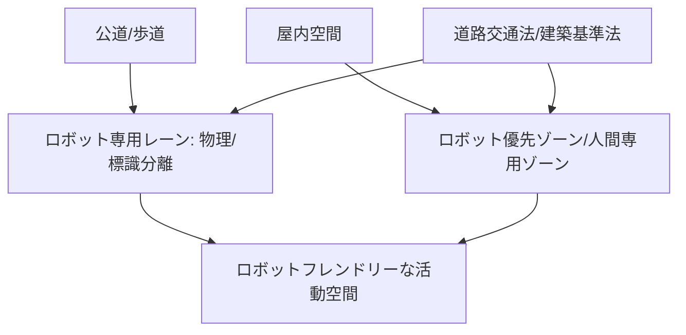

# T12-01-05 ロボット専用レーン・エリアゾーニング

## Summary（5つの要点）

1. **事故リスクの低減**: **低速・小型の配達ロボット**などが**歩行者と共存**する空間で、**事故の発生リスク**を**最小限**に抑えるための**物理的・論理的な空間分離** `(1)`。
2. **専用レーンの整備**: **歩道の一部**や**車道の端**に**ロボット専用の走行帯**を**物理的に分離**（ペイント、バリアなど）または**標識**によって設定し、ロボットの**円滑な通行**を確保。
3. **エリアゾーニング**: **商業施設、病院、マンション**などの**屋内・私有地**において、**ロボット優先通路**、**人間専用ゾーン**、**立ち入り禁止エリア**を**明確に設定**し、**ロボットの活動空間**を規定。
4. **法整備の進展**: 2023年4月に**遠隔操作型小型移動ロボット**の**公道走行**に関する**道路交通法**が改正され、**許可制**でロボットの**公道利用**が開始。**安全確保措置**の明確化が図られた `(2)`。
5. **空間情報との連動**: **3D地図**（T12-01-01）と連携し、**ロボット専用レーン**や**ゾーニング情報**を**デジタルデータ**としてロボットに提供。ロボットは**自己の位置**に基づき**走行すべき空間**を判断する。

#### 概念図

---

### 技術評価表（定量的な視点）
| 評価項目 | 評価 | 根拠 |
| :--- | :--- | :--- |
| 導入コスト | ⭐⭐⭐☆☆ | 道路、歩道の改修コスト、標識・センサー設置コスト |
| 技術成熟度 | ⭐⭐⭐⭐☆ | 法整備、制度設計は進行中。物理的なゾーニングは技術的に容易 `(1, 2)` |
| 日本の競争力 | ⭐⭐⭐⭐⭐ | **公道走行に関する法整備**がアジア諸国に先行して実現 `(2)` |
| 市場性 | ⭐⭐⭐⭐⭐ | **配達、警備、清掃**など、**公道走行**が必要な**ロボットサービス**の**前提条件** |
| 品質保証の重要性 | ⭐⭐⭐⭐⭐ | **走行ルール**の**明確さ**、**人間との衝突回避**のための**安全設計**が最重要 |

---

## 日本の立ち位置・強み弱みのSummary

### 強み：日本企業や研究機関が持つ独自の技術、優位性などを箇条書きで記述。

* **法規制の整備**: 2023年の**道路交通法改正**により、**遠隔操作型小型移動ロボット**の**公道走行**が制度的に可能となり、**実証実験**から**社会実装**への移行が加速 `(2)`。
* **都市計画との連携**: **国土交通省**や**自治体**が、**ロボット専用レーン**を**スマートシティ計画**に組み込む**取り組み**を推進。
* **ロボットの安全技術**: **人との協調作業**を前提とした**ソフトな機体設計**や**接触回避アルゴリズム**の開発が進んでいる。

### 弱み：日本が抱える規制、標準化の遅れ、海外依存などを箇条書きで記述。

* **専用レーンの普及速度**: 既存の**歩道空間**の**狭さ**や**インフラ改修**の**予算**の問題から、**専用レーンの全国的な整備**に時間がかかる。
* **エリアゾーニングの統一性**: **商業施設やマンション**ごとに**ロボットの走行ルール**が異なり、**ロボット開発者**にとって**サービス展開の障壁**となっている。
* **人々の受容性**: ロボット専用レーンに対する**歩行者の理解**や、**共存空間**における**人間側の行動ルール**の**周知徹底**が課題。

---

## 技術ロードマップ（短期/中期/長期）

### 短期目標（～2027年）

* **改正道路交通法**に基づき、**主要都市**の**特定エリア**で**配達・清掃ロボット**の**公道走行**を**本格的に開始**。
* **商業施設、大規模オフィス**の**屋内**で、**標準化されたエリアゾーニング**に基づく**ロボット優先通路**を設定。
* **3D地図**（T12-01-01）に**専用レーンの情報を統合**し、**ロボットの自律走行**を支援。

### 中期目標（2028年～2031年）

* **ロボット専用レーン**の**全国的な整備基準**を策定し、**地方都市**へも展開。
* **AI危険予測**（T13-05-04）に基づき、**時間帯、天候**に応じて**専用レーンの幅、場所**を**動的に変更**するシステムを導入。
* **人間**の**歩行速度、動線**を**AI**で解析し、**衝突リスク**を**ゼロ**にする**動的な空間利用**を実現。

### 長期目標（2032年～2035年）

* **都市空間全体**が**ロボット優先**の**動的な交通管制**を行う**フューチャーシティ**が実現。
* **ロボット**が**専用レーン**を**必要とせず**、**人間と完全に協調**して**安全**に**共存**できる**高レベルな自律技術**が確立。

### 📚 参照リンク

1. [国土交通省 プレスリリース：自動運転・移動サービスに関する検討状況](https://www.mlit.go.jp/report/press/sogo12_hh_000078.html)
2. [警察庁：遠隔操作型小型移動ロボットの公道走行に関する道路交通法改正](https://www.npa.go.jp/bureau/traffic/selfdriving/robot/index.html)
3. [経済産業省：ロボット活用に関するガイドライン](https://www.meti.go.jp/policy/mono_info_service/robotics/index.html)