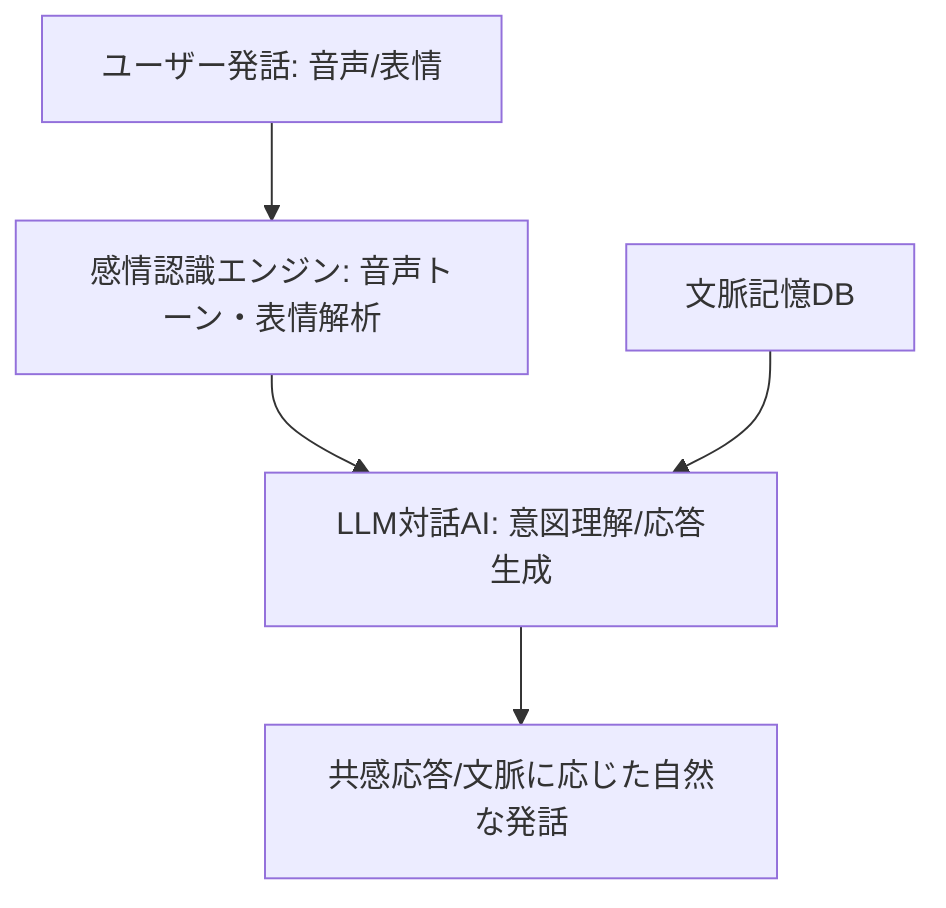

# T12-02-01 自然言語対話AI・感情認識エンジン

## Summary（5つの要点）

1. **大規模言語モデル（LLM）の活用**: **ChatGPT**や**Claude**などの**LLM**を基盤技術として採用し、**人間が発する複雑な文脈、意図、非定型な質問**を理解し、**流暢で自然な応答**を生成する `(1)`。
2. **マルチモーダル感情認識**: **音声のトーン（高さ、速度、抑揚）**、**カメラ**による**表情（笑顔、眉の動き）**、**ジェスチャー**などの**非言語情報**を**統合**して解析し、ユーザーの**感情状態（喜び、悲しみ、不安、怒り）**を推定する。
3. **共感と社会的孤立の解消**: 推定した感情に基づき、単なる情報提供ではなく、「それは大変でしたね」「おめでとうございます」といった**共感的な応答**を生成。**高齢者や単身者の社会的孤立**の解消に貢献する。
4. **文脈記憶（Contextual Memory）**: **会話の履歴**を保持し、**数ターン前**の発言内容や**過去の対話**を**参照**しながら応答を生成。これにより**長期的な関係性**を構築し、より**パーソナライズ**された会話を可能にする。
5. **日本の事例**: **SoftBank Robotics**の**Pepper**がこの分野の普及を牽引し、近年は**ユカイ工学のBOCCO**など、より**パーソナル**な対話に特化したデバイスが登場している。

#### 概念図

---

### 技術評価表（定量的な視点）
| 評価項目 | 評価 | 根拠 |
| :--- | :--- | :--- |
| 導入コスト | ⭐⭐⭐☆☆ | LLM利用料（APIコスト）、高性能GPU、センサーのコスト |
| 技術成熟度 | ⭐⭐⭐⭐☆ | LLMは急速に進化。感情認識は**精度向上**と**誤認識**の低減が課題 `(1)` |
| 日本の競争力 | ⭐⭐⭐☆☆ | LLM開発は米国勢が先行。**日本語LLM**の**きめ細やかな開発**と**応用**に注力すべき |
| 市場性 | ⭐⭐⭐⭐⭐ | **高齢化社会**における**見守り、介護支援**への需要が極めて高い |
| 品質保証の重要性 | ⭐⭐⭐⭐⭐ | **不適切な応答**（ハルシネーション）、**感情の誤認識**が**ユーザーの信頼**を損ねる |

---

## 日本の立ち位置・強み弱みのSummary

### 強み：日本企業や研究機関が持つ独自の技術、優位性などを箇条書きで記述。

* **きめ細やかな日本語LLM**: **日本語の独特な文脈、敬語、曖昧な表現**を理解するための**LLMのチューニング**技術。
* **ロボットとの統合ノウハウ**: **SoftBank Robotics**などが持つ、**対話AI**と**ロボットの身体表現**（T12-02-03）を**統合**させる**長年の運用ノウハウ**。
* **高齢者・介護データの蓄積**: **介護施設、高齢者向けサービス**における**対話データ**の蓄積（プライバシーに配慮した上での活用）。

### 弱み：日本が抱える規制、標準化の遅れ、海外依存などを箇条書きで記述。

* **LLM基盤技術の海外依存**: 基盤となる**汎用LLM**（GPT-4、Claude）の開発を**米国企業**に依存している点。
* **感情認識の客観的指標**: **感情**の**定量的、客観的な評価指標**の**国際標準化**が遅れ、**認識精度の比較**が困難。
* **プライバシーと倫理**: **感情、健康状態**など**機密性の高いデータ**を扱うため、**データ利用**における**倫理的・法的規制**への対応。

---

## 技術ロードマップ（短期/中期/長期）

### 短期目標（～2027年）

* **LLM**を**ロボットの標準対話エンジン**とし、**応答の流暢性**を**人間と区別できないレベル**に向上。
* **感情認識**の**精度**を**90%以上**に向上させ、**ユーザーのネガティブな感情**を**高精度**で検知。
* **ロボットの性格、口調**を**ユーザーの好み**に合わせて**パーソナライズ**する機能を標準搭載。

### 中期目標（2028年～2031年）

* **マルチモーダル統合**（T12-02-05）を高度化し、**視線、呼吸、姿勢**から**認知機能の低下**や**精神状態**を**予兆**として検知。
* **対話AI**が**医療・介護の専門知識**を習得し、**軽度な健康相談**や**服薬指導**を担う。
* **ロボット同士**が**ユーザーの情報を共有**し、**家庭内・施設内**で**シームレスなコミュニケーション**を提供。

### 長期目標（2032年～2035年）

* **ロボット**が**人間の意識**（T8-03-02）や**記憶**を**対話を通じて理解**し、**認知症の進行を遅らせる**などの**治療的効果**を発揮。
* **対話AI**が**自律的**に**新しい知識**を**学習・統合**し、**人間の成長**を**支援**する**生涯のパートナー**となる。

### 📚 参照リンク

1. [OpenAI: GPT-4o 技術解説](https://openai.com/blog/gpt-4o)
2. [SoftBank Robotics: Pepperの技術的進化](https://www.softbankrobotics.com/jp/)
3. [ユカイ工学: BOCCO emo 製品情報](https://www.ux-xu.com/products/bocco-emo/)