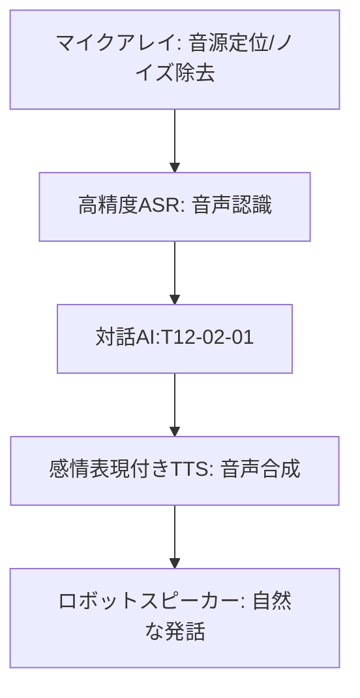

# T12-02-02 音声認識・音声合成技術

## Summary（5つの要点）

1. **高精度な音声認識（ASR）**: **ディープラーニングモデル**（Transformer、RNN-Tなど）を活用し、**雑音、遠隔、小声**などの**多様な環境**でも**人間と同等かそれ以上**の**認識精度**を実現 `(1)`。
2. **マイクアレイ処理**: **複数のマイク**（マイクアレイ）からの入力信号を**デジタル信号処理**で解析し、**発話者の方向**を特定（音源定位）し、**周囲の雑音**を**除去**することで、**クリアな音声入力**を可能にする。
3. **自然な音声合成（TTS）**: **WaveNet**や**Tacotron**などの**ニューラルネットワークベースの合成技術**により、**人間の声**に近い**自然な抑揚、ピッチ、リズム**を持つ音声を生成。機械的な印象を排除する。
4. **感情・パーソナリティ表現**: **喜び、悲しみ、怒り**といった**感情を込めた発話**や、**特定のキャラクター、高齢者、子供**など**ロボットの個性**に合わせた**声質**を**合成**できる（T12-02-01との連携）。
5. **多言語・方言対応**: **グローバルなサービス展開**のために**多言語**に対応するとともに、**高齢者支援**のために**日本語の方言**（関西弁、東北弁など）を**正確に認識・合成**する技術。

#### 概念図

---

### 技術評価表（定量的な視点）
| 評価項目 | 評価 | 根拠 |
| :--- | :--- | :--- |
| 導入コスト | ⭐⭐⭐☆☆ | マイクアレイ、高性能DSP/GPU、クラウドAPI利用料のコスト |
| 技術成熟度 | ⭐⭐⭐⭐☆ | ASR/TTSは成熟。**雑音環境、多言語、感情表現**の精度が向上中 `(1)` |
| 日本の競争力 | ⭐⭐⭐⭐☆ | **日本語処理**、**音響工学**（ヤマハ、ソニー）の技術は高い。**TTSの自然さ**は世界トップクラス `(2)` |
| 市場性 | ⭐⭐⭐⭐⭐ | スマートスピーカー、ロボット、コンタクトセンター、**全ての音声インターフェース**の基盤技術 |
| 品質保証の重要性 | ⭐⭐⭐⭐⭐ | **誤認識率（WER）**の低さ、**合成音声の自然さ（MOS）**がユーザー満足度に直結 |

---

## 日本の立ち位置・強み弱みのSummary

### 強み：日本企業や研究機関が持つ独自の技術、優位性などを箇条書きで記述。

* **音響・信号処理**: **ヤマハ、ソニー**などの企業が持つ、**マイクアレイ処理、ノイズキャンセリング**の**世界的な音響技術**。
* **高品質な日本語TTS**: **HOYA（VoiceText）**などの企業が持つ、**日本語の複雑な音素、アクセント**を**極めて自然**に再現する**音声合成技術**。
* **方言・高齢者音声対応**: **高齢者特有**の**声質、発話速度**や**地方の方言**に対応するための**専用学習データ**の蓄積。

### 弱み：日本が抱える規制、標準化の遅れ、海外依存などを箇条書きで記述。

* **ASR基盤モデルの海外依存**: **Google（Speech-to-Text）、Amazon（Lex/Polly）**といった**グローバルプラットフォーム**の**クラウドAPI**への依存度が高い。
* **エッジ処理の遅れ**: **通信が途絶した環境**でも**ロボット側（エッジ）**で**高速かつ高精度**に音声認識を行う**組み込み技術**の普及が遅れ。
* **声の権利の標準化**: **個人の声**を**AI学習**に利用する際の**肖像権、著作権**に相当する**権利の標準化**が未整備。

---

## 技術ロードマップ（短期/中期/長期）

### 短期目標（～2027年）

* **音声認識のWER（単語誤り率）**を**雑音環境下**で**人間と同等（5%未満）**にまで低減。
* **音声合成**で**感情の表現幅**を広げ、**対話AI**と連携した**感情豊かな応答**を可能にする。
* **エッジデバイス**上での**軽量なASRモデル**を実行し、**通信遅延の影響を最小限**にする。

### 中期目標（2028年～2031年）

* **周囲の環境音**（音楽、テレビ、話し声）を**ロボット**が**自動で識別**し、**会話の文脈**に**統合**する（例: 「今のテレビのニュースについてどう思う？」）。
* **話者の感情**に加え、**意図（皮肉、冗談、本気）**を**音声**から**高精度**で**推定**。
* **ロボットの声**を**ユーザーの親しい人物の声**に**極めて似せて合成**する**パーソナライズ技術**を確立（権利者に許可を得た上での利用）。

### 長期目標（2032年～2035年）

* **音声**と**視覚**（T12-02-05）を**統合**し、**口の動き**と**発話内容**の**同期**を**違和感なく**実現。
* **思考**（T8-03-02）や**体内の生体信号**を**合成音声**に**変換**し、**コミュニケーション**を行う**非言語コミュニケーションインターフェース**が実用化。

### 📚 参照リンク

1. [Google Cloud Speech-to-Text 公式サイト](https://cloud.google.com/speech-to-text)
2. [HOYA VoiceText テクノロジー紹介](https://voicetext.jp/tech/)
3. [Amazon Polly TTS 技術紹介](https://aws.amazon.com/jp/polly/)