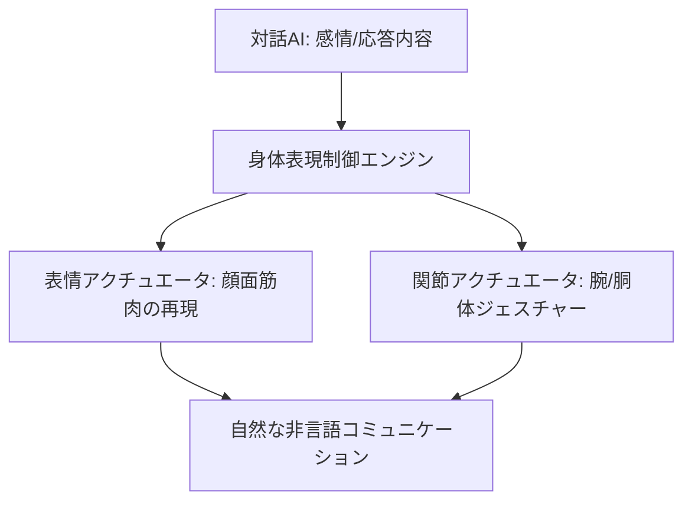

# T12-02-03 表情・ジェスチャー生成・身体表現制御

## Summary（5つの要点）

1. **非言語コミュニケーションの実現**: 人間の**表情（喜怒哀楽）**、**ジェスチャー（うなずき、身振り手振り）**といった**非言語コミュニケーション**をロボットが**自然に表現**することで、**対話の豊かさ**と**親近感**を向上させる。
2. **高密度アクチュエータ**: **顔の表情筋**を再現するために、**小型・高精度**な**アクチュエータ（モーター、空気圧）**を多数搭載し、**微細な表情の変化**を**リアルタイム**で生成する。
3. **柔軟な皮膚・素材技術**: **人間の皮膚**に近い**弾力性、質感**を持つ**柔軟なシリコン素材**を用い、**アクチュエータの動き**を**自然に伝える**とともに、**触覚インタラクション**（T12-02-05）を可能にする `(1)`。
4. **ジェスチャーの文脈理解**: **自然言語対話AI**（T12-02-01）の**応答内容**や**感情状態**と連動し、**適切なタイミングと大きさ**で**ジェスチャー**を生成。「大きく手を振る」「小さくうなずく」などの**表現の制御**。
5. **日本のアンドロイド技術**: **ATR（国際電気通信基礎技術研究所）**や**大阪大学の石黒浩教授**らが**Geminoid（ジェミノイド）**や**ERICA**といった**ヒューマノイド/アンドロイド**を開発。**極めて人間らしい身体表現**の**世界的な先進事例**を提供 `(2)`。

#### 概念図

---

### 技術評価表（定量的な視点）
| 評価項目 | 評価 | 根拠 |
| :--- | :--- | :--- |
| 導入コスト | ⭐⭐☆☆☆ | 高密度アクチュエータ、複雑な制御システム、外装素材に高コスト |
| 技術成熟度 | ⭐⭐⭐☆☆ | アンドロイドは研究レベル。低価格帯ロボットへの**自然な表情実装**が課題 `(2)` |
| 日本の競争力 | ⭐⭐⭐⭐⭐ | **アンドロイド**、**ヒューマノイド**の**人間らしさ追求**において**世界的な優位性** `(2)` |
| 市場性 | ⭐⭐⭐☆☆ | 高度な表現力は高付加価値市場（受付、展示）向け。一般家庭向けは低コスト化が鍵 |
| 品質保証の重要性 | ⭐⭐⭐⭐⭐ | **表情の不自然さ**（不気味の谷）、**ジェスチャーの遅延**が**受容性**に大きく影響 |

---

## 日本の立ち位置・強み弱みのSummary

### 強み：日本企業や研究機関が持つ独自の技術、優位性などを箇条書きで記述。

* **アンドロイド・ヒューマノイド技術**: **石黒研究室**などに代表される、**人間そっくり**の**外観と挙動**を再現する**世界最先端の技術**。
* **高精度アクチュエータ**: **小型・軽量・高出力**な**ロボット用モーター、ギア**の**サプライヤー**（ハーモニック・ドライブ・システムズ、日本電産など）。
* **柔軟素材技術**: **人間の皮膚**を模した**柔軟なシリコン素材、触覚センサー**を統合するための**材料科学**。

### 弱み：日本が抱える規制、標準化の遅れ、海外依存などを箇条書きで記述。

* **不気味の谷の克服**: **極めて人間そっくり**なロボットが引き起こす**「不気味の谷」**現象の**受容性**に関する**倫理的・心理的な課題**。
* **量産化の遅れ**: 高度な表現を持つアンドロイド技術が、**低コスト**で**大量生産**できる**民生品**に落とし込まれていない。
* **ジェスチャーの国際標準**: 文化圏によって**ジェスチャーの意味**が異なるため、**国際的なコミュニケーション**のための**標準的なジェスチャーライブラリ**の策定が課題。

---

## 技術ロードマップ（短期/中期/長期）

### 短期目標（～2027年）

* **汎用コミュニケーションロボット**に**目線、うなずき**などの**基本的な非言語表現**を**標準搭載**。
* **LEDディスプレイ顔**などで**簡略化**された**表情表現**を、**違和感なく**ユーザーに受け入れられるレベルに改善。
* **対話AI**と**身体制御**の**リアルタイム連携**の**遅延**を**50ms以下**に低減。

### 中期目標（2028年～2031年）

* **家庭用ロボット**に**空気圧**や**形状記憶合金**を用いた**安価**で**自然な表情生成アクチュエータ**を導入。
* **ユーザーの感情認識**（T12-02-01）の結果に基づき、**ロボットが適切な距離、姿勢**を**自律的**に**変更**する（**プロクセミクス**の制御）。
* **人間の行動模倣**（模倣学習）により、**新しいジェスチャー**を**ロボットが自動で習得**する。

### 長期目標（2032年～2035年）

* **アンドロイド**の**表情**が**人間と完全に区別がつかないレベル**に到達し、**不気味の谷**を**完全に克服**。
* **ユーザー**の**思考**（T8-03-02）や**意図**を**表情**で**先読み**し、**会話が始まる前**に**適切な反応**を返す。
* **ロボットの身体**が**完全な柔軟性**を持ち、**抱きしめる**などの**触覚コミュニケーション**（T12-02-05）を**安全**に行える。

### 📚 参照リンク

1. [ATRロボティクス研究所 公式サイト](https://www.atr.jp/research/robotics/index.html)
2. [石黒浩教授研究室（大阪大学）](https://www.lab.hiroshiishiguro.com/)
3. [SoftBank Robotics: Pepperのジェスチャー制御](https://www.softbankrobotics.com/jp/)