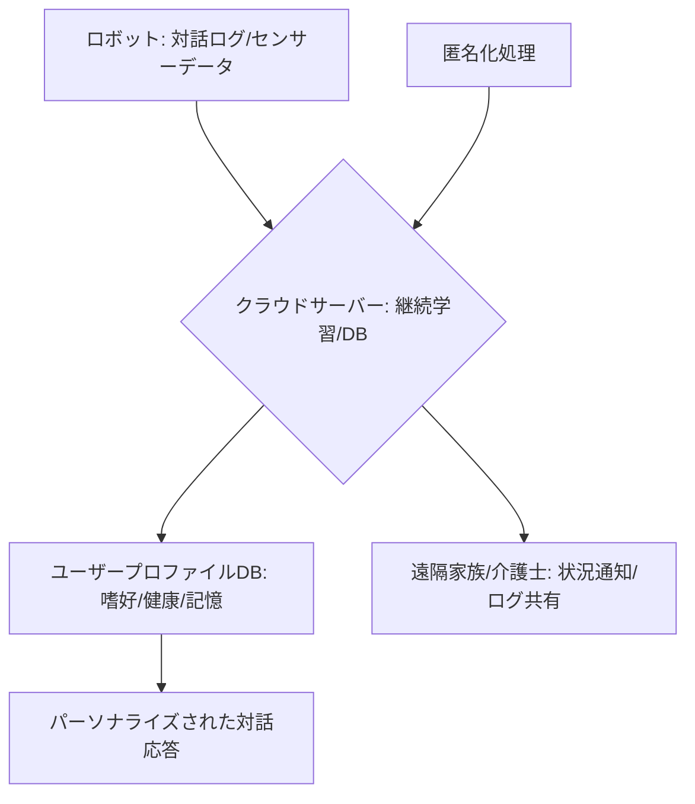

# T12-02-04 クラウド連携・学習機能（継続的対話学習）

## Summary（5つの要点）

1. **長期的な関係構築**: ロボットが**個々のユーザー**との**対話履歴、好み、生活リズム、健康状態**などのデータを**クラウドサーバー**に**継続的に蓄積**し、**個人専用のプロフィール**を構築する `(1)`。
2. **対話のパーソナライズ**: 蓄積されたデータに基づき、**会話の内容、トーン、提案**を**ユーザーに合わせて最適化**。例えば、**好きな食べ物**や**過去のイベント**について**記憶**しておき、**次の対話**で**自然に触れる**ことができる。
3. **継続的学習（Continual Learning）**: クラウド上の**大規模なユーザーデータ**を**分析・学習**することで、**対話AIモデル**（T12-02-01）を**定期的に更新**。**最新の知識、流行、コミュニケーションパターン**に対応し、**ロボットの知能**を**継続的に成長**させる。
4. **ローカル処理との分離**: **プライバシー性の高い個人データ**（健康状態、家族関係）の**処理**を**ロボット本体（エッジ）**で行い、**匿名化された対話ログ**のみを**クラウド**に送信するなど、**プライバシー保護**と**学習効率**の**バランス**を取る。
5. **家族・施設との連携**: クラウドを介して**家族や介護士**と**ロボットの活動ログ**や**ユーザーの状況**を**共有**。**遠隔見守り**、**緊急時の通知**（T13-05-02）などの**連携機能**を提供する。

#### 概念図

---

### 技術評価表（定量的な視点）
| 評価項目 | 評価 | 根拠 |
| :--- | :--- | :--- |
| 導入コスト | ⭐⭐⭐☆☆ | クラウドインフラ（サーバー、DB）、セキュリティ対策にコスト |
| 技術成熟度 | ⭐⭐⭐⭐☆ | データ蓄積・分析は成熟。**継続学習**と**プライバシー保護の両立**が課題 `(1)` |
| 日本の競争力 | ⭐⭐⭐☆☆ | クラウドサービス（AWS, Azure）への依存。**データ利活用**の**法整備**と**倫理基準**構築に注力すべき |
| 市場性 | ⭐⭐⭐⭐⭐ | ロボットの**「愛着」**と**「実用性」**を高める**必須機能**であり、市場は極めて大きい |
| 品質保証の重要性 | ⭐⭐⭐⭐⭐ | **データ漏洩**、**学習データの偏り**、**プライバシー侵害**が**社会的な信頼**を失う |

---

## 日本の立ち位置・強み弱みのSummary

### 強み：日本企業や研究機関が持つ独自の技術、優位性などを箇条書きで記述。

* **倫理的ガイドライン**: **AI戦略、人間中心のAI社会原則**など、**プライバシー保護**と**データ利活用**の**バランス**を取るための**行政主導のガイドライン策定**が進展。
* **高齢者ヘルスケアデータ**: **高齢者の生活・健康データ**の**質、量**が豊富であり、**介護・見守り**に特化した**パーソナライズ学習**に応用可能。
* **エッジAI技術**: **ロボット本体**で**機密性の高い情報**を処理するための**軽量なエッジAIモデル**の開発（T14-04-03）。

### 弱み：日本が抱える規制、標準化の遅れ、海外依存などを箇条書きで記述。

* **データのサイロ化**: **医療、介護、生活**の**データ**が**縦割り**で**連携**しておらず、**総合的なパーソナライズ**に必要な**データ統合**が困難。
* **法規制の複雑さ**: **個人情報保護法、医療情報システム**に関する**規制**が**複雑**で、**クラウド連携**や**データ共有**の**実装ハードル**が高い。
* **継続学習の安定性**: **新しい情報**を学習する際に**過去の知識**を**忘却**してしまう**「カタストロフィック・フォゲッティング」**の克服が技術的課題。

---

## 技術ロードマップ（短期/中期/長期）

### 短期目標（～2027年）

* **対話AI**が**ユーザーの趣味、家族構成**などの**基本的な個人情報**を**記憶**し、**会話**に**自然に反映**させる。
* **クラウド連携**において**匿名化、暗号化**を徹底し、**データセキュリティの国際標準**に準拠。
* **ユーザーの健康ログ**（T13-05-02）を**AI**が分析し、**異常時**に**家族へ自動通知**する機能を標準搭載。

### 中期目標（2028年～2031年）

* **対話AI**が**ユーザーの価値観、性格、思考パターン**を**高度に学習**し、**人生の悩み**など**深いテーマ**について**個別化されたアドバイス**を提供。
* **複数のロボット**（家庭用、施設用）間で**ユーザープロファイル**を**安全に引き継ぎ**、**一貫したサービス**を提供。
* **フェデレーテッド・ラーニング**（分散学習）を導入し、**クラウドにデータを集中**させることなく**学習効率**を向上。

### 長期目標（2032年～2035年）

* **ロボット**が**ユーザーの成長、老化**に合わせて**自らの性格、機能**を**動的**に**変更**する**究極のパーソナライズ**を実現。
* **対話AI**が**人間の意識**（T8-03-02）と**直接連携**し、**対話**を通じて**記憶の整理**や**認知機能のサポート**を**非侵襲的**に行う。

### 📚 参照リンク

1. [JST 未来社会創造事業：対話ロボットの継続学習に関する技術動向](https://www.jst.go.jp/kisoken/senryaku/teian-kobo/fy2021/pdf/JST-RITS2021-3_p34.pdf)
2. [総務省：AI・データ利用に関する倫理的・法的・社会的課題（ELSI）への対応](https://www.soumu.go.jp/menu_seisaku/ictseisaku/ai_elsi/index.html)
3. [Amazon Alexaのパーソナライズ技術](https://developer.amazon.com/ja-JP/blogs/alexa/alexa-news/2022/02/alexa-personalization-features.html)