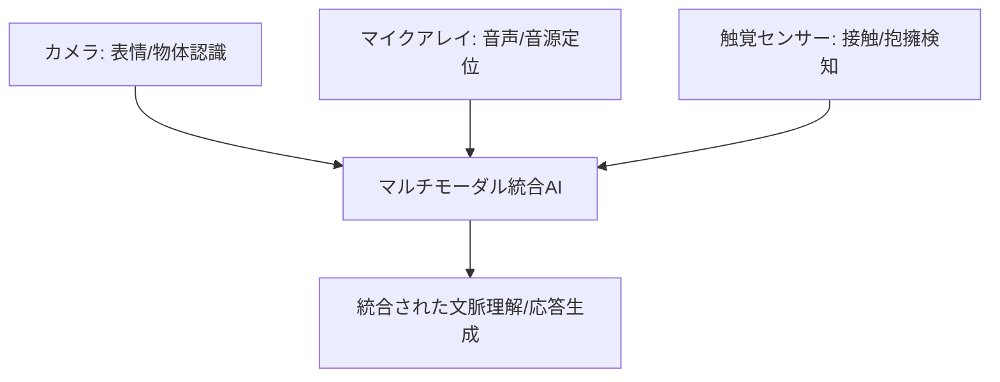

# T12-02-05 マルチモーダル統合（視覚・聴覚・触覚センサー統合）

## Summary（5つの要点）

1. **五感による豊かなインタラクション**: **カメラ（視覚）**、**マイク（聴覚）**、**タッチセンサー（触覚）**など、**複数の種類のセンサー**から得られる情報を**AI**で**統合**し、**人間**に近い**五感を活用したコミュニケーション**を実現 `(1)`。
2. **視覚による文脈理解**: **カメラ**で**ユーザーの顔認識**、**表情認識**（T12-02-01）を行うとともに、**周囲の物体**（本、テレビ、食べ物など）を**認識**し、**会話の内容**と**現実世界**の**文脈**を**結びつける**。
3. **触覚フィードバックの利用**: **ユーザーがロボットを撫でる、抱きしめる**といった**接触行動**を**タッチセンサー**で検知し、**愛着行動**と判断。**ロボット**は**適切な表情、発話、ジェスチャー**（T12-02-03）で**応答**し、**タッチセラピー**の効果を発揮 `(2)`。
4. **音源定位と視線誘導**: **マイクアレイ**で**発話者の位置**を**正確に特定**（音源定位）し、**ロボットの顔**や**カメラの視線**を**その方向**に**誘導**。**人間らしい対話**の**集中度**を高める。
5. **統合AIモデル**: 各センサーからの**異種データ**を**単一のAIモデル**（マルチモーダルLLM）で**同時**に**処理・分析**。**聴覚**と**視覚**の**不一致**（例: 笑顔なのに怒ったトーン）を**検知**し、**真の意図**を推定する。

#### 概念図

---

### 技術評価表（定量的な視点）
| 評価項目 | 評価 | 根拠 |
| :--- | :--- | :--- |
| 導入コスト | ⭐⭐⭐☆☆ | 複数のセンサー、高性能プロセッサ、複雑なデータ処理ソフトウェアのコスト |
| 技術成熟度 | ⭐⭐⭐☆☆ | 各センサーは成熟。**異種データのリアルタイム統合**と**大規模学習**が課題 `(1)` |
| 日本の競争力 | ⭐⭐⭐⭐⭐ | **センシング技術（T13-04）**、**触覚技術（T8-03-05）**、**ヒューマノイド技術**に強み `(2)` |
| 市場性 | ⭐⭐⭐⭐⭐ | 介護、教育、エンターテイメントなど、**高いレベルのインタラクション**が求められる分野で必須 |
| 品質保証の重要性 | ⭐⭐⭐⭐⭐ | **センサーのずれ**、**データの遅延**が**不自然な応答**につながり、**違和感**を与える |

---

## 日本の立ち位置・強み弱みのSummary

### 強み：日本企業や研究機関が持つ独自の技術、優位性などを箇条書きで記述。

* **センサー技術の集積**: **高性能カメラモジュール、MEMSマイク、高感度触覚センサー**など、**高品質なセンサー部品**の**サプライヤーが豊富**（T13-04-01, T13-04-04）。
* **アニマルセラピーの応用**: **認知症高齢者へのアニマル・ロボットセラピー**（**パロ**など）の**実証ノウハウ**があり、**触覚コミュニケーション**の**知見**が深い。
* **ヒューマノイドAI研究**: **複数の感覚器**から得られた情報を**人間らしく統合**して**行動**を生成する**ロボットAI研究**が進展。

### 弱み：日本が抱える規制、標準化の遅れ、海外依存などを箇条書きで記述。

* **マルチモーダルデータセット不足**: **視覚、聴覚、触覚**の**3種類以上**のデータを**同期**させた**大規模な日本語データセット**の**公開、標準化**が遅れ。
* **統合AIモデルの技術依存**: **マルチモーダルLLM**の**基盤技術**は**Google、Meta**といった**海外テックジャイアント**が先行。
* **リアルタイム処理の電力消費**: **複数のセンサー**からの**大量データ**を**ロボット本体**で**リアルタイム処理**するための**高性能CPU/GPU**の**消費電力**が大きく、**バッテリー寿命**に影響。

---

## 技術ロードマップ（短期/中期/長期）

### 短期目標（～2027年）

* **視覚**（表情、物体）と**聴覚**（音声、音源）の**2つのモーダル情報**を**リアルタイム**で**統合**し、**会話の文脈理解**の**精度**を**20%**向上。
* **触覚センサー**を**ロボットの体表面**に搭載し、**抱きしめる**などの**愛着行動**を**検知**し、**適切な応答**を返す。
* **認知症高齢者**への**特定のタッチ**（例：手首を握る）が**鎮静効果**を持つことを**定量的**に検証。

### 中期目標（2028年～2031年）

* **視覚、聴覚、触覚**に加え、**嗅覚**（T13-04-03）や**味覚**を**シミュレーション**した**5モーダル統合**を実現。
* **統合AIモデル**が**人間の意図**を**95%以上**の精度で**推測**し、**会話が始まる前**に**最適な行動**を**予測**して実行。
* **ロボットの操作**を**脳波**（T8-03-02）や**視線**で行う**ハンズフリーインターフェース**を統合。

### 長期目標（2032年～2035年）

* **ロボット**が**人間の意識**（T8-03-02）を**非侵襲的**に**センシング**し、**思考**や**潜在的なニーズ**を**完全に理解**した上で**自律的に行動**。
* **人間**は**ロボット**を通じて**五感情報**を**共有**し、**新しいコミュニケーションの形**を確立。

### 📚 参照リンク

1. [JST CRDS 研究開発の俯瞰報告書：ロボティクス・AI分野](https://www.jst.go.jp/crds/report/report1636/report1636.html)
2. [産業技術総合研究所（AIST）：アザラシ型ロボット「パロ」](https://unit.aist.go.jp/robotics/humanoid/paro/)
3. [東京大学 松尾研究室：マルチモーダルAIの研究動向](https://www.weblab.t.u-tokyo.ac.jp/)