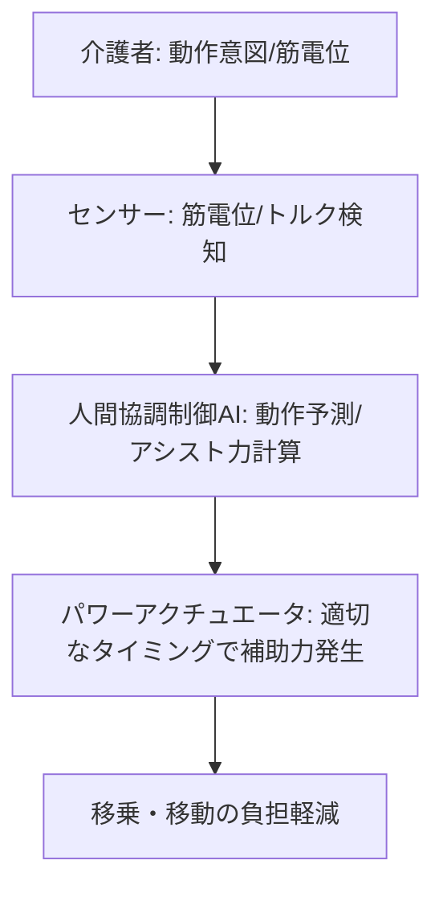

# T12-03-01 移乗・移動支援ロボット（パワーアシストスーツ）

## Summary（5つの要点）

1. **介護者の腰痛・負担軽減**: **被介護者**の**抱え上げ、移動**に伴う**介護者の身体的負担**（特に**腰部**）を**大幅に軽減**し、**介護離職の防止**や**生産性向上**に寄与する `(1)`。
2. **パワーアシストスーツ（装着型）**: **CYBERDYNEのHAL**や**ATOUN**の製品に代表される、**介護者の体に装着**し、**動作**に合わせて**モーター**が**補助力**を発生させるロボット。**生体電位信号（BES）**や**筋電位**を読み取り、**介護者の意図**を**予測**する `(2)`。
3. **非装着型移乗支援**: **リフト型**や**抱き上げ型**のロボットアーム、あるいは**床走行式**の機器など、**介護者が身体に装着せず**に**被介護者を移乗**させるための装置。**介助時の安全性**と**快適性**を両立。
4. **人間協調制御（HRI）**: **ロボット**が**人間の動作速度、力の方向**を**リアルタイムで予測**し、**遅延なく適切**なタイミングで**アシスト**を行う制御技術。**違和感のないスムーズな協調動作**が鍵。
5. **センシングと安全性**: **圧力センサー**、**トルクセンサー**、**ジャイロセンサー**などを搭載し、**被介護者の体重、姿勢、バランス**を**常時監視**。**転倒リスク**を**検知**し、**緊急停止**や**姿勢修正**を行う**安全設計**が最重要 `(1)`。

#### 概念図

---

### 技術評価表（定量的な視点）
| 評価項目 | 評価 | 根拠 |
| :--- | :--- | :--- |
| 導入コスト | ⭐⭐☆☆☆ | 機体価格（100万～数百万円）、メンテナンスコストが高額 |
| 技術成熟度 | ⭐⭐⭐⭐☆ | 個別技術は成熟。**小型・軽量化**と**低コスト化**が課題 `(2)` |
| 日本の競争力 | ⭐⭐⭐⭐⭐ | **HAL、ATOUN**など**生体信号制御**の分野で**世界的に圧倒的な優位性** `(2)` |
| 市場性 | ⭐⭐⭐⭐⭐ | **介護職員不足**が深刻化する**日独欧**で**高い需要**。
| 品質保証の重要性 | ⭐⭐⭐⭐⭐ | **誤作動、制御遅延**が**転倒**や**骨折**につながるため、**安全性、信頼性**が最重要 |

---

## 日本の立ち位置・強み弱みのSummary

### 強み：日本企業や研究機関が持つ独自の技術、優位性などを箇条書きで記述。

* **生体信号制御技術**: **CYBERDYNE（HAL）**に代表される、**筋電位**や**脳からの信号**を**読み取り**、**ロボットを制御**する**世界最高峰の技術**。
* **軽量化・高性能アクチュエータ**: **薄型、高トルク**の**モーター、減速機**（ハーモニック・ドライブ・システムズなど）の**サプライチェーン**。
* **人間工学に基づく設計**: **日本の介護現場**の**具体的なニーズ**に基づいた、**装着感、使いやすさ**を重視した**製品設計**。

### 弱み：日本が抱える規制、標準化の遅れ、海外依存などを箇条書きで記述。

* **価格の課題**: **介護保険**での**給付対象**となるための**価格帯**が**高止まり**しており、**普及**の**障壁**となっている。
* **操作習熟度**: **装着型スーツ**は**操作**に**一定の習熟**が必要で、**全介護職員**への**普及**には**トレーニング**の**仕組み**が必要。
* **国際標準化の遅れ**: **アシスト力、安全性、装着インターフェース**の**国際標準化**において、**日本独自の技術**が**デファクトスタンダード**になりきれていない。

---

## 技術ロードマップ（短期/中期/長期）

### 短期目標（～2027年）

* **パワーアシストスーツ**の**重量**を**現行モデル比で30%削減**し、**バッテリー稼働時間**を**8時間**に延長。
* **AI**による**動作予測**を**99%**の精度で実現し、**制御遅延**を**10ms以下**に短縮。
* **装着型・非装着型**の**安全基準**を**国際規格**に準拠させ、**保険適用拡大**を推進。

### 中期目標（2028年～2031年）

* **非装着型**の**移乗支援ロボット**が**人間**の**介護動作**を**完全に代替**し、**介護者が操作不要**の**自律移乗**を実現。
* **パワードスーツ**が**日常的なウェアラブルデバイス**となり、**介護**だけでなく**物流、建設現場**でも**標準装備**となる。
* **触覚センサー**を統合し、**被介護者の皮膚**にかかる**圧迫**を**リアルタイム**で**検知**し、**床ずれ**などを**予防**。

### 長期目標（2032年～2035年）

* **装着型ロボット**が**介護者の身体能力**を**大幅に超える**レベルで**拡張**し、**超人介護**を実現。
* **脳波**（T8-03-02）による**直感的な制御**が可能になり、**介護者の「考えた通り」**にロボットが動く。
* **生体機能**を**拡張**する**インプラント型**の**アシストデバイス**が実用化。

### 📚 参照リンク

1. [経済産業省：ロボット介護機器開発・導入促進事業](https://www.meti.go.jp/policy/mono_info_service/robotics/kaigorobo/index.html)
2. [CYBERDYNE株式会社 HAL 製品情報](https://www.cyberdyne.jp/products/HAL/)
3. [ATOUN株式会社 パワーアシストスーツ 製品情報](https://atoun.co.jp/)