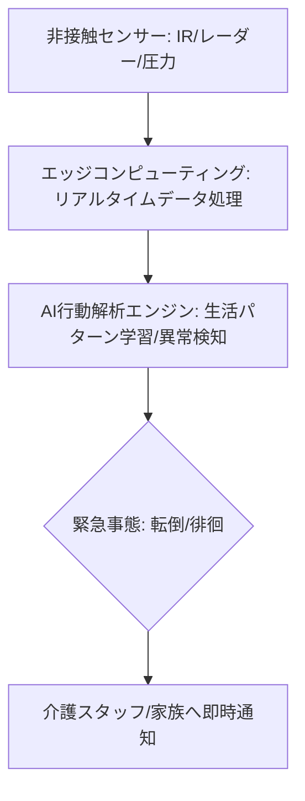

# T12-03-02 見守り・転倒検知センサーシステム

## Summary（5つの要点）

1. **事故の早期発見と予防**: **高齢者の居室**における**転倒、転落、徘徊**などの**緊急事態**を**非接触**で**リアルタイムに検知**し、**介護スタッフ**や**家族**に**即座に通知**することで、**事故の重篤化**を防ぐ `(1)`。
2. **多様な非接触センサー**: **赤外線センサー（熱画像）**、**ミリ波レーダーセンサー**、**ベッド下の圧力センサー**などを活用。**カメラ**を使用しない、または**プライバシーに配慮した処理（骨格情報のみ抽出）**を行うことで、**被介護者の尊厳**を保つ `(2)`。
3. **AIによる生活パターン学習**: **AI**が**被介護者**の**通常の生活リズム**（睡眠時間、トイレ回数、活動レベル）を**継続的に学習**。**長時間トイレにいる**、**深夜に異常な徘徊**など、**パターンから逸脱した異常行動**を**早期**に**予測・発見**する。
4. **睡眠・健康状態のモニタリング**: **非接触**で**心拍、呼吸、睡眠の質**を**計測**し、**健康状態のわずかな変化**（体調不良の予兆）を**検知**。**医療連携**（T13-05-02）の**基盤データ**を提供する `(1)`。
5. **誤検知・通知の最適化**: **誤報（False Alarm）**が**介護スタッフの疲弊**につながるため、**AIモデル**の**精度**を上げ、**通知の閾値**を**被介護者**や**介護施設**の**ルール**に合わせて**柔軟に設定**する機能が重要。

#### 概念図

---

### 技術評価表（定量的な視点）
| 評価項目 | 評価 | 根拠 |
| :--- | :--- | :--- |
| 導入コスト | ⭐⭐⭐⭐☆ | センサーは比較的安価だが、設置工事とシステム維持にコスト |
| 技術成熟度 | ⭐⭐⭐⭐☆ | 個別センサーは成熟。AIによる**行動予測**と**誤検知低減**が進化中 `(2)` |
| 日本の競争力 | ⭐⭐⭐⭐⭐ | **パナソニック、トーテックアメニティ**など**センサー、住宅設備メーカー**の**技術力**と**介護現場での実績**が豊富 `(2)` |
| 市場性 | ⭐⭐⭐⭐⭐ | **24時間見守り**の**省人化**に直結し、**介護施設、在宅介護**で必須 |
| 品質保証の重要性 | ⭐⭐⭐⭐⭐ | **転倒検知の失敗**が**人命**に関わるため、**精度（検出率、誤報率）**が最重要 |

---

## 日本の立ち位置・強み弱みのSummary

### 強み：日本企業や研究機関が持つ独自の技術、優位性などを箇条書きで記述。

* **非接触センサー技術**: **ミリ波レーダー、高感度赤外線センサー**など、**プライバシー**に**配慮**しながら**高精度**に**生体情報、行動**を捉える**センシング技術**。
* **住宅・設備との統合**: **パナソニック**などの**住宅設備メーカー**が、**見守りシステム**を**照明、エアコン**などと**統合**した**スマートホームソリューション**を提供。
* **介護現場との連携**: **厚生労働省**主導で**介護施設**での**実証**が進んでおり、**現場のニーズ**を**製品開発**に**迅速に反映**する**体制**。

### 弱み：日本が抱える規制、標準化の遅れ、海外依存などを箇条書きで記述。

* **データの利活用**: **見守りシステム**で収集された**貴重な生活パターンデータ**が、**個人情報保護の壁**により**AIの学習**に**十分に活用**できていない。
* **施設間連携の遅れ**: **異なるメーカー**の**見守りシステム**間での**データ連携**や**標準化**が遅れており、**施設のシステム統合**を妨げている。
* **在宅介護への普及**: **高額な初期費用**や**複雑な設定**が**在宅介護**への**普及**を**制限**している。

---

## 技術ロードマップ（短期/中期/長期）

### 短期目標（～2027年）

* **転倒検知**の**検出率**を**99.5%以上**、**誤報率**を**1%未満**に低減。
* **AI**が**睡眠時**の**心拍・呼吸**から**体調不良の予兆**を**自動で判断**し、**介護スタッフ**に**健康管理情報**を提供する。
* **プライバシー保護**のため、**カメラ**を使わずに**3D骨格情報**のみで**行動解析**を行う**AIモデル**の普及。

### 中期目標（2028年～2031年）

* **居室内のロボット**（T12-03-05）と**見守りセンサー**を**統合**。**ロボット**が**異常検知後**に**自律的**に**現場に急行**し、**初期対応**（声かけ、姿勢確認）を行う。
* **認知症の徘徊傾向**を**AI**が**数週間前に予測**し、**予防的介入**を**計画**する。
* **複数のセンサー情報**を**統合**し、**転倒**だけでなく**誤嚥、窒息**などの**予兆**を**高精度**で**検知**。

### 長期目標（2032年～2035年）

* **都市インフラ**と**連携**した**超広域見守りネットワーク**（T12-01-01）を構築。**GPS非対応の屋内**でも**居場所**を**cm級の精度**で**特定**。
* **AI**が**被介護者**の**潜在的なニーズ**を**生体情報**から**完全に理解**し、**要求する前**に**最適なサポート**を提供する。

### 📚 参照リンク

1. [厚生労働省：介護ロボットの開発・普及の促進](https://www.mhlw.go.jp/stf/seisakunitsuite/bunya/0000085440.html)
2. [パナソニック：ライフコンシェルジュ（見守りシステム）](https://www.panasonic.com/jp/business/solution/elderly-care/monitoring.html)
3. [トーテックアメニティ：見守りシステム 製品紹介](https://www.totec.co.jp/product/kaigo-mimamori/)