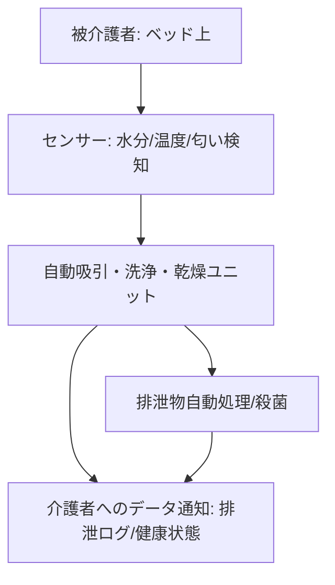

# T12-03-03 排泄支援ロボット（自動排泄処理装置）

## Summary（5つの要点）

1. **介護負担の集中軽減**: **排泄介助**は**介護**の中でも**最も頻度が高く、身体的・精神的負担**が大きい作業であり、これを**自動化**することで**介護者の負担**を**大幅に削減**する `(1)`。
2. **自動検知・自動処理**: **センサー**（水分、温度、圧力、匂い）で**排泄**を**リアルタイムに検知**し、**吸引、温水洗浄、乾燥、殺菌**の**一連のプロセス**を**完全に自動**で実行する（例: TOTOの**ベッドサイド水洗トイレ**） `(2)`。
3. **被介護者の尊厳保持**: **排泄後**の**即座**の**処理**と**匂いの除去**により、**被介護者**の**不快感**を**最小限**に抑え、**おむつ交換**に伴う**羞恥心**や**尊厳の毀損**を防ぐ。
4. **衛生管理と健康データ**: **自動洗浄・殺菌機能**により**感染リスク**を低減。さらに、**排泄物**の**量、回数、性状**を**自動記録**し、**AI**で**解析**することで、**脱水、便秘、膀胱炎**などの**健康状態の変化**を**早期に把握** `(2)`。
5. **ベッド上での利用**: **自力での移動が困難**な**要介護度の高い方**のために、**ベッドサイド**や**ベッドに設置**して**利用可能**な**コンパクト設計**が主流。**装着部の快適性**と**漏れ防止**が鍵となる。

#### 概念図

---

### 技術評価表（定量的な視点）
| 評価項目 | 評価 | 根拠 |
| :--- | :--- | :--- |
| 導入コスト | ⭐⭐☆☆☆ | 装置本体が高額。消耗品コスト、水道・電気工事が必要 |
| 技術成熟度 | ⭐⭐⭐⭐☆ | TOTO、パナソニックなど**日本のメーカー**が**世界をリード**。**小型化、静音化**が進行中 `(2)` |
| 日本の競争力 | ⭐⭐⭐⭐⭐ | **温水洗浄便座**の**技術基盤**、**衛生・水処理技術**において**圧倒的優位性** `(2)` |
| 市場性 | ⭐⭐⭐⭐⭐ | **要介護者の増加**と**介護者の負担増**により、**潜在的な需要**は極めて大きい |
| 品質保証の重要性 | ⭐⭐⭐⭐⭐ | **漏れ、匂い、騒音**が**被介護者の精神的ストレス**に直結。**衛生、静音性、信頼性**が最重要 |

---

## 日本の立ち位置・強み弱みのSummary

### 強み：日本企業や研究機関が持つ独自の技術、優位性などを箇条書きで記述。

* **水回り・衛生技術**: **TOTO、パナソニック**などが持つ、**温水洗浄、脱臭、水処理**に関する**世界最高水準の技術**。
* **センサー技術**: **排泄**の**タイミング**や**性状**を**高精度**で**非接触**で**検知**する**センサー技術**の蓄積。
* **製品設計**: **被介護者**の**身体的・心理的負担**を最小限にする**人間工学**に基づいた**装着部、操作部**の**設計**。

### 弱み：日本が抱える規制、標準化の遅れ、海外依存などを箇条書きで記述。

* **保険給付の課題**: **排泄支援機器**が**介護保険**の**レンタル対象品目**に**含まれず**、**導入の障壁**となっている（一部は対象）。
* **多機能化のコスト**: **排泄物解析**による**高度な健康診断機能**を付加することで**価格が高騰**し、**普及**を妨げている。
* **装着感の個人差**: **被介護者**の**体型、皮膚の敏感さ**に**合わせた**、**カスタムメイド**に近い**装着部**の**柔軟な対応**が技術的課題。

---

## 技術ロードマップ（短期/中期/長期）

### 短期目標（～2027年）

* **自動排泄処理装置**の**静音性**を**図書館レベル（40dB以下）**にまで低減。
* **排泄ログ**を**AI**が**自動解析**し、**便秘、脱水傾向**を**90%以上**の精度で**予測**。
* **装置の価格**を**現行モデル比で30%削減**し、**介護施設**への**標準導入**を推進。

### 中期目標（2028年～2031年）

* **装置**が**排泄物**から**糖分、タンパク質**などを**リアルタイム**で**分析**し、**簡易な健康診断**を**毎日自動**で実施。
* **自動排泄処理**と**移乗支援ロボット**（T12-03-01）を**連携**させ、**トイレへの自律移動**と**排泄**を**完全に自動化**。
* **超小型・使い捨て可能**な**排泄物処理センサー**を**衣類**に**統合**。

### 長期目標（2032年～2035年）

* **排泄処理**が**完全に非接触、非装着**で可能となる**超音波・吸引技術**や**生体制御技術**が確立。
* **ロボット**が**排泄**の**意思**を**自律的**に**読み取り**、**被介護者**が**意識**することなく**快適な排泄**を**支援**。

### 📚 参照リンク

1. [TOTO 介護・医療向け製品情報](https://www.toto.co.jp/products/nursingcare/index.htm)
2. [パナソニック 介護機器 製品情報（アラウーノ関連技術）](https://panasonic.jp/sumai/toilet/alauno_s/)
3. [NEDO：介護ロボット関連技術開発](https://www.nedo.go.jp/activities/ZZJP_100067.html)