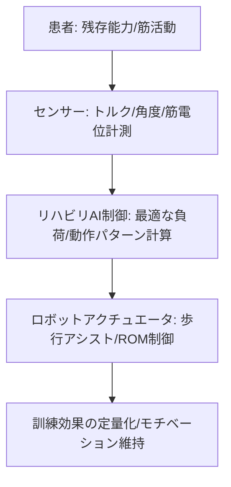

# T12-03-04 リハビリ支援ロボット（歩行訓練・関節可動域訓練）

## Summary（5つの要点）

1. **効率的・客観的なリハビリ**: **理学療法士**の**手技**に依存していた**訓練**を**ロボット**が**代替**し、**適切な負荷**と**正確な動作**を**反復**して提供。**訓練効果**を**定量化**し、**効率的**な**回復**を促す `(1)`。
2. **歩行訓練支援**: **HONDAの歩行アシスト**や**トヨタのWelwalk**に代表される、**下肢に装着**または**体幹**を**吊り下げ**て、**正しい歩行パターン**を**反復**して**学習**させるロボット。**麻痺**などで**歩行能力が低下**した患者の**運動機能再建**に利用 `(2)`。
3. **人間協調制御と負荷制御**: 患者の**残存能力**を**センサー**で**精密**に**計測**し、**必要最低限**の**アシスト力**のみを提供。**患者の自発的な運動**を促し、**回復を最大化**する**適応制御技術**が鍵。
4. **関節可動域（ROM）訓練**: **上肢・下肢**の**関節**を**正しい角度**と**速度**で**自動的**に**動かし**、**拘縮**（関節が固まること）を**予防・改善**。**訓練の進捗**を**自動記録**し、**セラピスト**に**データ**を提供する `(1)`。
5. **ゲーミフィケーション**: **単調になりがちなリハビリ**を**ゲーム感覚**で行えるように**ソフトウェア**を設計。**モチベーション**を**維持**し、**訓練**への**積極的な参加**を促す（例: VR/AR技術との連携）。

#### 概念図

---

### 技術評価表（定量的な視点）
| 評価項目 | 評価 | 根拠 |
| :--- | :--- | :--- |
| 導入コスト | ⭐⭐☆☆☆ | 医療機器認定、高精度センサー、アクチュエータにより非常に高額 |
| 技術成熟度 | ⭐⭐⭐⭐☆ | 臨床での効果が実証済み。**家庭用、小型化**が進行中 `(2)` |
| 日本の競争力 | ⭐⭐⭐⭐⭐ | **HONDA、トヨタ**などの**自動車メーカー**が**ヒューマノイド、アシスト技術**を応用し、**世界的な市場**で優位性 `(2)` |
| 市場性 | ⭐⭐⭐⭐⭐ | **脳卒中患者**の増加、**リハビリ専門職の不足**により、**医療・介護施設**での**需要**が爆発的 |
| 品質保証の重要性 | ⭐⭐⭐⭐⭐ | **訓練動作の誤り**が**症状の悪化**につながるため、**精度、安全性、医療機器の品質基準**への準拠が最重要 |

---

## 日本の立ち位置・強み弱みのSummary

### 強み：日本企業や研究機関が持つ独自の技術、優位性などを箇条書きで記述。

* **ヒューマノイド技術の応用**: **ASIMO**（HONDA）などで培われた**二足歩行、バランス制御**の**高度なロボット技術**を**リハビリ**に応用。
* **医療機器としての実績**: **Welwalk**などが**医療機器**として**薬事承認**を得ており、**臨床現場**での**信頼性**と**効果**の**エビデンス**を確立。
* **人間工学・制御技術**: **患者**の**安全と快適性**を**最優先**した**装着インターフェース**と、**意図**を**予測**する**協調制御**。

### 弱み：日本が抱える規制、標準化の遅れ、海外依存などを箇条書きで記述。

* **価格と保険適用**: **装置の価格**が高く、**リハビリ報酬**の**枠**に**合わない**ため、**導入できる施設**が**限定的**。
* **家庭用への普及遅れ**: **病院、施設**向けの**大型機器**が中心で、**在宅**で**日常的に利用できる**ような**安価で小型のデバイス**の開発が途上。
* **リハビリプログラムの標準化**: **ロボット**が**最適なリハビリプログラム**を**自動生成**するための**AI学習データ**の**標準化**が遅れ。

---

## 技術ロードマップ（短期/中期/長期）

### 短期目標（～2027年）

* **歩行アシストロボット**の**制御アルゴリズム**を**AI**で**最適化**し、**訓練効果**を**専門セラピスト**による訓練と**同等以上**に向上。
* **VR/AR技術**を**リハビリ**に**統合**し、**飽きさせない**訓練環境を提供。
* **在宅**で**利用可能**な**小型・軽量・低価格**な**関節訓練デバイス**を開発。

### 中期目標（2028年～2031年）

* **脳機能**（T8-03-02）と**ロボット**を**直接連携**させる**BMIリハビリ**を実用化。**思考**による**運動意図**を**直接**ロボットに伝え、**神経可塑性**を促進。
* **AI**が**患者**の**日々の体調、回復度**を**解析**し、**リハビリメニュー**を**毎日自動**で**カスタマイズ**。
* **複数のリハビリロボット**（歩行、上肢、手指）間での**データ連携**と**訓練計画**の**統合**。

### 長期目標（2032年～2035年）

* **リハビリテーション**が**完全な自動化**を実現し、**ロボット**が**最適**な**訓練**を**自律的**に**提供**する**無人リハビリテーションセンター**が実現。
* **ロボット**が**リハビリ過程**で**得られたデータ**を**分析**し、**脳卒中の予防**や**治療法開発**に**貢献**。

### 📚 参照リンク

1. [トヨタ自動車 Welwalk WW-2000 製品情報](https://global.toyota/jp/mobility/robot/welwalk/)
2. [本田技研工業 歩行アシスト 製品情報](https://www.honda.co.jp/WALKASIST/)
3. [国立障害者リハビリテーションセンター：ロボットリハビリテーション研究](https://www.rehab.go.jp/)
