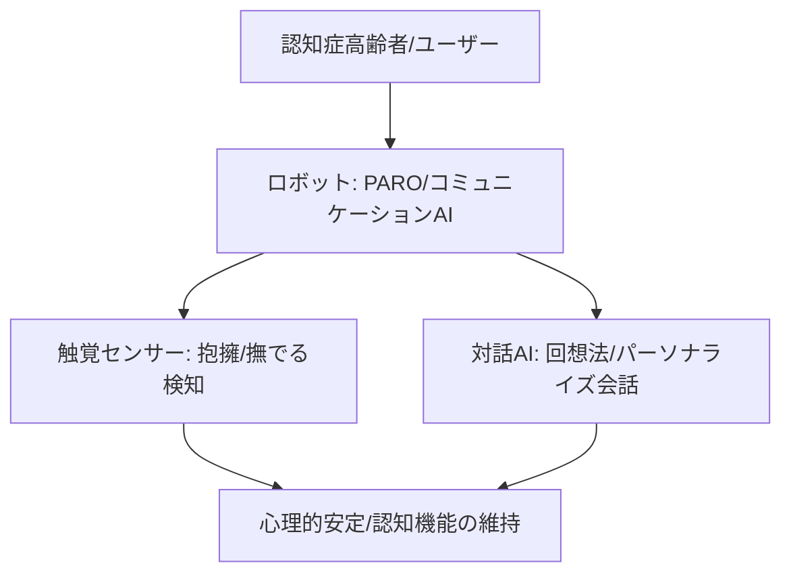

# T12-03-05 コミュニケーション・レクリエーションロボット（認知症対策）

## Summary（5つの要点）

1. **心理的安定とQOL向上**: **認知症高齢者**や**孤独を感じる方**の**話し相手**となり、**心理的な安定、不安の軽減、生活の質の向上（QOL）**に貢献する `(1)`。
2. **アニマルセラピー効果**: **産業技術総合研究所（AIST）**が開発した**アザラシ型ロボット「PARO」**に代表されるように、**動物の代替**として**触れ合い、撫でる**ことで、**ストレスホルモン**を**低下**させ、**癒し効果**をもたらす `(2)`。
3. **非言語コミュニケーション**: **触覚センサー**（T12-02-05）により、**ユーザー**が**ロボット**を**抱きしめる**などの**接触**を**検知**し、**適切な鳴き声、動き、表情**（T12-02-03）で**応答**。**非言語的な心の交流**を重視する。
4. **認知機能維持（回想法・脳トレ）**: **昔の写真、音楽、動画**を**提示**し、**昔の記憶**を**呼び起こす**ことで**認知機能の維持**を図る**回想法**を**AI**で**自動化**。**脳トレゲーム、歌唱プログラム**の**進行役**も担う。
5. **パーソナライズされた対話**: **ユーザー**の**過去の対話履歴**（T12-02-04）から**好きな話題、記憶**を**学習**し、**認知症の症状**に**合わせた**、**混乱**を**避ける**ような**個別化された会話**を提供する `(1)`。

#### 概念図

---

### 技術評価表（定量的な視点）
| 評価項目 | 評価 | 根拠 |
| :--- | :--- | :--- |
| 導入コスト | ⭐⭐⭐☆☆ | 機体は比較的高額だが、介護報酬の対象となるケースも多い |
| 技術成熟度 | ⭐⭐⭐⭐☆ | **PARO**は**国際的**に**医療機器**として**認証**されており、**実績**が豊富 `(2)` |
| 日本の競争力 | ⭐⭐⭐⭐⭐ | **アニマルセラピーロボット**の分野で**PARO**が**世界市場**を**牽引** `(2)` |
| 市場性 | ⭐⭐⭐⭐⭐ | **認知症患者**の**増加**に伴い、**非薬物療法**としての**需要**が**グローバル**で拡大 |
| 品質保証の重要性 | ⭐⭐⭐⭐⭐ | **不適切な対話**や**誤った情報**が**認知症患者**の**症状悪化**を招くため、**応答の適切性、安全性**が最重要 |

---

## 日本の立ち位置・強み弱みのSummary

### 強み：日本企業や研究機関が持つ独自の技術、優位性などを箇条書きで記述。

* **アニマルセラピーロボット**: **PARO**が**30カ国以上**で**導入**され、**国際的な実績**と**医療機器認証**を持つ。
* **非言語コミュニケーション設計**: **撫でる、抱きしめる**といった**触覚インタラクション**に**特化**した**センサー**と**動作制御技術**。
* **介護現場でのノウハウ**: **認知症専門医、介護士**との**連携**を通じて、**認知症高齢者**に**特化**した**対話、レクリエーションプログラム**の開発が進展。

### 弱み：日本が抱える規制、標準化の遅れ、海外依存などを箇条書きで記述。

* **認知症症状への個別対応**: **認知症**の**進行度、症状**が**個人**によって**大きく異なる**ため、**ロボット**の**対応力**に**限界**がある。
* **データ利活用の課題**: **認知症患者**の**機密性の高い対話データ**の**収集、解析**における**プライバシー保護**と**倫理的規制**。
* **高度な対話AIの統合**: **PARO**は**触覚**が中心であり、**ChatGPT**などの**高度な自然言語対話AI**（T12-02-01）との**本格的な統合**が途上。

---

## 技術ロードマップ（短期/中期/長期）

### 短期目標（～2027年）

* **コミュニケーションAI**を**LLMベース**（T12-02-01）に**高度化**し、**認知症の症状**に**合わせた****共感的な対話**を実現。
* **触覚センサー**に加え、**カメラ**で**ユーザー**の**顔色、姿勢**を**検知**し、**不安やストレス**を**高精度**で**推定**。
* **回想法プログラム**を**個別**に**自動生成**し、**実施結果**を**介護記録**に**自動連携**。

### 中期目標（2028年～2031年）

* **ロボット**が**複数の認知症高齢者**を**同時**に**認識**し、**集団レクリエーション**の**ファシリテーター**を担う。
* **認知機能の低下**を**対話内容**や**身体の動き**から**AI**が**早期に予測**し、**専門医**に**情報**を提供する。
* **高齢者**の**好み**に**合わせた**、**外観**や**機能**を**カスタマイズ**できる**パーソナライズモデル**（ペット型、人形型、ヒューマノイド型）を標準化。

### 長期目標（2032年～2035年）

* **ロボット**が**人間の意識**（T8-03-02）と**共鳴**し、**認知機能の改善**や**記憶の再構築**を**非侵襲的**に**支援**する**AIセラピー**を実現。
* **ロボット**が**高齢者の生涯のパートナー**となり、**終末期ケア**においても**心理的な支え**を提供する。

### 📚 参照リンク

1. [経済産業省：コミュニケーション・レクリエーション介護ロボットの導入事例](https://www.meti.go.jp/policy/mono_info_service/robotics/kaigorobo/index.html)
2. [産業技術総合研究所（AIST）：アザラシ型ロボット「パロ」公式サイト](https://unit.aist.go.jp/robotics/humanoid/paro/)
3. [日本認知症ケア学会：ロボットセラピーに関する研究](https://www.jsdc.gr.jp/)