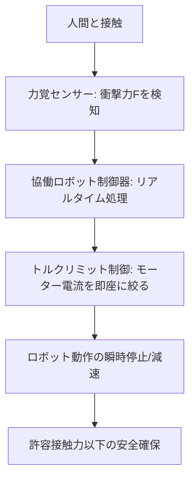

# T12-04-01 力覚センサー・トルクリミット制御

## Summary（5つの要点）

1. **安全性の確保（ISO/TS 15066準拠）**: **協働ロボット（コボット）**が**人間**と**同じ空間**で**安全**に作業するために**必須**の技術。ロボットと人間が**接触**した際に、**力覚センサー**や**電流制御**により**衝撃力**を**ISO/TS 15066**で定められた**許容接触力**以下に**即座に制限**し、**作業者の傷害**を防ぐ `(1)`。
2. **力覚センサーの役割**: **ロボットの関節部**や**エンドエフェクタ**に設置された**高感度な力覚センサー**（ひずみゲージ式、静電容量式など）が、**外部**から**加わる力**や**トルク**を**リアルタイム**で**検知**する。
3. **トルクリミット制御**: **センサー**からの**信号**に基づき、**モーターへの供給電流**を**精密に制御**することで、**ロボットの各関節**が**発生できるトルク**を**上限値**（リミット）**以下**に抑える。これにより、**接触時**に**衝撃**が**発生する前**に**動作を停止**または**力の方向**を**反転**させる `(2)`。
4. **人間協調作業の実現**: **ネジ締め、研磨、挿入**など、**力**を**繊細**に**加減**する必要がある作業で、**力覚センサー**を**フィードバック**として利用。**人間**が**力**で**ロボット**を**誘導**する**ダイレクトティーチング**（T12-04-03）も可能になる。
5. **代表的な製品**: **Universal Robots（UR）**、**FANUC（CRシリーズ）**、**安川電機（MOTOMANシリーズ）**など、**主要な協働ロボットメーカー**の**全製品**に**標準搭載**または**オプション**として提供される `(2)`。

#### 概念図

---

### 技術評価表（定量的な視点）
| 評価項目 | 評価 | 根拠 |
| :--- | :--- | :--- |
| 導入コスト | ⭐⭐⭐☆☆ | センサー自体は高価ではないが、制御システムの複雑化でコスト増 |
| 技術成熟度 | ⭐⭐⭐⭐☆ | 技術は成熟。**接触力の瞬時検知**と**制御応答速度**が向上中 `(1)` |
| 日本の競争力 | ⭐⭐⭐⭐⭐ | **FANUC、安川電機**など**産業用ロボットの強豪**が、**高精度な制御技術**を**協働ロボット**に応用 `(2)` |
| 市場性 | ⭐⭐⭐⭐⭐ | **人間とロボット**の**作業領域分離**が**不要**となり、**製造現場**での**導入**が**加速** |
| 品質保証の重要性 | ⭐⭐⭐⭐⭐ | **安全規格（ISO/TS 15066）**への**準拠**が**市場参入の必須条件**。

---

## 日本の立ち位置・強み弱みのSummary

### 強み：日本企業や研究機関が持つ独自の技術、優位性などを箇条書きで記述。

* **産業用ロボット制御のノウハウ**: **FANUC、安川電機、川崎重工**など、**長年培われた産業用ロボット**の**高精度なサーボ制御技術**を**安全制御**に応用。
* **センサー部品の優位性**: **高精度**な**ひずみゲージ式**や**静電容量式**の**力覚センサー**の**サプライヤー**（例: ワコー、村田製作所）の存在。
* **安全規格への対応**: **日本のロボットメーカー**が**ISO/TS 15066**などの**国際規格**の**策定**に**積極的**に参加し、**国内市場**に**迅速に対応**。

### 弱み：日本が抱える規制、標準化の遅れ、海外依存などを箇条書きで記述。

* **リスクアセスメントの複雑さ**: **協働ロボット**の**設置**には**詳細**な**リスクアセスメント**が**義務付け**られており、**中小企業**での**導入**の**心理的ハードル**が高い。
* **プログラミングの複雑さ**: **力制御**を**応用**した**繊細**な**作業**（研磨、嵌合）の**プログラミング**には**高度なスキル**が必要とされる場合がある。
* **欧米メーカーの先行**: **Universal Robots**が**直感的ティーチング**（T12-04-03）と**安全機能**を**統合**し、**協働ロボット市場**で**先行**している。

---

## 技術ロードマップ（短期/中期/長期）

### 短期目標（～2027年）

* **力覚センサー**の**価格**を**現行比30%削減**し、**標準装備化**を加速。
* **ISO/TS 15066準拠**の**自動リスクアセスメントツール**を**提供**し、**導入の障壁**を**低減**。
* **協働作業**における**力制御**の**プログラミング**を**AI**が**自動生成**する機能の開発。

### 中期目標（2028年～2031年）

* **ロボット**が**人間**の**接触**だけでなく、**意図**を**筋電位**や**視線**から**先読み**し、**接触前に減速・回避**する**予測制御**を実現。
* **力覚センサー**を**アーム全体**に**統合**し、**体積**を**最小化**。**人間**の**皮膚**のような**触覚**（T8-03-05）を再現。
* **協働ロボット**の**国際安全規格**が**SaaS**として**リアルタイム**で**更新**され、**規制対応**を**自動化**。

### 長期目標（2032年～2035年）

* **力制御**が**人間の手のひら**の**繊細さ**を**再現**し、**外科手術**などの**超精密作業**を**人間**と**協働**で**実行**。
* **ロボット**が**人間**の**感情状態**を**力**の**加減**から**推定**し、**共感的なフィードバック**を行う。

### 📚 参照リンク

1. [ISO/TS 15066: Collaborative robots - Safety requirements](https://www.iso.org/standard/60835.html)
2. [FANUC：協働ロボット CRXシリーズ 技術紹介](https://www.fanuc.co.jp/ja/product/robot/series/cr.html)
3. [Universal Robots：安全機能と認証](https://www.universal-robots.com/ja/)