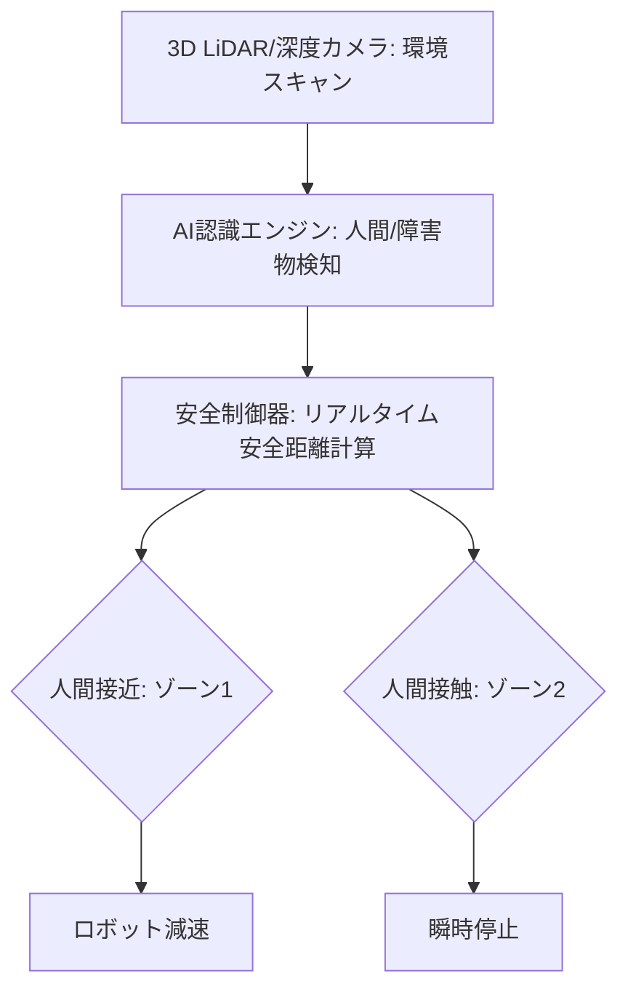

# T12-04-02 視覚認識・環境センサー（人間検知・障害物回避）

## Summary（5つの要点）

1. **作業空間の動的監視**: **3D LiDAR**や**深度カメラ（ToF、ステレオビジョン）**を用いて、**ロボット**の**作業エリア全体**を**リアルタイム**で**三次元的**に**マッピング**し、**人間**や**予期せぬ障害物**を**検知**する `(1)`。
2. **人間検知と安全距離の確保**: **AI画像認識技術**（ディープラーニング）により、**人間**の**骨格、位置、速度**を**正確**に**特定**。**人間**が**協働ロボット**に**接近**した際、**ISO 10218**に基づき**安全距離**を**自動で計算**し、**段階的**に**減速**または**停止**（安全定格監視停止）する `(1)`。
3. **動的経路再計画**: **作業空間内**に**障害物**が**突然出現**した場合、**ロボット**が**動作を停止**するだけでなく、**障害物**を**回避**する**新しい経路**を**リアルタイム**で**計算**し、**作業を継続**する（**柔軟性**の向上）。
4. **物体認識とピッキング**: **高解像度カメラ**と**AI**を**統合**し、**供給コンベア上**の**バラ積み部品**や**不定形な物体**を**認識**し、**正確にピックアップ**（ピック&プレース）する（**汎用性**の向上）。
5. **安全ライトカーテン代替**: 従来の**物理的な柵、安全ライトカーテン**を**カメラ・LiDAR**による**仮想的な安全ゾーン**で**代替**。**設置面積**を**最小化**し、**導入コスト**を**削減**する `(2)`。

#### 概念図

---

### 技術評価表（定量的な視点）
| 評価項目 | 評価 | 根拠 |
| :--- | :--- | :--- |
| 導入コスト | ⭐⭐⭐☆☆ | 3Dセンサー、高性能GPU、AIソフトウェアのコスト |
| 技術成熟度 | ⭐⭐⭐⭐☆ | 個別技術は成熟。**動的環境**での**認識速度、精度**が向上中 `(2)` |
| 日本の競争力 | ⭐⭐⭐☆☆ | **センサー部品**に強み。**AI画像認識アルゴリズム**は**海外プラットフォーム**に依存傾向 `(2)` |
| 市場性 | ⭐⭐⭐⭐⭐ | **製造、物流、医療**など**あらゆる現場**で**安全、柔軟**な**自動化**に必須 |
| 品質保証の重要性 | ⭐⭐⭐⭐⭐ | **人間**の**検知失敗**は**重大事故**に直結。**悪環境下（粉塵、光量不足）**での**検出精度**が最重要 |

---

## 日本の立ち位置・強み弱みのSummary

### 強み：日本企業や研究機関が持つ独自の技術、優位性などを箇条書きで記述。

* **高品質センサー部品**: **ソニー、パナソニック**などが提供する**CMOSイメージセンサー、ToFセンサー**などの**高性能**な**深度カメラ技術**。
* **FA現場の知見**: **製造現場**の**特殊**な**環境**（油、光沢面、高温）に**対応**した**信頼性の高いセンサーシステム**の**実装ノウハウ**。
* **自律移動技術との融合**: **AGV/AMR**（無人搬送車）で培われた**SLAM、LiDAR**による**地図作成・自己位置推定技術**を**協働ロボット**の**作業空間認識**に応用。

### 弱み：日本が抱える規制、標準化の遅れ、海外依存などを箇条書きで記述。

* **AIプラットフォームの依存**: **骨格認識、物体認識**の**基盤**となる**ディープラーニングフレームワーク**（TensorFlow、PyTorch）や**クラウドAI**への**依存**。
* **動的経路計画の計算コスト**: **リアルタイム**での**複雑**な**経路再計画**には**高性能なプロセッサ（GPU/FPGA）**が必要で、**ロボット本体**の**コスト増**と**消費電力増**につながる。
* **国際安全規格との連携**: **ISO 10218**や**ISO/TS 15066**に基づく**安全距離計算**の**国際標準化活動**への**積極的**な**貢献**と**国内実装**の**迅速化**が課題。

---

## 技術ロードマップ（短期/中期/長期）

### 短期目標（～2027年）

* **AI**による**人間検知**の**精度**を**99.9%**に向上させ、**悪環境下**での**誤検知率**を**0.1%未満**に低減。
* **ロボット**が**人間**の**動作**を**1秒先**まで**予測**し、**接触**の**リスク**を**最小化**した**動作軌道**を**自律的**に**選択**。
* **3Dセンサー**と**AI**を**ロボットコントローラ**に**統合**し、**外部安全機器**なしでの**協働運転**を**標準化**。

### 中期目標（2028年～2031年）

* **ロボット**が**人間**の**作業意図**を**視線**や**ジェスチャー**から**認識**し、**先回り**して**必要なツール**を**提供**する。
* **複数の協働ロボット**と**人間**が**同じ空間**で**完全に同期**して**作業**を行う**マルチロボット協調制御**を実現。
* **光学センサー**と**触覚センサー**（T12-04-01）の**情報を融合**し、**環境認識**と**力制御**を**シームレス**に**統合**。

### 長期目標（2032年～2035年）

* **作業空間全体**を**AI**が**完全に理解**し、**人間**が**意識**することなく**ロボット**が**最も効率的**で**安全**な**タスク**を**自律的**に**実行**。
* **人間の意識**（T8-03-02）や**精神状態**を**視覚情報**から**推定**し、**疲労時**には**ロボット**が**作業負荷**を**自動で肩代わり**する。

### 📚 参照リンク

1. [SICK：協働ロボット向けセーフティソリューション](https://www.sick.com/jp/ja/p/w/sensing-solutions-for-collaborative-robots/c/p531587)
2. [オムロン：協働ロボットの安全とビジョンシステム](https://www.omron.com/jp/ja/automation/feature/collaborative-robot/)
3. [Intel RealSense テクノロジー：深度カメラの応用](https://www.intelrealsense.com/)