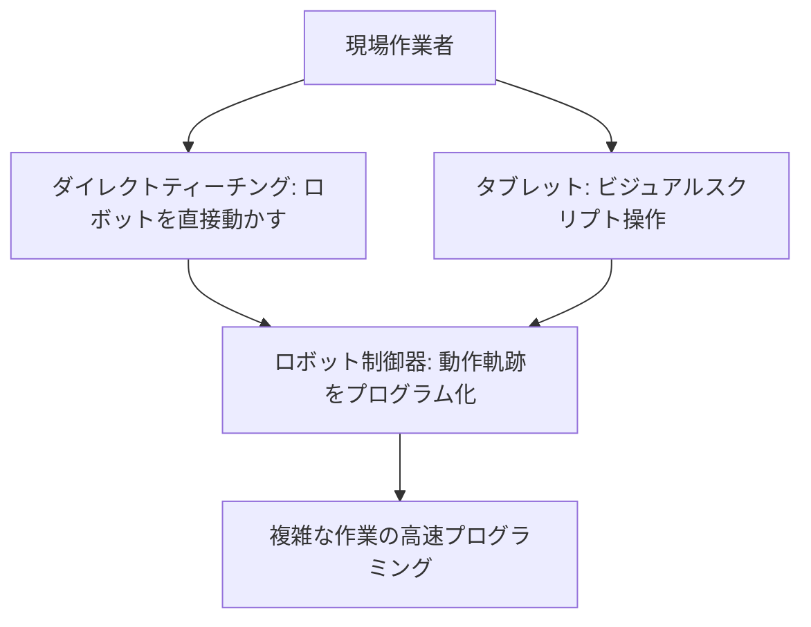

# T12-04-03 直感的プログラミング・ティーチングインタフェース

## Summary（5つの要点）

1. **専門知識不要のプログラミング**: **高度なロボットプログラミング言語**（例: VAL, KAREL）の**知識**がない**現場の作業者**でも、**ロボット**の**作業内容**を**簡単**に**設定・変更**できる**インタフェース**を提供する `(1)`。
2. **ダイレクトティーチング**: **協働ロボット**の**アーム**を**直接**つかみ、**人間**が**手**で**目的の動作**を**行い**、その**軌跡、位置、速度**を**ロボット**に**記憶**させる**教示方法**。**溶接、塗装**など**複雑な動作**の**教示時間**を**大幅に削減** `(2)`。
3. **グラフィカルプログラミング**: **タブレット**や**専用のティーチペンダント**上で、**アイコン**や**ブロック**を**組み合わせ**て**プログラム**を**作成**する**ビジュアルスクリプト方式**。**初心者**でも**直感的**に**ワークフロー**を**設計**できる（Universal Robotsの**Polyscope**など）。
4. **シミュレーションとデバッグ**: **プログラミング中**に**ロボットの動作**を**仮想空間**で**シミュレーション**し、**干渉**や**危険性**を**事前にチェック**。**デバッグ**を**効率化**し、**現場**での**ダウンタイム**を**最小化**。
5. **Web/モバイル連携**: **プログラミング**、**監視**、**データ解析**の**インタフェース**を**Webブラウザ**や**スマートフォンアプリ**に**対応**させる。**遠隔**からの**状態確認**や**プログラム修正**を可能にする `(1)`。

#### 概念図

---

### 技術評価表（定量的な視点）
| 評価項目 | 評価 | 根拠 |
| :--- | :--- | :--- |
| 導入コスト | ⭐⭐⭐⭐☆ | ソフトウェアライセンス、専用ティーチペンダントのコスト |
| 技術成熟度 | ⭐⭐⭐⭐⭐ | **Universal Robots**などで**既に確立**された技術。**AIによる自動生成**が次世代の課題 `(2)` |
| 日本の競争力 | ⭐⭐⭐☆☆ | **ダイレクトティーチング**は進展。**ビジュアルスクリプト**の**直感性**は**海外メーカー**が**先行** |
| 市場性 | ⭐⭐⭐⭐⭐ | **中小企業**や**多品種少量生産**の現場で**導入障壁**を**低減**し、**市場を拡大** |
| 品質保証の重要性 | ⭐⭐⭐⭐⭐ | **ティーチングエラー**が**製品の品質**や**ロボットの故障**に直結するため、**検証機能**が必須 |

---

## 日本の立ち位置・強み弱みのSummary

### 強み：日本企業や研究機関が持つ独自の技術、優位性などを箇条書きで記述。

* **力制御によるティーチング**: **力覚センサー**（T12-04-01）を**利用**した**高精度**な**ダイレクトティーチング技術**。**FANUC**などが**実績**。
* **汎用性の高いGUI**: **安川電機**や**川崎重工**など、**既存の産業用ロボット**の**ティーチペンダント**を**協働ロボット**向けに**改良**し、**統一的**な**操作感**を提供。
* **現場の熟練工の知恵の継承**: **熟練工**の**動作**を**AI**で**解析**し、**ダイレクトティーチング**で**教示**する**プロセス**の**自動化研究**。

### 弱み：日本が抱える規制、標準化の遅れ、海外依存などを箇条書きで記述。

* **ユーザーフレンドリーなUI/UX**: **Universal Robots**の**Polyscope**のような**徹底**して**現場作業者**に**寄り添った**、**直感的**で**洗練**された**UI/UX設計**が**海外メーカー**に**一日の長**がある。
* **プログラミング教育**: **直感的**な**インタフェース**が**普及**する一方で、**ロボットプログラミング**の**基礎教育**が**追いついていない**。
* **AIによる動作自動生成の遅れ**: **ティーチング**に**要する時間**を**ゼロ**に近づける**AI**が**作業内容**から**最適動作**を**自動で推定**・**生成**する技術が途上。

---

## 技術ロードマップ（短期/中期/長期）

### 短期目標（～2027年）

* **協働ロボット**の**ティーチング**に**要する時間**を**現行比50%削減**する**AIアシスト機能**を**標準搭載**。
* **AR/VR**を**利用**し、**仮想空間内**で**動作**を**プレビュー**しながら**ティーチング**を**行う**インタフェースを実用化。
* **タブレット**上で**自然言語**（「この部品を箱のここに入れる」）で**指示**するだけで**ロボット**が**動作**を**自動生成**。

### 中期目標（2028年～2031年）

* **作業者**が**ヘルメット**や**ウェアラブルデバイス**を**装着**し、**視線、脳波**（T8-03-02）から**作業意図**を**読み取り**、**ロボット**が**自律的**に**動作**を**修正**・**最適化**。
* **ロボット**が**過去**の**作業履歴**や**熟練工の動作データ**を**継続的**に**学習**し（T12-02-04）、**プログラム**を**自動改善**。
* **クラウドベース**で**多様**な**アプリケーションプログラム**を**共有**し、**ゼロからプログラミング**する**必要**を**排除**。

### 長期目標（2032年～2035年）

* **ロボット**が**人間**の**思考**を**先読み**し、**ティーチング**を**一切必要**とせず、**人間**と**完璧**に**協調**して**自律作業**を行う。
* **プログラミング**という**概念**が**消滅**し、**人間**が**作業**を**行う**だけで**ロボット**が**学習**し**再現**。

### 📚 参照リンク

1. [Universal Robots：Polyscopeによる直感的なプログラミング](https://www.universal-robots.com/ja/)
2. [川崎重工：sukusukuによるダイレクトティーチング](https://www.khi.co.jp/mobility/robot/products/collaborative/)
3. [ファナック：FANUC CRXシリーズ ティーチング方法](https://www.fanuc.co.jp/ja/product/robot/series/crx.html)