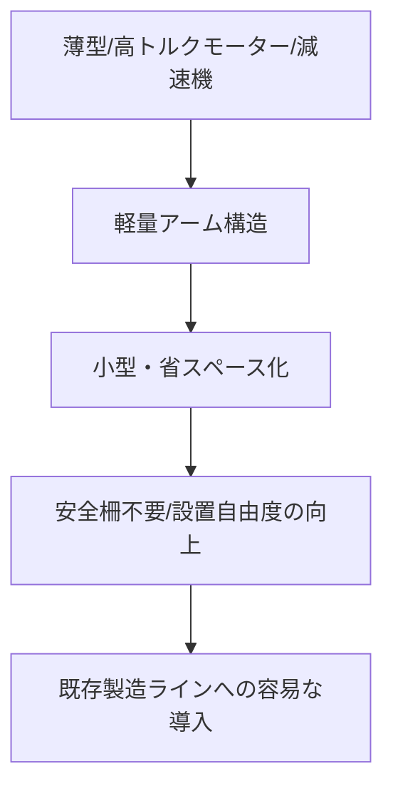

# T12-04-04 軽量・小型アームデザイン（省スペース配置）

## Summary（5つの要点）

1. **既存ラインへの容易な導入**: **協働ロボット**は**従来の産業用ロボット**と異なり、**安全柵が不要**（安全機能が組み込まれているため）であるため、**既存**の**製造ライン**や**狭い作業スペース**に**容易**に**追加設置**できる `(1)`。
2. **小型・軽量設計**: **アーム**の**関節部**に**薄型・高トルク**の**モーター、減速機**を**採用**し、**アーム全体**を**軽量化**。**可搬重量**が**3kg**から**20kg程度**、**リーチ**が**500mm**から**1300mm程度**の**小型モデル**が主流。
3. **設置自由度の向上**: **軽量化**により、**床面**だけでなく、**壁面**や**天井**にも**設置**が可能。**省スペース**を**実現**し、**生産ライン**の**レイアウト**を**柔軟**に**変更**できる `(2)`。
4. **導入障壁の低減**: **小型**で**安価**な**モデル**が増えることで、**初期投資**を**抑え**られ、**中小企業**や**初めてロボット**を**導入**する**企業**の**自動化**への**障壁**を**大幅に低減**する `(2)`。
5. **ケーブル内蔵デザイン**: **モーター**や**センサー**に**接続**する**ケーブル**を**アーム内部**に**内蔵**することで、**外部**への**露出**を**減らし**、**安全性**と**デザイン性**を**向上**。**狭い空間**での**作業**や**異物混入**の**リスク**を**低減**。

#### 概念図

---

### 技術評価表（定量的な視点）
| 評価項目 | 評価 | 根拠 |
| :--- | :--- | :--- |
| 導入コスト | ⭐⭐⭐⭐☆ | 従来の産業用ロボットに比べ**低価格** |
| 技術成熟度 | ⭐⭐⭐⭐☆ | 技術は確立。**軽量化**と**高可搬重量**の**両立**が**次世代の課題** `(2)` |
| 日本の競争力 | ⭐⭐⭐⭐⭐ | **モーター、減速機**など**基幹部品**で**圧倒的優位性**（ハーモニック・ドライブ・システムズなど） `(2)` |
| 市場性 | ⭐⭐⭐⭐⭐ | **人手不足**の**中小企業**、**多品種少量生産**で**爆発的**な**需要** |
| 品質保証の重要性 | ⭐⭐⭐⭐⭐ | **軽量化**と**高剛性**を**両立**させる**材料、設計**の**信頼性**が重要 |

---

## 日本の立ち位置・強み弱みのSummary

### 強み：日本企業や研究機関が持つ独自の技術、優位性などを箇条書きで記述。

* **基幹部品の優位性**: **ハーモニック・ドライブ・システムズ**の**高精度減速機**など、**小型、高トルク、高剛性**を**実現**する**重要部品**の**世界的なサプライヤー**の存在。
* **産業用ロボットのノウハウ**: **ファナック、安川電機**などが**長年培った**、**過酷な環境**での**耐久性**と**信頼性**に**優れ**た**ロボット設計技術**。
* **設置ノウハウ**: **製造ライン**の**最適化**に関する**豊富なSIer**（システムインテグレーター）が、**省スペース**での**導入、運用**を**支援**。

### 弱み：日本が抱える規制、標準化の遅れ、海外依存などを箇条書きで記述。

* **デザインコンセプト**: **Universal Robots**など**海外**の**協働ロボット**に比べ、**デザイン**や**ユーザーフレンドリーな外観**の**重要性**への**認識**が**遅れ**ていた。
* **軽量化と可搬重量のトレードオフ**: **軽量化**を**追求**する**あまり**、**産業用ロボット**に**必要**な**高可搬重量（20kg以上）**との**両立**が**難しい**。
* **規制緩和の遅れ**: **協働ロボット**の**安全規格（ISO 10218, ISO/TS 15066）**に基づく**国内の規制**の**解釈、運用**が**海外**に**比べ**て**慎重**で、**導入**の**自由度**を**制限**している側面。

---

## 技術ロードマップ（短期/中期/長期）

### 短期目標（～2027年）

* **軽量化**と**高可搬重量（20kg以上）**を**両立**させた**ハイブリッド**な**協働ロボット**を**標準化**。
* **アーム**の**構造材**に**炭素繊維複合材料（CFRP）**を**適用**し、**剛性**を**維持**しつつ**さらなる軽量化**。
* **制御器**を**アーム内部**に**統合**し、**外部**の**制御盤**を**不要**にする**オールインワン設計**を普及。

### 中期目標（2028年～2031年）

* **アーム**が**環境**や**作業内容**に**応じて**、**リーチ、剛性**を**動的**に**変更**できる**可変構造ロボット**を実現。
* **ロボット**が**作業台**や**壁面**に**自律的**に**取り付け、取り外し**を**行い**、**作業場所**を**自己変更**。
* **小型軽量**でありながら**IP69K**などの**高レベル**の**防水・防塵性能**を**実現**し、**過酷な環境**での**利用**を**拡大**。

### 長期目標（2032年～2035年）

* **ナノマテリアル**や**超電導技術**を**モーター**に**応用**し、**極限**まで**小型・軽量化**された**人間の腕**と**見分け**の**つかない**高性能な**協働アーム**を実現。
* **体積、重量**が**実質的**に**ゼロ**となり、**あらゆる環境**に**設置**可能な**「空気のような」ロボット**の**実現**。

### 📚 参照リンク

1. [安川電機：MOTOMAN-HCシリーズ 製品情報](https://www.yaskawa.co.jp/business/robot/product/collaborative/motoman-hc10dt)
2. [ハーモニック・ドライブ・システムズ：減速機技術](https://www.hds.co.jp/products/)
3. [川崎重工：協働ロボットの小型化技術](https://www.khi.co.jp/mobility/robot/products/collaborative/)